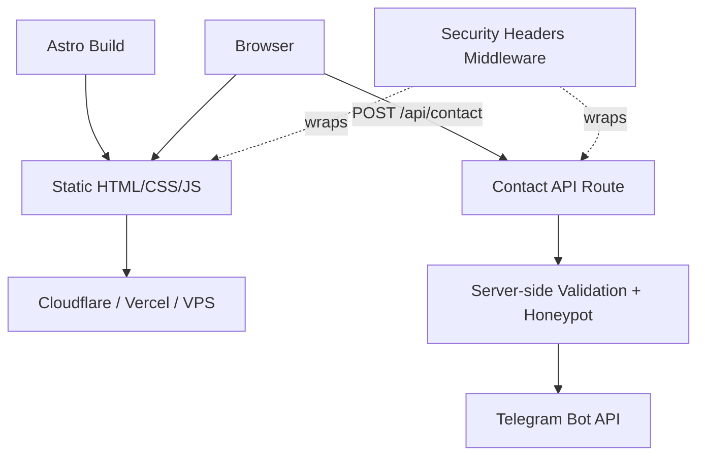

# Corporate Landing Page

A performance and SEO-focused landing page built for a client, using Astro's static-site-generation model.

---

## Overview

A corporate/service-business landing page: hero, about, services, advantages, process, case studies, testimonials, FAQ, and a contact form — built as a fully static site with a single serverless API route for form submission. The brief was a fast, SEO-strong, conversion-focused site rather than a heavy web app, so the architecture follows that directly: everything that can be pre-rendered at build time is, and the only server-side code that exists is the one endpoint that actually needs it.

This is client work, currently in development — the underlying codebase is written to be reusable as a template for similar landing pages, but this instance is being built for a specific client's site.

---

## Engineering Summary

What stands out here isn't complexity — it's discipline for a project type (marketing landing pages) that often gets built without much engineering rigor at all. The contact form has server-side validation, a honeypot spam trap, and HTML-escaped output before being relayed to Telegram. Security headers (CSP, HSTS, X-Frame-Options, Permissions-Policy) are applied globally through middleware rather than left to hosting-platform defaults. CI runs linting, type-checking, and unit tests on every push, plus two separate scheduled jobs — one for Lighthouse performance budgets, one for SEO regressions (broken metadata, missing JSON-LD, sitemap drift) — each with an explicit comment explaining why it runs on a schedule instead of every commit.

---

## Key Features

* Fully static-generated pages with one serverless API route for the contact form
* Server-side form validation, honeypot spam detection, and Telegram-based lead delivery
* Global security headers (CSP, HSTS, X-Frame-Options, Permissions-Policy) applied via middleware
* Centralized, data-driven content (site config, services, page sections defined as data, not hardcoded into components)
* SEO baseline: Open Graph, Twitter Cards, JSON-LD (Organization/LocalBusiness/FAQ/Service schema), sitemap, robots.txt
* Scheduled Lighthouse performance monitoring, separate from per-commit CI
* Scheduled + per-PR SEO regression checks (metadata, headings, images, structured data, sitemap, HTML validation)
* Docker-based deployment alongside native Vercel/Cloudflare Pages support

---

## Technical Stack

**Framework**
Astro, TypeScript

**Styling**
Tailwind CSS

**Build Tool**
Vite

**Backend (form endpoint only)**
Astro API route (serverless), Telegram Bot API for lead notifications

**Testing**
Vitest

**Infrastructure**
Docker, Vercel / Cloudflare Pages compatible

**CI**
GitHub Actions — lint/typecheck/test/build/docker on push, scheduled Lighthouse, scheduled + PR-triggered SEO checks

---

## Architecture

The site is static-generated at build time — every page except the contact endpoint has `prerender` left at its default (on), so the deployed output is plain HTML/CSS with minimal client-side JS. The one dynamic piece is `POST /api/contact`: it validates the payload server-side, rejects submissions where a hidden honeypot field was filled (a bot tell), and forwards valid submissions to a Telegram chat via the Bot API, with all user-supplied text HTML-escaped before being sent (the message is delivered in Telegram's HTML parse mode, so unescaped input could otherwise break formatting or inject unintended markup into the message).

Security headers are applied globally, not per-route, via Astro middleware that wraps every response.

---

## Interesting Engineering Decisions

**Static generation over a full server-rendered app.** A marketing landing page doesn't need per-request rendering — content changes at deploy time, not per visitor. Going fully static means faster loads, a smaller attack surface, and cheap hosting, with the one genuinely dynamic piece (the contact form) isolated to a single serverless function rather than pulling the whole site into a server-rendering model.

**Telegram over email or a CRM integration for lead delivery.** For a small business site, a lead landing directly in a Telegram chat is immediate and requires no separate inbox-checking habit or third-party CRM setup — a pragmatic choice matched to how the client will actually use it.

**Lighthouse and SEO checks run on a schedule, not every commit.** Both workflows carry an explicit comment explaining the reasoning: Lighthouse scores vary run-to-run by several points, so running it on every push would just generate noise; the SEO check catches regressions that don't necessarily show up in a code diff (like a sitemap silently dropping a page), which a scheduled safety net catches without needing to gate every PR on it.

**Content centralized as data, not scattered across components.** Site copy, services, and section content live in dedicated content files rather than being hardcoded inside Astro components — the kind of separation that makes copy changes (which happen far more often than layout changes on a site like this) safe and low-risk.

---

## Challenges

**Preventing spam without a CAPTCHA.** A visible CAPTCHA adds friction to a form whose entire purpose is capturing leads. A honeypot field (invisible to real users, reliably filled in by bots) filters out unsophisticated spam without costing genuine visitors anything.

**Keeping performance and SEO from silently regressing.** Neither category tends to show up as a visible bug — a missing meta tag or a Lighthouse score creeping down over several commits is easy to miss in normal review. Solved with dedicated, scheduled CI jobs whose entire job is catching exactly that kind of regression.

---

## Reliability

The contact endpoint fails closed on malformed input — invalid JSON and validation errors both return an explicit error response rather than silently dropping the submission. Telegram delivery no-ops safely if the bot token/chat ID aren't configured, rather than crashing the endpoint, which keeps the form usable before the notification channel is fully wired up in a given environment.

---

## Security Considerations

* Content-Security-Policy scoped to only the origins actually needed (self, plus Google/Yandex analytics endpoints) rather than left permissive
* HSTS with `includeSubDomains` and `preload`
* `X-Frame-Options: DENY` and `frame-ancestors 'none'` to prevent clickjacking
* `Permissions-Policy` explicitly disables geolocation, camera, and microphone
* User-supplied form input is HTML-escaped before being embedded in the outbound Telegram message
* Honeypot field for basic bot/spam filtering
* Server-side validation is authoritative — client-side validation exists for UX, but the API route independently validates before acting on any submission

---

## Lessons Learned

The two scheduled CI jobs (Lighthouse, SEO checks) were worth the setup effort specifically because both categories are the kind of thing that degrades quietly. Writing the reasoning directly into the workflow comments — why scheduled instead of per-commit — was a small thing, but it's meant to save a future "why doesn't this run on every push?" conversation, with myself or anyone else touching the repo later.

---

## Technologies Demonstrated

* Static site generation and performance-oriented frontend architecture
* Serverless API route design
* Security header configuration (CSP, HSTS, and related headers)
* Spam prevention without degrading UX
* SEO engineering (structured data, sitemap, metadata validation)
* CI pipeline design, including scheduled non-blocking quality checks
* Third-party API integration (Telegram Bot API) with input sanitization

---

## Suitable Portfolio Categories

Client Work · Frontend/Web Engineering · SEO & Performance · API Design