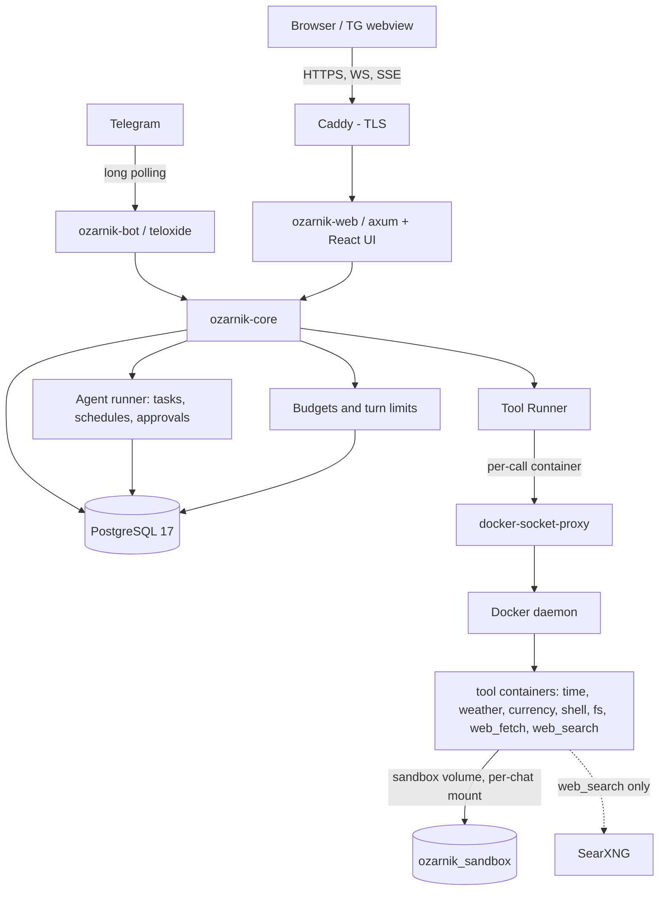

# Ozarnik

A Russian-language AI assistant that keeps one brain across every surface you talk to it from — a Telegram bot and a web Mini App sharing one Rust core, one PostgreSQL database, and one sandboxed tool runtime. Live at [@ozarnik_russian_robot](https://t.me/ozarnik_russian_robot) and [ozarnik.duckdns.org](https://ozarnik.duckdns.org/).

---

## Overview

The product idea is simple to state and hard to hold onto: the assistant should be the *same* assistant whether you write to it in Telegram or open the web app. Same conversation history, same memory of you, same dossier, same tools. Clients are thin adapters; everything that decides anything lives in `core/`.

What that means structurally is a Rust workspace where `bot/` (teloxide, long polling) and `web/` (axum — REST, WebSocket, SSE, plus the built React frontend) are separate binaries that share a library crate and a database. Neither starts the other. Anything a client knows that `core` does not is a bug waiting to be duplicated in the next client.

Around that sits an agentic layer — background tasks that outlive the request that asked for them — a per-call container sandbox for tools, spending ceilings, and a deployment sized for a 2 GB single-core box.

**43,165 lines of code across 190 tracked files in 21 days**, measured with `cloc` over git-tracked files rather than estimated. 398 Rust test functions. 14 SQL migrations. Two co-authors: I wrote 102 of the 146 commits, the client wrote 44.

Finished, deployed, and running. **I no longer have any stake in it — see [Status](#status).**

---

## Engineering Summary

The decision the whole project turns on is that **a client adapter is not allowed to hold state or make policy**. `bot/` and `web/` translate their transport into a `ChatSink` and call into `core`; every limit, every budget, every tool decision, every piece of memory, and every row of history lives on the other side of that line.

This was not free. It cost a storage rewrite twice in three days and a great deal of pushing logic back down after it drifted up. What it bought is that the second client surface — the entire web application, 8,600 lines of authored code — was added without touching how the assistant thinks, and the two surfaces cannot disagree about what the assistant remembers, because there is exactly one place that remembers.

The second decision, and the one most of the security work follows from, is that **the model is an untrusted actor inside the system**. It chooses tool arguments, it chooses file paths, it chooses URLs to fetch, and everything it reads — a forwarded document, a fetched web page, a stored message from last month — can carry instructions. So the boundaries are placed where the kernel or the network stack enforces them, not where a string is validated:

* a tool that runs a model-chosen shell command gets **only its own chat's directory as its entire filesystem**, because there is no path argument to validate in `sh -c`, and validating one would mean predicting how the shell expands a string;
* the URL fetcher checks the **resolved address on every redirect hop and connects to the address it checked**, because a name is attacker-controlled and a second DNS lookup can answer differently;
* sub-agent output carries a type whose only variant is `Untrusted`, so the fact that "our own component produced it" cannot quietly launder text that originated with an attacker.

The third is that **spending is a first-class constraint**. This runs against a paid model API with a weekly allowance, and a loop nobody is watching is money nobody authorized. There are bounds on a chat turn (rounds, tokens, seconds), bounds on a task, and calendar-aligned ceilings per deployment and per chat — with the deployment-wide one existing specifically because a per-chat limit is no limit at all when anyone can start a chat.

---

## Key Features

* **One core, two client surfaces** — Telegram bot and web/Telegram Mini App, sharing history, memory, dossiers and tools through one PostgreSQL database
* **Streaming replies** over WebSocket with an SSE fallback, both able to `resume` a generation that was in flight when the connection dropped
* **Long-term memory** with seven categories, PostgreSQL full-text search with the Russian dictionary, and a trigram index as the fallback path for queries the dictionary cannot stem
* **Dossiers** — what the assistant has concluded about a person from their messages, with a separate group-scoped variant built only from what they said in that room
* **Agentic tasks** — durable multi-step work with its own record, budget and step log, resumable by a different process after a crash
* **Schedules** — recurring tasks, each firing checked against the chat's spending ceiling
* **Tool approvals** — a human gate before a call runs, storing the exact call rather than a summary of it
* **Seven sandboxed tools**, one binary and one container image each: `time`, `weather`, `currency`, `shell`, `fs`, `web_fetch`, `web_search`
* **Self-hosted SearXNG** for search, so queries never leave the box and there is no third-party key or bill
* **Proactive engine** — the assistant may open a conversation after a long idle period, rate-limited and cooldown-bounded
* **Group chat awareness** — rolling room summary carrying the room's style, rebuilt only when the new messages are worth the call
* **Budgets and an admin surface** — weekly ceilings per deployment and per chat, raisable from Telegram by an allowlisted user
* **Numbered failure reporting** — the user gets a fault number, an operator channel gets the fault, captured through a `tracing` layer rather than at call sites
* **Prompts read from disk at runtime**, with a compiled-in copy as the fallback — edit the persona without rebuilding
* **One-command deploy** — `docker compose up -d` from the repository root, nothing built on the server

---

## Technical Stack

**Core & services**
Rust 2021, tokio, teloxide 0.17 (bot), axum 0.8 (web), sqlx 0.8, reqwest with rustls

**Storage**
PostgreSQL 17 — migrations applied by the application itself at startup, no separate migrate step

**Frontend**
React 19, TypeScript, Vite, Tailwind — served by the axum binary in production, Vite dev server with an `/api` proxy (WebSocket upgrade included) in development

**Sandbox & deployment**
Docker, one image per tool, started per call and thrown away; `tecnativa/docker-socket-proxy`; Caddy for TLS behind a compose profile; SearXNG

**CI**
GitHub Actions — three independent jobs (Rust clippy+tests against a real PostgreSQL service, `cargo audit`, frontend lint+tests), plus a weekly advisory re-check on a cron

---

## Architecture

`bot` and `web` are separate processes with no link between them other than `core` and the database. Both can run tools; both go through the socket proxy to do it. Tool containers are started by the **host** daemon as siblings, not by compose — a fact that shapes several decisions below, because compose's volume and network name prefixes mean nothing out there.

---

## Interesting Engineering Decisions

**Confinement moved from validation to the mount.** The sandbox is one volume laid out as `/sandbox/<chat_id>/…`, and originally a tool either mounted it or did not — a boolean. That boolean hid the distinction that matters: "mounts the sandbox" means "can see every chat's files", which is safe for the `fs` tool only because core pins `user_id` and `fs` joins it before touching anything, and not safe at all for a tool that runs a command the model wrote. So `SandboxMount` became three states — `None`, `Whole`, `PerChat` — and `shell` gets `PerChat`: its own directory mounted at `/work` and nothing else in the container's filesystem. A container given only its own directory cannot reach a neighbour's however the command is spelled.

**Three guards on a model-chosen path, because each catches what the others cannot.** `send_file` takes a path chosen by the model, and both sinks joined it onto the sandbox root unguarded — so `../../proc/self/environ` resolved out of the sandbox, was read, and was uploaded into the requesting user's chat, carrying the bot token, the model API key and the database password. There is now one `sandbox::resolve` for every caller, checking: no `..` component; the result still starts with the base (an absolute path would otherwise let `Path::join` replace the whole prefix); and containment *after* resolving symlinks (a link has no `..` and does start with the base, while pointing wherever it likes). The module says plainly that the third check is still check-then-use and that real containment is the mount — this layer stops the easy version.

**SSRF defence keyed on the address, not the name.** `web_fetch` is the one tool that takes the *host* from the model rather than putting a parameter into a request to a host we chose. Its policy module holds three properties: the check is on the resolved address; every redirect hop is checked, because a public URL redirecting to `169.254.169.254` is the standard cloud-metadata theft and a client that follows redirects itself never gets asked; and the connection is pinned to the approved address, because resolving-then-handing-back-the-name leaves a second lookup that can answer differently. The refusal reason is a type so it can be logged — the model is told one sentence for every refusal, because "loopback" versus "private" is only useful to somebody mapping the network.

**The socket proxy, with the disclaimer kept in the file.** Tools run as sibling containers, so both the bot and the outward-facing web service needed the Docker daemon — and `/var/run/docker.sock` was mounted into both, which is full host root, including on the one service that faces the internet. It was replaced with a socket proxy allowing exactly the calls the runner makes: container lifecycle and image inspect/pull, everything else off and written out explicitly so the refusal is visible rather than implied. The comment above it says, in as many words, that this narrows the API surface but does not make the access safe — anyone who can create a container can create one with `/` bind-mounted — and that the real boundary is an unprivileged runner service or a rootless daemon. Naming what a mitigation does *not* do is what keeps the next person from treating it as solved.

**Sub-agent output has a type with one variant.** Six model calls existed to serve other model calls — vision summarization, title generation, chat summarization, the dossier analyser, and two the task runner added — each reading text nobody vouched for and producing text that re-enters a context with tools attached. That is laundering: output from "our own component" reads as more trustworthy than the user input it was derived from, when it is exactly as trustworthy. So sub-agents return a type carrying `Untrusted`, and there is deliberately no `Trusted` variant, so its absence is something you have to look at rather than something you could forget.

**An approval gate that refuses instead of truncating.** A tool call awaiting human approval has a 3000-character ceiling on what can be shown — and it is a *refusal* limit, not a truncation limit. An argument that does not fit is denied rather than shortened and asked about anyway, because approving a summary of a command is not approving the command. Likewise, the deadline denies rather than proceeds (silence is not consent), and the runner executes the *stored* call rather than re-asking the model, so approval attaches to the call and not to a category.

**Task state lives in rows, not in the process.** A chat turn keeps its state in a `Vec<Message>` that dies with the request. A task keeps its state in `task_steps`, and the context for step N is rebuilt from those rows every time. That is the whole reason a task can be claimed by a different process after a crash and carry on — nothing is replayed from memory because nothing important is in memory.

**Tasks may not arm schedules, and the reason is spelled out.** `task_start` and `task_schedule` are denied to tasks. The depth cap (`MAX_TASK_DEPTH = 1` — a task may spawn a task, that child may not) bounds a *tree*; a schedule adds spending spread over *time*, which a depth cap does not touch. A task that could arm a schedule would be one injected sentence away from recurring spend nobody typed and nobody confirmed. Meanwhile `send_file` was deliberately *removed* from that deny list: with it denied, a task that wrote five files could only recite their names, and the model — told it had no such tool — invented a download link instead. It goes through `sandbox::resolve` like every other model-chosen path, so it gets the same guard a chat reply gets.

**A tool's description follows the deployment, not the tool.** With SearXNG configured, `web_search` meta-searches the open web; without it, Wikipedia and DuckDuckGo Instant Answers only. A static description cannot be true in both cases, and the wrong half is not cosmetic: the description written for the keyless fallback tells the model, explicitly, that fresh news and prices are not available — so on a deployment that *has* SearXNG, the model was being instructed to refuse the one thing that deployment just paid 160 MB of RAM for. A tool talked out of its own capability is a tool that is switched off. `SearchReach` now carries both the tool schema text and the persona's one sentence about search, in the same file, because the two drifting apart leaves the model believing the more pessimistic of the two.

**The admin allowlist is config, not a database row.** Raising a spending ceiling is the most valuable thing in the deployment to compromise, and a list stored in the database is editable by whatever can write that table — the first thing an attacker who reaches the database would do is add themselves. Config is changed by whoever can restart the process, which is the boundary already protecting the API key. Unparseable ids are dropped with a warning rather than failing startup: a typo must not take the deployment down, but it must not silently widen the list either, and dropping fails closed.

**`/admin` is invisible rather than forbidden.** An unrecognised command falls through to the model as ordinary text. So to a non-admin, `/admin` behaves exactly like any other unknown word — there is no answer that confirms it exists. The same principle covers the numbered commands: "no such id", "already answered" and "expired" share one wording, because telling a stranger which of the three it was is telling them what exists.

**Failure capture as a `tracing` layer.** There are ninety-nine `warn!`/`error!` sites and there will be more; a reporting scheme that depends on remembering to call it reports whatever somebody last remembered. So capture is a subscriber layer. The number shown to the user is minted before anything touches the database, because the reply has to carry it. The queue is bounded and drops on overflow rather than growing while the database is the thing that is broken — which is exactly when it fires hardest — and the module's own log events are excluded by target, or the writer's "could not write" warning would enqueue another event that fails the same way.

**Errors classified by our own prefixes.** The pipeline fails with a `String` assembled for the log, and the user was shown it verbatim — a dead socket arrived as `что-то пошло не так: AI: модель nemotron: сеть: error sending request…`. Classification keys off the prefixes the pipeline itself writes rather than a provider's wording, which we do not control, and maps to short lowercase messages in the same register as the rate-limit refusals. The raw text still goes to the log.

**Two transports under one interface.** WebSocket is primary — lower latency, and cancellation travels the same channel. SSE is the fallback for networks and proxies that cut connection upgrades. The frames are identical, so nothing above the transport layer knows which one it has. Both implement `resume`: the generation survives on the server, so a reconnect fetches what was missed instead of leaving a hung indicator.

**Session signing separated from the bot token.** Sessions were signed with the bot token, which put two roles in one secret: whoever held the token could mint a session for any `user_id`, and rotating the token — the only response to a leak — logged everyone out. Fixing one meant breaking the other. `OZARNIK_SESSION_KEY` splits them, falling back to the token when unset so existing sessions survive the upgrade.

**Group profiles are a second kind of dossier, not the first one pointed elsewhere.** The existing dossier is assembled from a person's messages across every chat, private ones included — serving that in a group room is a disclosure hole. So a group-scoped profile is built only from what that person said *in that room*. Both group summaries are built ahead of time by a background pass and only ever read by a turn, because they run on the slow free tier and a summary computed while somebody waits is the slowest tier sitting in the critical path.

**`direct` tool execution needs an acknowledgement, not just a value.** `OZARNIK_TOOL_RUNNER=direct` is not a lighter sandbox, it is no sandbox: `shell` becomes `sh -c <model-chosen command>` as an ordinary host process with the bot's privileges. It stayed enabled by a single word in `.env` — and `.env` is exactly the file that gets copied to a server. The process now refuses to start unless a second variable is set to a specific spelled-out string (`tools-run-on-this-host`), so it cannot be switched on by a stray `=1` or a copied `true`.

**Memory limits for predictability, not thrift.** The target box is 2 GB / 1 vCPU. Every service carries `mem_limit`, summing to ~1.6 GB and leaving room for the host and for tool containers — an agent thread can ask for eight of those in one message. Without limits the kernel still runs out of memory under pressure; it just picks the victim by size, which usually means PostgreSQL, the one process whose death costs data rather than a retry. With them, the container that actually overran is the one that dies, and `docker inspect` says so afterwards.

**`cargo fmt --all --check` fails on every branch and is deliberately not a gate.** The tree was never formatted wholesale, and doing it now would bury every future diff under unrelated churn. CI reports it and moves on; the rule is to format the lines you touch, in the style of the code around them. Existing Russian comments stay Russian; new ones are written in English. Both are the same call — the cost of a sweeping change to a live codebase is paid by everyone reading diffs afterwards.

---

## Challenges

**Storage rewritten twice in three days.** The baseline stored messages as JSONL — `db.rs` opened on `PathBuf` with hand-rolled async file writes. It moved to SQLite on 08-15 and to PostgreSQL on 08-17. The second hop was not indecision: SQLite meant `Arc<Mutex<Connection>>`, which serialised every query on one mutex *and* ran it synchronously inside `async fn`, blocking tokio worker threads. The file's own header records this, because the next person to reach for an embedded database deserves the reason rather than the outcome. `db.rs` today opens on `PgPool`, and 14 numbered migrations exist where there were none.

**Compose name prefixes versus sibling containers.** Compose prefixes volume and network names with the project name. Tools are started by the application through the *host* daemon, where that prefix means nothing — so a tool asking for `ozarnik_sandbox` silently mounted a different, empty volume and never saw a single uploaded file. The volume name is now pinned with `name:`, the runner takes it as configuration, and the tool network exists purely so tools can resolve `searxng` by DNS. The compose file also states, verified, that a separate network is *not* a boundary: a container on it reaches another container at `172.17.x` by address, because Docker passes traffic between its bridges by default. What actually protects the database is `--network=none` on `shell`, the private-range policy inside `web_fetch`, and the PostgreSQL password.

**Registry login as an undiagnosable prerequisite.** The images are private, so the host must `docker login` once as the user that runs compose — which also creates `~/.docker/config.json`, which `bot` and `web` mount so they can pull tool images. Skip it and Docker helpfully creates a *directory* at that path, and every tool call fails with an error that never mentions login. And the default image prefix is `ghcr.io/iillumination` — two i's, because GHCR lowercases the owner name. The default previously said `illumination`, a name that does not exist, and `docker compose up -d` failed to pull with no hint that one letter was the reason. Both are now written down in the file where they bite.

**Telegram's two logins are not fallbacks for each other.** The Login Widget runs in an ordinary browser and delivers a signed user object via JS callback; the Mini App runs inside Telegram's webview and delivers `initData` as a query string. They need different BotFather setup and different endpoints. The trap: `telegram-web-app.js` is loaded on every page view and creates `window.Telegram.WebApp` **even in a desktop browser**, with `initData` as an empty string — so the obvious detection check is wrong, and the frontend has to test the payload rather than the object's existence. This was verified against a live client and written up in `docs/telegram.md` rather than left in someone's head.

**"The bot is ignoring me."** Telegram queues updates server-side until something fetches them. Nothing is lost, nothing errors, it just sits there — which looks identical to a broken bot. The docs lead with it, and with the one-line `getWebhookInfo` check that distinguishes "nobody is polling" from "something is wrong".

**Verifying tools the way they actually run.** `scripts/verify-tools.sh` drives each real image through the real flags the runner uses. It has already caught a bug unit tests could not see — which is the argument for its existence, since a tool that passes in-process and fails in a container has passed the wrong test.

---

## Testing

* **398 Rust test functions** (`#[test]` / `#[tokio::test]`), against **0** at the baseline three weeks earlier
* Storage tests run against a **live PostgreSQL**, each getting its own throwaway database via `sqlx::test`, which also applies the real migrations — so no test shares state and no test runs against a schema that only exists in a fixture
* 11 TypeScript/TSX test files under vitest, covering the chat hook, both transports, the task view and the message components
* `scripts/verify-tools.sh` exercises every tool container through the real runner flags
* CI runs three independent jobs so a failure names itself: red `rust` is our code, red `audit` is somebody else's, red `web` is the frontend — plus a weekly cron re-running the advisory check, because a new CVE lands without anyone pushing code

---

## Security

A dedicated pass on 08-21, plus hardening carried through the agentic work:

* **Dossier IDOR** fixed, and **callback authorization** added — inline-button callbacks were acting on ids without checking who pressed them
* **Path traversal in `send_file`** closed by one shared `sandbox::resolve`, replacing three separate implementations and one place that had none
* **Raw Docker socket** replaced by a scoped socket proxy, with the residual risk documented rather than declared solved
* **SSRF** policy in `web_fetch`: resolved-address allowlisting by shape, every redirect hop, pinned connection address, IPv4-in-IPv6 forms refused whole rather than unwrapped-and-checked
* **Prompt-injection laundering** addressed with the `Untrusted` sub-agent type
* **Session key** split from the bot token
* **Per-chat sandbox quota** (256 MB default), so one user filling a shared volume cannot degrade everyone
* **Rate limiting** per user — messages per minute, one generation in flight, uploads per hour, upload size and count — added to the bot, which previously had none at all and was therefore the cheapest way to flood the model
* **Tool-call audit log** and a dependency audit in CI

---

## Lessons Learned

**Write down what a mitigation does not do.** The socket proxy, the tool network, the symlink check — each has a comment saying explicitly where it stops. That is the difference between a control someone will improve later and one someone will trust later. The temptation is always to describe what you built; the useful half is the residual risk.

**A capability the model has been talked out of is a capability you do not have.** Two separate bugs were the same bug: a tool schema that undersold what the deployment could do, and a denied `send_file` that pushed the model into inventing a download link. In both cases the code was correct and the behaviour was wrong, because the model acts on what it is told it has. Descriptions are configuration, and they belong next to the thing they describe.

**Put durable state in rows before you need it to be durable.** The task runner rebuilding its context from `task_steps` looks like ceremony until the first crash, at which point it is the only reason work survives. Retrofitting it would have meant unpicking every place that held state in a local variable.

**A `Mutex<Connection>` inside `async fn` is a design decision, not a detail.** Three days between two storage backends is the price of not asking, early, whether the concurrency model of the store matches the concurrency model of the runtime.

**Two co-authors need the conventions written down more than one does.** The branch rules, the migration append-only rule, the formatting rule, the comment-language rule — all of it went into the README not as bureaucracy but because the alternative is discovering the disagreement in a merge conflict.

---

## Status

Finished and deployed. It runs at [@ozarnik_russian_robot](https://t.me/ozarnik_russian_robot) and [ozarnik.duckdns.org](https://ozarnik.duckdns.org/).

I am recording the commercial outcome plainly, because the honest version is more useful than a gap: **I was paid roughly one sixth of the agreed price, removed from the project, and the client retained the entire codebase.** I hold no rights in it and receive nothing from it. The 102 commits are mine, the architecture described above is mine, and the running product is theirs.

Will not leave any names here of the people i worked with, don't feel like there is a reasom to shame them, the project is worthless commercially anyway (imo), so i think they need the money more than i do XD, and i also stole their server, i am the only one with root/any access at all there and the service is currently running on it, they can ofc get it back in the provider's dashboard, but at least i can have a vpn for some time before they notice it

The write-up stands on the code, which I read to produce it. Nothing here is inferred from memory of the client relationship.

---

## Technologies Demonstrated

* Multi-crate Rust workspace with a strict core/adapter boundary and two independent client binaries
* Async Rust at scale — tokio, streaming model responses, WebSocket and SSE with resumable generations
* PostgreSQL schema design with application-applied migrations, full-text search with a language dictionary, trigram fallback, and partial indexes
* Container sandboxing with per-call lifecycle, kernel-enforced per-tenant mounts, and a scoped Docker socket proxy
* SSRF defence at the resolved-address layer, including redirect chains and DNS-rebinding pinning
* Prompt-injection threat modelling — untrusted-output typing, tool denial lists, depth caps, human approval gates
* Durable background job execution with leases, step logs, crash resumption and per-task budgets
* Cost governance — turn limits, calendar-aligned per-scope ceilings, free/paid tier routing for non-blocking work
* Telegram platform integration — bot API, Mini App, both authentication paths, inline keyboards, group semantics
* React 19 + TypeScript frontend with transport abstraction and a tested chat state machine
* Docker Compose deployment sized and memory-bounded for constrained hardware, with CI-built images and no server-side build
* Operational tooling — backup/restore, model availability probing, deployment-shaped tool verification, fault reporting through a tracing layer

---

## Suitable Portfolio Categories

Client Work · Backend Engineering · Systems Programming (Rust) · AI/LLM Engineering · Security Engineering · DevOps · Telegram Automation
