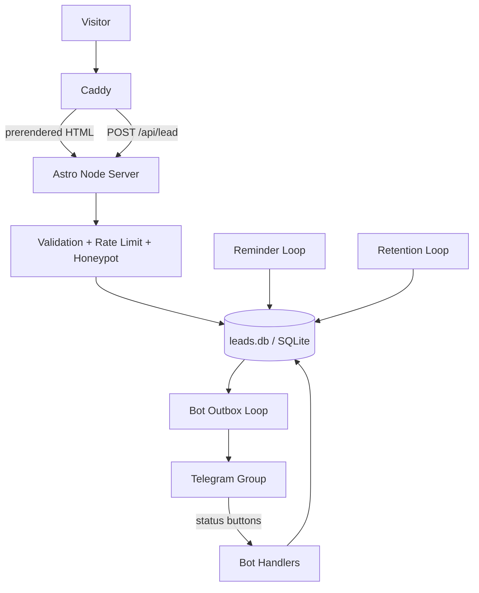

# Water-Well Drilling Company Site

A marketing site for a regional water-well drilling company, delivered as a deployable stack: static Astro front end, a lead pipeline that cannot drop an enquiry, and a Python Telegram bot that delivers leads and tracks what happens to them afterwards.

---

## Overview

The brief was an ordinary one — a brochure site for a service business, with a form that gets enquiries to the owner. The interesting constraints were the ones around it: the client is not a developer, the site had to be handed over in a state they could fill in themselves, and a lost enquiry is a lost job, so the form had to be more trustworthy than "we posted it to an API and hoped".

What was delivered is three containers behind `docker compose up -d`. Caddy terminates TLS and serves the cache and security headers; an Astro server serves prerendered HTML and one dynamic route; a Python bot delivers leads into a Telegram group and gives the team status buttons under each one. The site is in Russian and every string, price, and phone number lives in `src/config/` — no copy is hardcoded in a component.

Finished and handed over.

---

## Engineering Summary

The decision the whole project turns on is that **the website never talks to Telegram**. It validates a lead, writes it to SQLite, and tells the visitor it arrived. Everything after that — delivery, retries, status tracking, reminders — belongs to the bot, which reads the same database file from its own container.

That split was a response to a real failure mode in the earlier design, where the site sent the message inside the request handler: when Telegram was unavailable, the only surviving copy of the enquiry was a line on stderr in a container that rotates its logs, and the visitor got an honest but useless "please call us instead". Under the current design a failed send is just a row with `notified_at IS NULL`, and the bot keeps trying. The success message shown to the visitor becomes true the moment the row commits, which is the only point at which it *is* true.

Three properties fall out of that boundary for free: the web container has no bot token, so compromising it cannot post as the bot; Telegram's latency and availability are entirely outside the form's response path; and the lead history outlives the chat.

The other half of the work is the handover. The site ships with blank values on purpose — a blank renders as a visible dashed marker naming the field to fill, not as an empty string, and every build prints a checklist of what remains.

---

## Key Features

* Static generation for every page; `prerender = false` on exactly one route, `/api/lead`
* Durable lead pipeline — SQLite as the handover point between two services in two languages
* Telegram bot with per-lead status buttons (picked up, reached, contract, refused), `/stats`, `/today`, `/pending`, CSV export, and reminders about leads nobody touched
* Retry with exponential backoff (5s → 5min), flood-control handling, and a parked-lead state that stops a permanently undeliverable lead from blocking the queue
* Five-layer form protection, no external service: honeypot, minimum fill time, per-IP rate limit, shared client/server validation, HTML escaping at the point of sending
* CSP with per-bundle hashes, plus HSTS, `X-Frame-Options`, `Permissions-Policy`, COOP/CORP
* All client content and copy centralized in `src/config/`, with a post-build report of what's still blank
* Self-hosted subsetted Cyrillic fonts, three hand-written client scripts, no JS framework
* Retention: IP and User-Agent aged out separately from the business record
* `docker compose up -d` works with no `.env` at all — every variable has a working default
* An end-to-end smoke script that verifies the deployed stack through the proxy, and runs in CI

---

## Technical Stack

**Site**
Astro 7 (`output: 'static'` + `@astrojs/node` standalone adapter), TypeScript at `strictest`, Tailwind CSS 4 with tokens in `@theme`

**Storage**
SQLite via `node:sqlite` — built into Node, nothing to compile or keep patched

**Bot**
Python 3.13, aiogram 3

**Proxy**
Caddy 2 — automatic HTTPS, HTTP/3, compression, cache and security headers

**Testing**
Vitest (site), pytest (bot), plus `scripts/smoke.sh` against the running stack

**CI**
GitHub Actions — lint/typecheck/test with coverage, production build, bot lint/mypy/pytest, and a compose smoke job

---

## Architecture

Three containers on one bridge network, sharing one named volume. Caddy is the only thing published to the host; the Node server is reachable only from inside. Both application containers run with `read_only: true`, `no-new-privileges`, and a tmpfs for the one path each needs to write.

The site owns the schema — it creates the table and applies migrations, because the side that creates the row is the natural owner. The bot contains no DDL at all; on startup it verifies that the columns it depends on are present and turns a version mismatch into a clear startup error instead of a query failing at three in the morning.

It also *waits* for the table rather than requiring it. On a freshly deployed site the table doesn't exist until the first visitor submits the form, which could be a week — so the bot polls indefinitely, refreshing its heartbeat while it waits so that "waiting" reports as healthy rather than as a hung container.

---

## Interesting Engineering Decisions

**A file as the service boundary, not an API.** The two services meet at a SQLite file on a shared volume, opened in WAL mode with a busy timeout on both sides. There is no queue broker, no HTTP call between them, and no shared library. The practical benefit is that the bot's language is a free choice — it can be whatever the person maintaining it knows, because the contract is a table, not a client. At the volume of a regional company this isn't close to a limit.

**A partial index for the question the outbox actually asks.** The delivery loop scans every few seconds asking for rows where `notified_at IS NULL`, so the index is `ON leads (id) WHERE notified_at IS NULL` — it only ever holds the rows still waiting, which on a healthy system is approximately none.

**Backoff in memory, attempt count on disk.** The retry schedule only matters while the process is alive, and a restart retrying immediately is the behavior you want. The attempt *count* persists, so a lead that genuinely cannot be delivered eventually stops blocking the queue and starts being reported in `/stats` instead. Flood control is treated differently again: `retry_after` is Telegram's problem, not the lead's, so it holds the whole queue without counting an attempt against any individual lead.

**A spam rejection is indistinguishable from a success.** A submission that trips the honeypot or the 2.5-second fill-time floor gets the same 200 and the same confirmation message as a real one, and is silently discarded. A bot that gets a distinct error learns which of its submissions work.

**`X-Real-IP` over `X-Forwarded-For`.** The rate limiter keys on client address, so a client-controllable header is a rate-limit bypass. Caddy *replaces* `X-Real-IP` on every request, which makes it the one header here a client cannot influence; `X-Forwarded-For` is a list proxies append to, so its left-most entry is whatever the client sent. The proxy sets both explicitly rather than relying on a default that could change.

**Build-time vs. runtime configuration, learned the hard way.** Astro's `astro:env` with `access: 'public'` inlines values into the bundle at build time — editing `.env` and restarting does nothing, silently. So anything an operator might want to tune without a rebuild (database path, rate limits) is read from `process.env` at request time instead, and an invalid value is ignored with a warning so a typo can't disable the rate limiter. `PUBLIC_SITE_URL` stays build-time deliberately, because canonical URLs, OpenGraph and the sitemap depend on it.

**One `.env` for the entire repository.** Vite reads it via `envDir: '..'`, Compose reads it from the same place, and the dev server loads it into `process.env` itself. Two near-identical env files in two directories would have drifted within a month.

**CSP from one source only.** Astro computes hashes for its own bundles and emits the policy as a `<meta>` tag; Caddy deliberately sets no CSP header, because two policies intersect and the hashes stop matching. The single deliberate relaxation is `style-src-attr 'unsafe-inline'`, scoped with `kind: 'attribute'` — the geological cross-section, depth scale and calculator position elements through `style` attributes, and a hash cannot cover an attribute. `style-src` itself stays hash-locked and `script-src` is untouched.

**Blanks that are visible rather than empty.** Client values ship unfilled, and an unfilled value renders as a dashed placeholder naming the field. Combined with the post-build report, "what's left to fill in" is answered by the build instead of by reading six config files. Config helpers take their configuration as a defaulted parameter rather than reading a module-level variable, which is what makes it possible to test the behavior of a fully-filled site without having one.

---

## Challenges

**Caddy's `email` directive and the empty-string problem.** Compose passes an unset variable through as an empty string, and to Caddy an empty variable is a *set* variable — so its own `{$VAR:default}` fallback never fires, and an `email` directive with no argument is a syntax error that stops the server. This put Caddy in a restart loop. The fix is to substitute the keyword along with the value: `CADDY_ACME_DIRECTIVE: ${ACME_EMAIL:+email}` expands to `email you@example.com` or to nothing at all. The smoke script now parses the Caddyfile in every state `ACME_EMAIL` can be in.

**A second `Cache-Control` instead of a replaced one.** The Node server sends its own `Cache-Control` on every response, so header rules in the proxy were appending a second, conflicting value — a fingerprinted asset arriving marked both immutable and stale. Caddy's `>` prefix replaces rather than appends; the smoke test asserts exactly one value per route class.

**Proving deployment rather than declaring it.** Both of the failures above happen at startup or at request time, and no build-only CI job can catch either. `scripts/smoke.sh` brings the whole stack up with no `.env` — the zero-setup path a fresh clone gets — and checks routes, redirects, security headers, cache classes, compression, the form up to and including its rate limit, and a lead traveling all the way to a stubbed Telegram API, exactly once. Everything is checked through the proxy, never against Node directly, because the proxy is where the properties being asserted actually live.

**Contrast without a muted grey.** The palette was measured against WCAG AA on every page, and any grey light enough to read as secondary on this background fails 4.5:1. So there is no muted grey in the design system — secondary text is expressed through size and weight instead. Similarly, ochre needed two shades: one dark enough to sit under white text, one dark enough to *be* text on white. A single shade cannot do both.

---

## Reliability

The failure modes were enumerated deliberately, and each has a defined outcome:

* **Telegram down or erroring** — attempts increment, the reason is recorded, the next try is backed off. The lead is undelivered, not lost.
* **Flood control** — the whole queue slows; no lead is penalized for it.
* **A lead that never sends** — after `BOT_MAX_ATTEMPTS` it stops holding up the queue and is reported as stuck. It is still in the database.
* **Bot not configured** — the site keeps accepting and storing leads. The backlog delivers as soon as a token appears.
* **Disk not writable** — the only remaining way to lose a lead. The visitor gets an honest 503 telling them to call, and the name and phone go to stderr so they can be recovered by hand.

A token without a chat ID is treated as a normal intermediate state rather than an error, because answering `/id` in the group is how the operator obtains the chat ID in the first place. The bot runs, answers `/id`, and holds the leads.

---

## Security Considerations

* The web container holds no Telegram credentials at all — the token exists only in the bot container, so a compromised front end cannot post as the bot
* Both application containers run read-only with `no-new-privileges`; only the leads volume and a tmpfs are writable
* The Node server is never published to the host; Caddy is the only ingress, and Caddy's admin API is bound to loopback inside its container
* Request bodies capped at 64KB at the proxy, so an oversized payload is rejected with a 413 before Node buffers or parses it
* Server-side validation is authoritative; the client imports the same module purely for UX
* User input is sanitized (control characters stripped, whitespace collapsed, length capped) on arrival and HTML-escaped again at the point it enters a Telegram message
* Status changes are restricted to the configured chat, optionally narrowed to an admin list; a stranger who finds the bot gets silence
* The privacy policy promised data wouldn't be kept beyond its purpose, and the retention module is what makes that true in code rather than only on the page — IP and User-Agent clear after 30 days by default, while deletion of the lead itself is off by default, because silently destroying a client's business records is a worse default than keeping them

---

## Testing

* 131 test functions — 76 Vitest blocks on the site, 55 pytest functions on the bot — with several parameterized into more cases
* Store tests run against a real SQLite engine in `:memory:`, so every statement the module issues is genuinely executed
* The bot's delivery loop is tested against a `Sender` Protocol that mirrors `Bot.send_message` exactly, rather than a conveniently loose stub that would typecheck here and fail where a real bot is passed
* Python is type-checked with mypy in `strict`, the site with `astro check` against TypeScript's `strictest`
* The compose job builds both images and exercises the deployed stack end to end, across the language boundary — the site writes the lead, the Python bot delivers it to a stubbed Bot API

---

## Lessons Learned

Moving the send out of the request handler is the change I'd make first on any project like this again. It looks like extra machinery — a second service, a shared file, a delivery loop — and it replaces a whole category of "sorry, please call us" with a row that eventually gets delivered. The visitor-facing message becomes honest as a side effect, because the thing it claims (we have your enquiry) is exactly the thing that just happened.

The other lesson is about handover. A site delivered to a non-technical client with `TODO` comments in the source is a site that ships with placeholders in production. Making blanks *visible in the rendered page* and printing the remaining list after every build turned the fill-in step into something with a completion condition, rather than something the client and I would have discovered was incomplete after launch.

---

## Technologies Demonstrated

* Multi-service architecture with an intentionally minimal boundary (a shared SQLite file, not an API)
* Outbox-pattern delivery with backoff, flood-control handling, and dead-letter reporting
* Schema ownership and migration across two languages and two containers
* Static-first frontend architecture with a single dynamic route
* Reverse-proxy configuration: TLS automation, cache classes, security headers, body limits, trusted-header handling
* Container hardening — read-only root filesystems, dropped privilege escalation, no published application ports
* CSP with build-computed hashes, and a scoped, argued exception
* Layered spam prevention without third-party services or a CAPTCHA
* Personal-data retention implemented as code, matching a published privacy policy
* Deployment verification as a CI job, not a README claim
* WCAG AA contrast work with measurement, and the design constraints that follow from it

---

## Suitable Portfolio Categories

Client Work · Backend Engineering · Frontend/Web Engineering · DevOps · Automation
