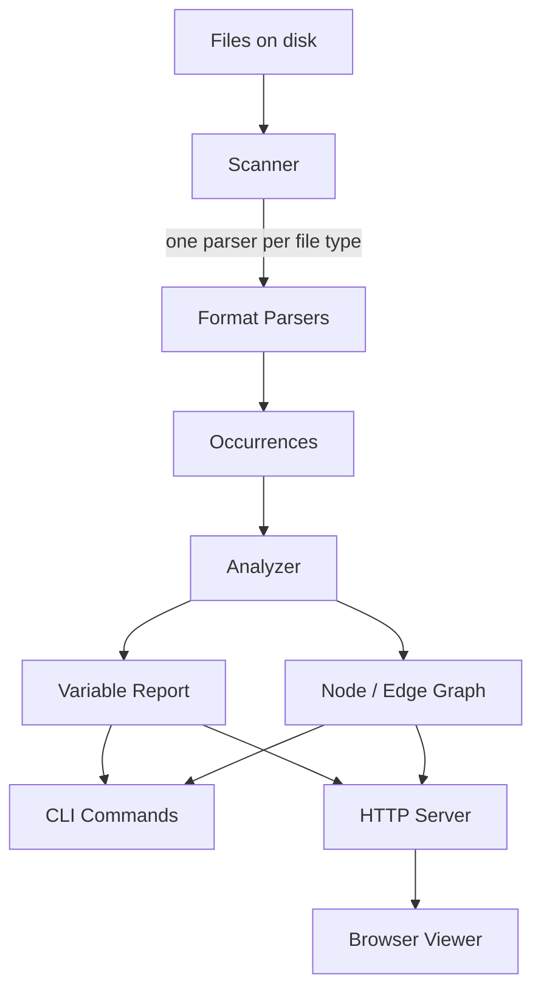

# EnvGraph

A developer tool that reads a project's configuration and shows where every environment variable comes from, where it is passed, and where it is used. Go CLI with an embedded interactive graph viewer. Open-sourced on GitHub under MIT.

---

## Overview

Configuration in a modern project is scattered across places that don't know about each other: a `.env` file, a `docker-compose.yml`, a Dockerfile, a GitHub Actions workflow, and the application code that actually reads the values. Nothing checks that these agree. A variable the code reads but nothing supplies fails at runtime; a variable defined years ago and read by nothing sits in `.env` forever, and neither problem shows up until someone goes looking.

EnvGraph goes looking. It scans a project, parses every configuration source and consumer it recognizes, and folds the result into one verdict per variable — `ok`, `missing`, or `unused` — with exact file and line for each source, each container it is passed into, and each place it is read. `envgraph scan` prints that as text, `envgraph explain DATABASE_URL` traces a single variable end to end, `envgraph check` exits non-zero so CI can gate on it, `envgraph export` writes the graph as JSON, and `envgraph serve` opens the whole thing as an interactive graph in a browser.

The intended user is the person who just cloned a repository and wants to know what it actually needs to run, or the person who has to answer "why is this empty in staging".

---

## Engineering Summary

The interesting part of this project is not the parsing, it's the decision about what counts as supplying a value — and the architecture that keeps that decision in exactly one place.

Parsers deliberately decide nothing. Each one takes a file and reports occurrences: this file mentions `FOO`, in this way, at this line. Whether that makes `FOO` missing, unused, or fine is the analyzer's call. The consequence is that adding a seventh or eighth configuration format touches no resolution logic at all — the design doc spells out the five-step recipe for adding one, and none of the steps are in the analyzer, the graph, the CLI, or the viewer.

The semantic decision underneath is strictness about sources. `DATABASE_URL: ${DATABASE_URL}` in a compose file passes a value along without supplying one, so it does not count as a source. A tool that treats every mention as a definition never reports the bug you actually have. Strictness of that kind normally produces false positives on renames — `DB_HOST: ${POSTGRES_HOST}` genuinely does give the container `DB_HOST` — so the model carries `DerivedFrom`, and the analyzer resolves derived variables to a fixed point: a derived variable is supplied exactly when all of its inputs are, and since one derived variable can feed another, the loop repeats until nothing new resolves, exiting when a cycle stops making progress.

Roughly 3,300 lines of Go against 4,400 lines of tests — 236 test functions, all black-box, every test file in `package foo_test` exercising only the exported API. Two third-party dependencies total.

---

## Key Features

* Seven configuration sources parsed: `.env`, Docker Compose, Dockerfile, GitHub Actions workflows, Go, Python, JavaScript/TypeScript
* One verdict per variable — `ok` / `missing` / `unused` — with file and line for every source, injection, and consumer
* `check` exits with status 1 on a missing variable, so it works as a CI gate; `--strict` fails on unused ones too
* `explain <VAR>` traces one variable end to end, and answers even for variables an ignore rule hides from every other command
* Interactive browser viewer with a live force-directed layout, served from the binary itself
* JSON export with byte-stable output, so a committed `graph.json` diffs meaningfully
* `.envgraph.yml` for per-project ignore and exclude rules, with glob wildcards
* Shell, OS, and CI-runner variables (`PATH`, `HOME`, `GITHUB_*`, `RUNNER_*`, …) ignored by default, because reporting them is noise
* Values redacted by default in JSON, export, and the HTTP API — `.env` files hold credentials

---

## Technical Stack

**Language**
Go 1.26, single binary, `CGO_ENABLED=0`

**CLI**
`spf13/cobra`

**Parsing**
`go/ast` from the standard library for Go source; hand-written parsers for `.env`, Dockerfiles, and shell-style interpolation; `gopkg.in/yaml.v3` for Compose and Actions; regex over sanitized text for Python and JS/TS

**Viewer**
Plain ES modules, vendored Cytoscape.js, a hand-written force simulation, compiled in with `go:embed`

**CI**
GitHub Actions — lint, three-OS test matrix with the race detector, four-platform build matrix, and a dogfooding job

---

## Architecture

Four stages, each depending only on the one before it. The scanner walks the tree and picks a parser per file. Parsers turn one file into occurrences. The analyzer folds occurrences into verdicts and builds the graph. The CLI and the HTTP server are two front ends over the same report.

The data model is three types wide. An `Occurrence` is one mention of one variable in one file, tagged as a `definition` (supplies a value), a `reference` (reads one from elsewhere), or a `consumption` (application code reads it at runtime). A `Service` is a named runtime context that variables flow into. A `Variable` is an occurrence set folded into one verdict.

Modelling Compose services and Actions jobs as the same `Service` type is what made GitHub Actions support cheap: a job receives variables exactly the way a container does, so workflow support needed no new node type and no new edge kind.

Dependencies point one way. The `parser` package imports nothing at all — not even the standard library. `scanner` imports the parsers, `analyzer` imports `scanner` and `graph`, `cli` and `server` sit on top, and only `cmd/envgraph` imports `cli`.

---

## Interesting Engineering Decisions

**Parsers report, the analyzer decides.** This is the whole architecture in one line. A parser that decided "this variable is missing" would need to know about every other file in the project, which would either make parsers stateful or make resolution logic appear in seven places. Keeping parsers to pure `(path, content) → occurrences` functions means each one is independently testable against a string literal, and the resolution rules live in one file.

**`${VAR}` in compose is not a source.** The single most consequential decision in the codebase. It is the difference between a tool that finds the misconfiguration and a tool that agrees with itself. `${PORT:-8080}` *is* a source, because a fallback can never resolve to nothing, and `- DATABASE_URL` on its own is not, because forwarding a host variable is not providing one.

**Derived variables resolve to a fixed point rather than in one pass.** Strictness needs an escape hatch for renames, and the escape hatch needs to chain: `A` may be built from `B`, which is built from `C`. A single pass would resolve `B` and leave `A` wrongly reported as missing. The loop repeats until an iteration resolves nothing new, which also terminates cleanly on a cycle instead of spinning.

**`go/ast` for Go, regex for everything else.** Go gets a real parser because the standard library ships one — it ignores commented-out code, sees through aliased imports (and correctly yields nothing on a blank or dot import), and gives exact positions. Python and JavaScript have no equivalent in Go, so they match text. But JavaScript sanitizes first, in a small hand-written state machine that blanks comments and string bodies while preserving byte offsets and newlines so line numbers stay exact, and tracks template-literal nesting — because `${...}` inside a backtick string is executable code, and a naive regex would either miss real reads or find fake ones inside strings.

**Reading the shell inside `run:` blocks.** A workflow step whose script reads `$DEPLOY_TOKEN` with nothing supplying it is the failure worth catching, because it only surfaces when the job runs. So the workflow parser strips `${{ }}` expressions (GitHub substitutes those before the shell sees them), then reads what's left as shell — while excluding names the script assigns to itself, loops over, or `read`s, since a shell local is not configuration.

**Two dependencies, and no build step but `go build`.** Cobra and yaml.v3. The viewer is plain ES modules plus one vendored Cytoscape file, embedded with `go:embed` — no bundler, no `npm install`, and the binary is self-contained. Every parser stays debuggable with a stack trace.

**Stable output by construction.** Nodes and edges are emitted in sorted order and the graph is a map keyed by ID, so an unchanged project exports byte-identically. That is what makes committing `graph.json` and diffing it worthwhile.

**Parse failures are warnings, not errors.** One malformed compose file becomes an entry in `Result.Errors` and a line on stderr; the rest of the scan proceeds. A tool that aborts on the first bad file hides the whole project.

---

## Challenges

**Deciding what "supplied" means, per format, without special-casing.** Every format has its own way of half-supplying a value: a Dockerfile `ARG VERSION` with no default needs `--build-arg` at build time and therefore is not a source, while `ARG VERSION=1` is; a workflow `KEY: ${{ secrets.KEY }}` *is* a source because GitHub supplies it from outside the repository. Each of these reduces to the same question — would this file alone guarantee the process sees a value? — and the `HasDefault` / `DerivedFrom` / `Origin` fields on `Occurrence` are what let every parser answer it in the same vocabulary.

**Line numbers surviving sanitization.** The JavaScript sanitizer had to produce two views of the source — one with strings kept, one with them blanked — with byte offsets and newlines preserved in both, because `process.env["FOO"]` needs the string contents while `process.env.FOO` must not match inside a comment. Rewriting characters in place rather than deleting them is what keeps reported lines correct.

**Reporting real projects without drowning in noise.** Pointed at an actual repository, a strict checker finds things nobody asked about: a Dockerfile extending `PATH` looks like an unused definition, and committed test fixtures look like broken configuration. The answer was a default ignore list for shell/OS/runner variables plus an `.envgraph.yml` for per-project rules — and EnvGraph ships one of its own, excluding the `examples/` directory whose configuration is deliberately broken.

**Windows.** Paths are made relative to the scan root and converted to forward slashes at the moment of discovery, so everything downstream — locations, graph IDs, `env_file` resolution — is slash-separated by construction rather than by remembering to convert. The test matrix runs on Windows to keep it that way.

---

## The Viewer

`envgraph serve` starts an HTTP server with two JSON endpoints and a static page, and re-scans the project on **every** API request. There is no cache and no file watcher — a scan is fast enough that reloading the page is the entire freshness story.

`web/force.js` is a continuous force simulation: pairwise repulsion, springs along edges, gravity toward the centre of mass, velocity damping. Cytoscape's built-in layouts run once and stop, which makes a dragged node snap rather than pull its neighbours; this one keeps running so the graph reacts to being dragged, and idles once total kinetic energy falls below a threshold instead of burning CPU on a settled graph.

Status is never carried by hue alone — `ok`-green and `missing`-red are nearly indistinguishable under deuteranopia — so each status also carries a glyph and a border treatment.

---

## Security Considerations

* Values are redacted by default everywhere they could leave the terminal: `scan -f json`, `export`, and the HTTP API all strip them unless `--show-values` is passed. `.env` files hold credentials, and the JSON is the thing most likely to be committed or piped somewhere.
* `serve` binds to `127.0.0.1` by default. A configuration map is not something to expose on a LAN by accident.
* CI asserts the redaction rather than trusting it: the dogfooding job boots `serve` against an example project and fails if a known `.env` value appears in `/api/graph` without `--show-values`.
* The tool reads files and never executes anything it finds — no `docker compose config`, no importing Python, no evaluating JavaScript.

---

## Testing

* 236 test functions across 14 files, all black-box — every test file is `package foo_test` and goes through the exported API only
* Per-package unit tests beside each package, end-to-end tests in `tests/`, fixture projects in `examples/`
* CI runs `gofmt`, `go vet`, staticcheck, `go mod tidy` with a diff check, and `go test -race -shuffle=on` with coverage across Ubuntu, macOS, and Windows
* Cross-compilation is verified for linux/amd64, linux/arm64, darwin/arm64, and windows/amd64
* A dogfooding job runs the built binary against its own examples and asserts that `check` **fails** on them — they carry deliberately planted missing and unused variables, so a passing run there means detection has regressed
* The same job runs `envgraph check . --strict` on the repository itself, boots the viewer, and pulls every embedded asset — the viewer is the one part that can only fail at runtime, where the embedded files and the API meet

---

## Lessons Learned

The parser/analyzer split is what made GitHub Actions support tractable. Workflows are the most complicated format in the set — jobs, nested `env:` blocks at three levels, expression syntax, and shell scripts embedded inside them — and adding it meant one new package plus a file-type case in the scanner. Nothing in the analyzer, the graph, the CLI, or the viewer changed, because jobs turned out to be services and the occurrence vocabulary already had a word for everything a workflow does.

The other lesson is that a correctness tool is judged on its false positives. Being strict about what counts as a source is what makes the output worth reading; a checker that treats every mention as a definition never reports the bug you have. But strictness alone, pointed at a real repository, buries the finding under variables the project never wrote — a Dockerfile extending `PATH`, a committed fixture. The default ignore list and `.envgraph.yml` aren't polish on top of the analysis; without them the analysis doesn't get read.

---

## Technologies Demonstrated

* Multi-format static analysis with a pluggable parser architecture
* AST-based analysis with `go/ast`, including import-alias resolution
* A hand-written lexer state machine (comment/string/template-literal sanitization with offset preservation)
* Fixed-point resolution over a dependency graph, with cycle termination
* Graph data modelling with stable, reproducible serialization
* CLI design with Cobra — shared flag sets, testable command execution, meaningful exit codes
* Embedded static assets and a zero-dependency browser front end
* A force-directed layout implemented from scratch
* Black-box test design and a multi-OS, multi-arch CI pipeline with dogfooding

---

## Suitable Portfolio Categories

Backend Engineering · Developer Tooling · Static Analysis · DevOps · Open Source
