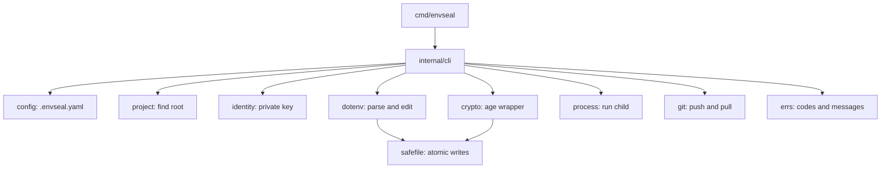

# envseal

Go CLI that encrypts `.env` files so they can live in Git — using age, with no account, no server and no network access. Commit the ciphertext, keep the key on your machine, run your app normally. Open-sourced under MIT.

---

## Overview

`.env` files are the last thing in a project that cannot be committed. So they travel by Slack, get pasted into tickets, drift between machines, and go stale in a password manager nobody updates.

The usual answer is a hosted secrets manager: an account, a subscription, a network dependency, and an outage that stops your team from starting a local server. envseal takes the third option — secrets live in the repository as age ciphertext, encrypted for a list of public keys, and anyone authorized just runs the app.

```bash
envseal keys generate           # once per machine
envseal init                    # set up this project
envseal encrypt .env            # → .env.enc, safe to commit
envseal run -- ./server         # decrypted in memory, never on disk
```

Synchronization happens through Git itself: `envseal push` encrypts, commits and pushes; `envseal pull` fetches, decrypts and summarizes what a teammate changed — by variable name, never by value. There is no server in the middle.

It shares a subject with [EnvGraph](./envgraph.md) — both are tools about environment variables — but from the opposite end: EnvGraph answers *where does this value come from*, envseal answers *how does this value travel safely*.

---

## Engineering Summary

The cryptography is deliberately not the interesting part. All encryption is [age](https://age-encryption.org), and envseal implements none of its own — files stay standard, so `age -d -i ~/.envseal/identity .env.enc` works today and would still work if the project disappeared. The interesting work is resolving what to encrypt and for whom, editing a `.env` without disturbing it, and handing plaintext to a process without letting it touch a disk.

Running through all of it is one invariant: **a secret value never appears in output, logs, or error messages** — and it's enforced by tests rather than by intention. That single rule is visible in the shape of nearly every package, and most of the more unusual decisions in the codebase are downstream of it.

Around 4,550 lines of non-test Go against 5,039 lines of tests — 237 test functions plus two fuzz targets with committed crash corpus — all black-box, every test file in `package <pkg>_test` driving the exported API. CI runs the suite on Linux, macOS and Windows, with gofmt and `go mod tidy` drift checks and `govulncheck`.

---

## The Invariant, Traced Through the Code

The rule is "secrets never printed". Here is what it actually costs, module by module.

**`errs` carries paths, line numbers and names — never values.** Every failure is a typed error holding an exit code, a summary, an optional explanation, and a list of things to check. The decrypt path distinguishes *not encrypted for you* from *this file is damaged* and offers different remedies for each, without either message quoting a byte of the file.

**`identity.String()` returns the public key.** The obvious footgun in a type holding private material is that something eventually prints it — a debug log, a `%v`, a wrapped error. Making the stringer return the *public* half means the accident is harmless by default. Parse failures never echo their input either.

**`rotate` has no `--value` flag.** Deliberately: a secret passed on the command line lands in shell history and is visible to anyone who can run `ps`. The value is typed without echo, or generated, or piped in on stdin.

**`diff` and `pull` report names only.** An encrypted change becomes reviewable without becoming readable — `+ STRIPE_WEBHOOK_SECRET`, `~ DATABASE_URL`, `- OLD_API_KEY`. That's enough to review a pull request and not enough to leak one.

**`syncstate` stores a SHA-256, not content.** To tell an untouched file from one you edited by hand, envseal records what it last wrote — as a hash, under the home directory rather than in the project, so a repository is never modified to hold bookkeeping and the record is useless for recovering what it describes.

**Commands that touch secrets are tested for their absence.** The contributing guide makes it a rule: if a command handles a secret, assert it does not appear in its output. The invariant holds because the suite would fail, not because everyone remembers.

---

## Key Features

* `.env` files encrypted with age to ASCII armor, so Git treats them as ordinary diffable text
* Per-project recipient list in `.envseal.yaml` — add or remove people by public key
* `run` decrypts in memory and executes a child process with the environment; plaintext never hits disk
* `push` / `pull` synchronize through Git, with no server anywhere
* `rotate` replaces one variable's value in memory, leaving every other byte of the file intact
* `diff` shows what changed by name; `check` validates the project and catches committed plaintext
* `status` and both validators emit `--json` and meaningful exit codes, so CI can gate on them
* `init` writes the `.gitignore` rules, including the `!*.enc` negation that people forget
* Identity resolution from `--identity`, `ENVSEAL_IDENTITY` (path *or* key material), then `~/.envseal/identity`
* Shell completion for bash, zsh, fish and powershell

---

## Technical Stack

**Language**
Go 1.26, statically linked, no runtime dependencies

**Cryptography**
`filippo.io/age` — nothing hand-rolled

**CLI**
`spf13/cobra`, `golang.org/x/term` for no-echo input

**Config**
`gopkg.in/yaml.v3`, with unknown fields rejected

**Distribution**
goreleaser, Homebrew tap, GHCR image, GitHub Action

---

## Architecture

A CLI in front of age, with dependencies pointing one way — `cli` uses everything, leaf packages use only `errs` and `safefile`, and nothing imports `cli`.



`envseal run` is the path that matters most: find the project, load config, read the encrypted file, resolve the identity, decrypt, parse, compose the parent environment with the decrypted one, **clear the plaintext**, then start the child and exit with its code.

**Path handling is settled once.** A shared workspace resolver means explicit path arguments are relative to your working directory while paths from configuration are relative to the project root — decided in one place rather than per command, which is exactly the kind of inconsistency that otherwise accumulates one command at a time.

**Project discovery stops at a `.git` boundary**, so walking up to find `.envseal.yaml` can never escape into an unrelated parent project.

---

## Interesting Engineering Decisions

**The `.env` editor works on byte spans.** Each parsed entry records the byte range of its *value*, so `Set` rewrites only those bytes. Comments, ordering, blank lines, spacing and the quoting of every other variable survive by construction — not because a renderer tries faithfully to reproduce them, which is the usual approach and the usual source of spurious diffs. `export KEY = old # note` becomes `export KEY = new # note`, and the file keeps its original bytes everywhere else.

**Quoting keeps the author's style when it still works.** The renderer picks the quoting a value *needs*, but prefers the style the entry already had, so rotating a secret doesn't churn a file with unnecessary changes.

**Two edge cases that only come from real use.** A NUL in a value is rejected outright, because the operating system marks the end of an environment value with one — writing it would produce a sealed file nothing could read back. And when an empty value is followed by a comment (`KEY= # note`), the new value needs a space injected before it, or it glues onto the `#` and swallows the comment into the value.

**Atomic writes, with the exposure stated.** Every writer goes through one function that writes to a temporary file *in the destination directory* — never a shared location like `/tmp` — created `0600`, widened to the target mode only after the content is written, then renamed. The package documentation says plainly that atomic replacement means decrypted content briefly exists under a second name, and bounds what that costs: owner-only, removed on every error path, and only an uncatchable kill between write and rename can leave it behind. Naming the residual risk is more useful than a claim that there isn't one.

**The child runs in its own process group.** So it never receives a terminal signal directly; everything reaches it through envseal's forwarder. That keeps the exit code accurate — including reporting a signal death correctly — and platform differences are isolated behind four functions with `_unix` and `_windows` implementations.

**Exit codes are public API.** Six of them, documented: configuration, encryption, identity, process, git, general. Scripts depend on them, so they don't change — and `envseal run` returns the child's own code, using a deliberately silent error type to carry that status out without printing anything.

**`push` refuses to be clever.** It shows what it will do and asks first, refuses outright if your plaintext `.env` is tracked by Git, and commits **only** the files it manages — so unrelated staged work is never swept into a secrets commit. That last constraint is the difference between a tool you trust with `git commit` and one you don't.

**`init` writes the `.gitignore` rule people get wrong.** A `.env.*` ignore silently swallows `.env.enc` itself, so the generated rules include the `!*.enc` negation. The tool fixes the trap rather than documenting it.

**Config validation is strict in both directions.** Unknown YAML fields are rejected rather than ignored, and the check keeping a configured `file:` path inside the project is written to hold on every platform, not just the one running it.

---

## Distribution

A CLI nobody can install is a CLI nobody uses, so packaging is treated as part of the product.

Releases are built with goreleaser: statically linked binaries for Linux, macOS and Windows on amd64 and arm64, published with a `checksums.txt` the README shows you how to verify. There's a Homebrew tap for the common case, `go install` for Go users, and a container image on GHCR for CI that names an image — with the caveat spelled out that `envseal run` starts a child process, so on your own machine you want the binary rather than the image.

The GitHub Action is its own component, with install and annotation scripts: it fetches a checksum-verified binary, validates the project, and annotates failures directly on the pull request. `ENVSEAL_IDENTITY` accepts either a path or the key material itself, specifically so CI never has to write a temporary key file.

A changelog is maintained alongside it, and the docs include a release procedure.

---

## Security Considerations

* All encryption is age; envseal implements no cryptography of its own, and produces standard files with no lock-in
* Private key material never escapes its type — the stringer returns the public key, parse errors never echo input
* Errors carry paths, line numbers and names, never values, and tests assert secret-handling commands don't print secrets
* Plaintext is cleared from memory after being composed into the child's environment
* Atomic writes are `0600` until written, in the destination directory, with the residual window documented
* Secrets are never accepted as command-line arguments — no-echo prompt, generation, or stdin only
* CI identities are recommended to be dedicated rather than personal, and `ENVSEAL_IDENTITY` takes key material directly to avoid temp files

**What it does not protect against**, stated plainly in the project's own docs: malware or anything else running as you, since it can read your identity file; a stolen unlocked device; a leaked private key, which opens everything it was a recipient of, forever; other processes on the machine reading the child's environment; and compromised CI, which by definition holds a key.

And the property that surprises people most: **removing a recipient does not un-share what they already have.** Their copy of the old `.env.enc` still opens with their key, and Git history keeps it forever. Rotation controls *future* encryptions — to truly revoke access, the secret has to be changed at its source. A secrets tool that didn't say this out loud would be the more dangerous product.

---

## Testing

* 237 test functions across 5,039 lines — more test code than application code
* All black-box: every test file is `package <pkg>_test`, exercising only the exported API. The stated rule is that if something needs testing but is unreachable from outside, the API is wrong
* Two fuzz targets on the `.env` parser and its `Set` operation, with crash corpus committed — the right tool for a byte-level editor whose whole promise is that it doesn't corrupt your file
* CLI commands are driven through the real entry point with buffers, so output and exit codes are tested as users see them
* CI on Linux, macOS and Windows with the race detector, plus gofmt and `go mod tidy` drift checks and `govulncheck`

---

## Lessons Learned

The byte-span editor is the piece I'd reuse. The instinct when you need to change one value in a structured text file is to parse it into a model and render it back — and that quietly rewrites everything, so the diff for "I changed one secret" touches the whole file and reviewers stop reading them. Recording where each value *is* and rewriting only that range makes preservation a property of the design rather than a quality of the renderer, and it's the difference between a rotate command people trust and one they check afterwards.

The other lesson is that one invariant, stated as a sentence and enforced by tests, shapes more code than a long list of guidelines. "Secrets never printed" is why the identity type stringifies to its public half, why `rotate` has no `--value` flag, why errors carry names instead of values, and why the sync record is a hash. None of those were separate decisions.

---

## Technologies Demonstrated

* CLI design with Cobra — subcommands, shell completion, `--json` output, exit codes as a stable interface
* Applied cryptography *usage* — age recipients, armored output, identity resolution, without hand-rolling primitives
* Byte-preserving parsing and editing of a text format, with fuzz testing
* Atomic file writes with permission sequencing and documented residual risk
* Cross-platform process control — process groups, signal forwarding, accurate exit-code propagation
* Git integration for a synchronization workflow with strict commit scoping
* Error design as a subsystem: typed errors, exit codes, actionable remediation
* Release engineering — goreleaser, checksummed multi-platform binaries, Homebrew tap, container image
* CI tooling as a shipped artifact — a published GitHub Action with checksum verification and PR annotation
* Black-box test design and multi-OS CI with vulnerability scanning

---

## Suitable Portfolio Categories

Backend Engineering · Security · Developer Tooling · DevOps · Open Source
