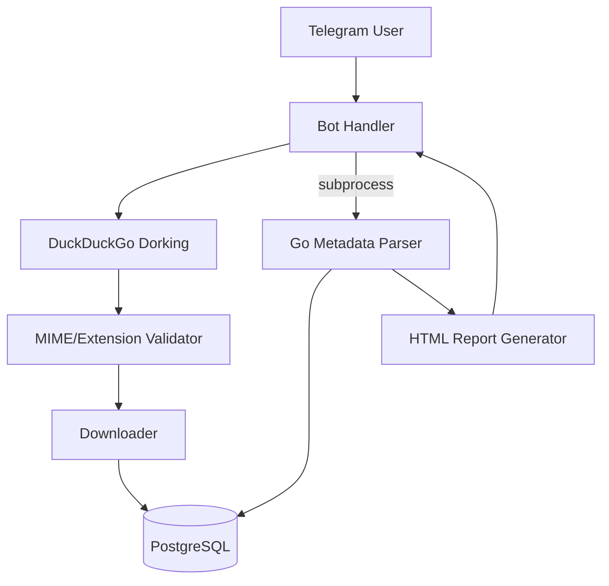

# ExifDork

An OSINT tool for discovering publicly indexed documents on a target domain and extracting hidden metadata from them, controlled via a Telegram bot. Not finished — development is currently paused.

---

## Overview

ExifDork automates a specific OSINT technique: search engine dorking (`site:domain filetype:pdf`, etc.) to find documents a company has published and search engines have indexed, downloading them, and extracting embedded metadata (author names, usernames, software versions, internal file paths, creation timestamps) that documents routinely leak without anyone noticing. This kind of metadata has real reconnaissance value — it can reveal employee names, internal software, and organizational structure well beyond what's on the page itself.

The intended interface is a Telegram bot: send a domain, get back an HTML report of every document found and what metadata was extracted from it. A single-file mode (upload one document, get its metadata immediately) is present in the code but not implemented.

This project is unfinished and paused rather than abandoned outright — it's included here because the architecture and the parts that are done demonstrate real engineering, even though the product isn't complete.

---

## Engineering Summary

The project splits along the same lines as other work in this portfolio: Python handles I/O-bound orchestration (search, downloading, the Telegram bot, database writes), and Go handles the CPU-bound analysis step (metadata extraction across PDF/OOXML/ODF formats, plus an `exiftool` wrapper for broader format coverage, and report generation), invoked as a subprocess once documents are ready. What's built is functional end-to-end for the domain-scan path — search, download, validate, extract, report — with real safeguards (MIME/extension filtering, size limits, worker-pool concurrency) already in place despite the project not being finished.

---

## Key Features

* Search-engine dorking across configurable file extensions to discover publicly indexed documents
* Download pipeline with MIME-type whitelisting, extension blacklisting, and file size limits before anything is saved to disk
* Deduplication against previously processed URLs via a Postgres-backed registry
* Metadata extraction for PDF, DOCX/XLSX/PPTX (OOXML), and ODT/ODS/ODP (ODF) formats, parsed directly rather than through a heavyweight dependency
* `exiftool` integration for broader format coverage on a single-file basis
* Concurrent worker-pool metadata extraction in Go
* HTML report generation, delivered back through the Telegram bot
* An explicit compliance/acceptable-use policy scoping the tool to publicly accessible information

---

## Technical Stack

**Bot / Orchestration**
Python, `aiogram` (Telegram), `aiohttp`, `asyncpg`

**Search**
DuckDuckGo search (`ddgs`)

**Analysis**
Go — direct OOXML/ODF/PDF metadata parsing, `exiftool` subprocess wrapper

**Database**
PostgreSQL

**Infrastructure**
Docker

---

## Architecture

A user sends a domain to the Telegram bot. The Python side runs a search across a configured list of file extensions, validates each discovered URL against a MIME/extension policy, downloads what passes, and registers it in Postgres — deduplicating against anything already processed. Once downloads finish, Python shells out to a separate Go binary, which pulls the queue of downloaded files from Postgres, extracts metadata across a worker pool, writes results back to the database, and renders the final HTML report. The bot picks the report back up and sends it to the user.

---

## Interesting Engineering Decisions

**Validating before downloading, not after.** The validator checks file extension against a blacklist before a request is even made, then checks `Content-Type` and `Content-Length` headers before the body is read — rejecting oversized or wrong-type files without downloading them fully first. Cheap checks run before expensive ones.

**Direct XML parsing over a general-purpose document library.** OOXML and ODF formats are both just zip archives with a predictable metadata XML file inside (`docProps/core.xml`, `meta.xml`). Reading that file directly, rather than pulling in a full document-parsing library, keeps the dependency footprint small for a job that's genuinely simple once you know where the data lives.

**Subprocess handoff between Python and Go, once per domain scan.** Unlike Stinger's persistent worker-pool pattern, this project spawns the Go binary once per domain scan rather than keeping it running — a reasonable choice here, since metadata extraction happens once per batch of downloaded files rather than needing a live per-request loop.

---

## Reliability

URL registration against Postgres happens before download, so a URL already seen (successfully or not) isn't reprocessed. Failed downloads and failed metadata extractions are marked explicitly in the database rather than silently dropped, so a scan's outcome is auditable after the fact.

---

## Security Considerations

* MIME-type whitelist and extension blacklist applied before any file is downloaded
* File size capped before download completes, based on the `Content-Length` header
* The project ships an explicit compliance/acceptable-use policy scoping it to publicly accessible information and prohibiting use for unauthorized access, doxxing, or privacy violations — worth noting since a tool like this can be misused, and the intent here is stated plainly rather than left ambiguous

---

## What's Missing

This is genuinely unfinished, and it's worth being direct about what isn't there: the single-file upload handler in the Telegram bot is a stub (`# TODO: Service for the single file metadata scan`) with no implementation behind it. There's no test suite. Error handling around the Go subprocess handoff is present but minimal. Development is currently paused rather than continuing.

---

## Lessons Learned

The direct-XML-parsing approach for OOXML/ODF metadata (reading the known internal file out of the zip rather than reaching for a document library) is a pattern worth remembering — most structured document formats are more inspectable than they first appear, and a full parsing library is often more than the actual problem needs.

---

## Technologies Demonstrated

* OSINT reconnaissance technique automation (search dorking)
* Cross-language subprocess orchestration (Python ↔ Go)
* File validation and safe download handling
* Structured document format parsing (OOXML, ODF, PDF metadata)
* Telegram bot development
* PostgreSQL-backed deduplication and job tracking

---

## Suitable Portfolio Categories

OSINT Tooling · Backend Engineering · Automation