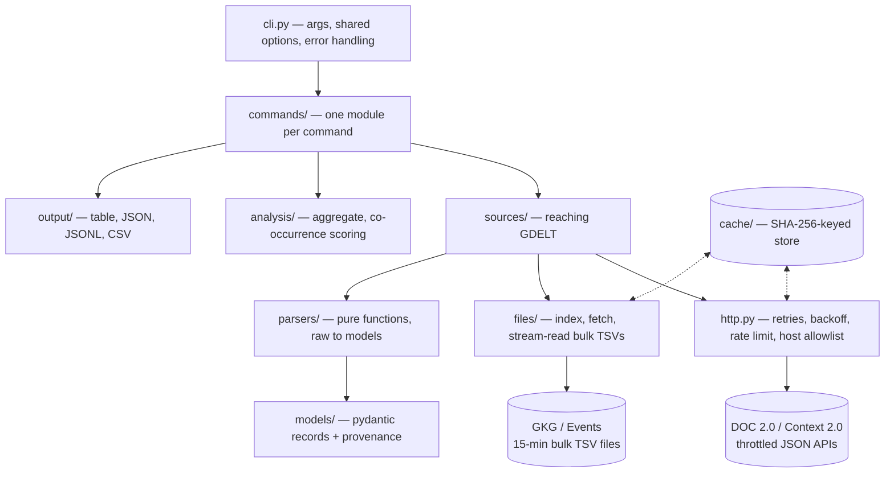

# gdeltx

A command-line tool that puts one consistent interface over GDELT — the world news-monitoring project that publishes its data as several very different, uneven things: rate-limited JSON query APIs with short coverage windows, and bulk tab-separated files with no query engine at all. Open-sourced on GitHub under MIT.

---

## Overview

GDELT is a genuinely valuable OSINT data source — worldwide news coverage, entities, structured events, geography — but using it directly means learning four unrelated interfaces, each with its own limits and its own way of failing quietly. `gdeltx` normalizes all of it behind eight commands (`search`, `context`, `entities`, `events`, `sources`, `timeline`, `related`, `geo`), caches everything, and prints a readable table or clean JSON/JSONL/CSV for `jq`, DuckDB, or pandas.

The project's stated philosophy is not to make GDELT look more reliable than it is: coverage limits are surfaced as warnings rather than silently truncated, a GDELT "mention" is never presented as a verified fact, and co-occurrence is always labeled as co-occurrence, never causation. That same honesty extends to the tool's own status — the README marks it alpha, pre-PyPI, install-from-source only.

**A real caveat worth stating plainly:** GDELT's DOC 2.0 query API (the endpoint behind `search`) is, in practice, unreliable to the point of being the tool's biggest limitation. Verifying this project meant actually running it against the live API, and `search` was rate-limited (HTTP 429) on essentially every attempt, even from a single client making one request every several seconds — well within GDELT's own stated limit. The project's own fixture-capture script (`scripts/capture-fixtures.sh`) documents the same experience: it retries a 429 once with a 60-second pause and renames the file `.FAILED` if that also fails, and two of the checked-in test fixtures are exactly that — failed captures, with synthetic fixtures substituted so the test suite doesn't depend on GDELT being reachable at all. The bulk-file-backed commands (`entities`, `events`, `related`, `geo`, and the GKG side of `sources`/`timeline`) hit a different, unthrottled static file host and are, by contrast, reliably fast — this is a GDELT API limitation specific to the DOC query endpoint, not a gap in gdeltx's own handling of it, which does correctly retry, back off, and surface GDELT's own rate-limit message with a clean exit code rather than hanging or returning an empty result.

---

## Engineering Summary

The architecture's central move is treating "GDELT" as two genuinely different systems rather than one API with quirks. Query endpoints (DOC 2.0, Context 2.0) get a shared `HttpClient` with one `RateLimiter`, capped exponential backoff with jitter, and — a detail worth calling out — explicit handling for the fact that GDELT sometimes reports an error as HTTP 200 with a short plain-text body instead of a real error status; `Fetched.json()` distinguishes that case from a genuine parse failure or an empty result. Bulk files (GKG, Events) get an entirely separate path: a 15-minute time-slot index, a bounded thread pool that downloads out of order but yields files back in time order, and a streaming pre-filter that never parses a row's columns unless a plain-text substring match already found the query in it.

The result is byte-identical, deterministic output — every ranking has a full tie-break, floats are rounded before sorting so summation order can't reorder results, and 478 tests pass with zero network access (a `conftest.py` fixture makes any real socket connection fail a test outright; all HTTP is mocked with `respx` against captured or synthetic fixtures). I verified the whole thing myself: `ruff check`, `ruff format --check`, and the full test suite all pass clean, and I ran the actual CLI against live GDELT to see the throttling firsthand.

---

## Key Features

* Eight commands over four underlying GDELT data sources, normalized to one CLI shape
* Table, JSON, JSONL, and CSV output, with `--geojson` for `geo` — data goes to stdout only, every diagnostic goes to stderr
* Every JSON export carries provenance (`query`, `endpoint`, `retrieved_at`, `parameters`, `cached`), so a result set can be reproduced or audited later
* A two-tier cache: short-TTL for API responses, permanent (size-capped, LRU-evicted) for bulk files that never change once published
* `related` scores co-occurrence with Jaccard overlap rather than raw counts, so ubiquitous names like "United States" don't top every result
* Coverage limits are enforced and explained, not silently applied — `--allow-large` is required to read past a bulk-file safety threshold
* Rich, sysexits-style exit codes (`64` bad input, `70` upstream failure, `75` rate limited, `78` bad config) instead of a bare non-zero
* A strict host allowlist enforced as an HTTP request hook, so it also covers redirects — nothing gdeltx does can reach a non-GDELT host

---

## Technical Stack

**Language**
Python 3.14

**CLI**
Typer + Rich

**Validation / models**
Pydantic v2, permissive (`extra="allow"`) records

**HTTP**
`httpx`, mocked in tests with `respx`

**Testing**
pytest, 478 tests, no network access permitted during the run

---

## Architecture

Dependencies point one way — `parsers/` and `models/` do no I/O at all, `analysis/` is deterministic counting with no I/O either, and only `sources/` ever touches the network. `related` is a nice example of the split paying off: it reads the same bulk files twice, once to collect articles naming the query and once to count how common each candidate entity is across the whole file set (which is what its score normalizes against) — and because the first pass already cached the files, the second pass touches disk, not the network.

---

## Interesting Engineering Decisions

**A shared `RateLimiter` and retry policy, used by every query-API call — no source module rolls its own.** `sources/http.py` is the only place a 429, a 5xx, a timeout, or a connection error gets retried, with capped exponential backoff plus jitter, and honoring GDELT's own `Retry-After` header when present. This is exactly what made verifying the rate-limiting behavior straightforward: the failure I hit against the live API was one clean, well-formed `RateLimitError` with GDELT's own explanation text attached, not a hang or a stack trace.

**Treating an HTTP 200 with a one-line plain-text body as an error.** GDELT sometimes reports a query rejection as a successful response containing a short non-JSON string. `Fetched.json()` checks for exactly this shape (short body, doesn't start with `{`, `[`, or `<`) and raises `APIError` with GDELT's own message, rather than either crashing on the JSON parse or — worse — silently returning nothing and looking like a query with zero results.

**Bulk files are matched before they're parsed.** `readers.py` pre-filters raw TSV lines with a case-insensitive substring check before splitting them into columns at all, so a file with no mention of the query costs a scan, not tens of thousands of field-parses. The match is then re-checked against the *right* field (names or page title for GKG, actor names for Events) so a query that happens to appear inside a URL doesn't produce a false positive.

**Provenance travels with every result, not just the data.** `RequestMeta` — query, endpoint, retrieval time, the exact parameters or file range used, and whether the cache answered — rides along in JSON and GeoJSON output specifically so an exported result set can be reproduced or defended later, which matters for anything used as evidence in an investigation rather than just a quick lookup.

**Determinism is enforced, not assumed.** Every ranked output has a full tie-break chain (count, then case-folded name, then name) instead of relying on dict or set ordering, and scores are rounded before sorting so floating-point summation order can never flip two results relative to each other. Identical input produces byte-identical output — a property the test suite actually checks rather than takes on faith.

**Security by narrow contract, not by scanning for bad input.** No module imports `subprocess` or calls `eval`/`exec`/`os.system`, and a dedicated test enforces it. The host allowlist runs as an `httpx` request hook, which means it also fires on every redirect hop — a compromised or misconfigured redirect can't quietly send a request somewhere that isn't GDELT. Cache keys must be SHA-256 digests, so user query text never becomes a filesystem path.

---

## The GDELT reliability problem

This is worth its own section because it's the single biggest thing to know before relying on this tool for anything time-sensitive.

GDELT's own documented limit is one DOC API request every 5 seconds. In practice, hitting `search` from a fresh client produced a `429` on the first request and every retry after it — four attempts, full backoff, still refused, exiting cleanly with code `75` and GDELT's own message pointing users toward the ngrams dataset for high-traffic use instead. The project's `docs/configuration.md` already documents this exact experience ("the DOC article list is refused far more readily than timelines or Context, even at 6 seconds' spacing") and the fixture-capture script bakes in a single 60-second retry specifically because the endpoint needed it during development. Two of the checked-in test fixtures are literal casualties of this — `doc_artlist.json.FAILED` and `geo_pointdata.geojson.FAILED` — with synthetic replacements substituted so the test suite's correctness doesn't depend on GDELT's mood that day.

The practical takeaway, and the one gdeltx's own docs already give: `search` and the DOC side of `sources`/`timeline` are the contended, unreliable path, while `entities`, `events`, `related`, `geo`, and the GKG side of `sources`/`timeline` — everything that reads GDELT's static bulk files instead of its query API — worked immediately and consistently when I tested them, no throttling encountered. If a workflow can be built on the bulk-file commands instead of `search`, it will be dramatically more reliable in practice.

---

## Security Considerations

* HTTP traffic is restricted to `api.gdeltproject.org` and `data.gdeltproject.org` over HTTPS only, enforced as a request hook that also covers redirects
* Cache keys are SHA-256 digests of the request; arbitrary input never reaches the filesystem, and eviction only ever touches files with that exact naming
* No credentials of any kind are required or stored
* No shell execution anywhere in the codebase — enforced by a dedicated test, not just a convention
* The only files gdeltx ever writes are its own cache entries

---

## Testing

* 478 tests, all passing, zero network access permitted during a run (a `conftest.py` fixture fails any real socket connection)
* HTTP is mocked with `respx` against fixtures that are either captured live responses or, where capture failed (see above), synthetic replacements
* `tests/test_workflow.py` runs full investigations through `main()`, checking every command's stdout/stderr separation, exit codes, and flag behavior end to end
* `tests/test_hardening.py` covers process-level behavior that needs a real subprocess: broken pipes, `python -m gdeltx`, and streaming memory bounds — measured, not assumed

---

## Lessons Learned

The most transferable lesson here isn't in the code, it's in the project's posture toward an upstream dependency that doesn't behave: rather than treating GDELT's inconsistency as a bug to eventually fix, the docs, the fixture-capture tooling, and the CLI's own error messages all treat it as a known, load-bearing fact of the environment. A `.FAILED` fixture isn't hidden or deleted, it's a visible record of what actually happened, with a synthetic stand-in that keeps the test suite meaningful anyway. That's a more honest and more maintainable response than either ignoring the flakiness or over-engineering retry logic to paper over an API that GDELT itself asks high-traffic users to stop hitting.

The other lesson is architectural: splitting "GDELT" into two source types with genuinely different reliability, pacing, and parsing models — rather than one client class with branches — is what made it possible to be honest about the query API's problems without that unreliability leaking into the (perfectly solid) bulk-file commands.

---

## Technologies Demonstrated

* Multi-source API integration with fundamentally different reliability, pacing, and data-shape characteristics unified behind one interface
* Rate limiting, capped exponential backoff with jitter, and `Retry-After`-aware retry logic
* Streaming, memory-bounded processing of large compressed bulk files with a pre-filter to avoid unnecessary parsing
* Deterministic, byte-stable CLI output design (JSON/JSONL/CSV) with reproducibility metadata
* Jaccard-based co-occurrence scoring to counter frequency bias in entity ranking
* Security-conscious HTTP design: host allowlisting via request hooks, hash-based cache keys, no shell surface
* Fully network-free test suite design (478 tests) using recorded and synthetic fixtures

---

## Suitable Portfolio Categories

OSINT Tooling · Backend Engineering · CLI Design · Data Engineering · Open Source
