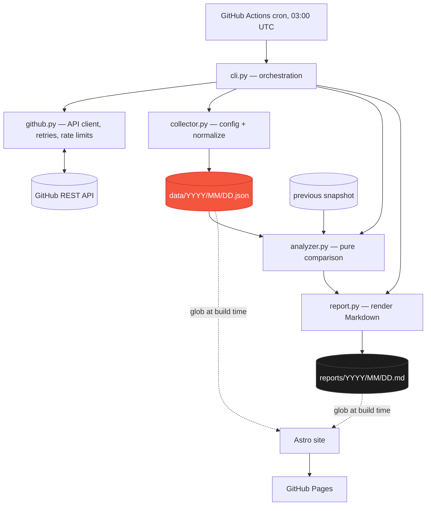

# ghistory

A daily, permanent record of how the GitHub ecosystem changes — a scheduled Python collector that commits its own dataset back to git, paired with an Astro site that browses it. Live at [peacexf.github.io/ghistory](https://peacexf.github.io/ghistory/). Open-sourced on GitHub under MIT.

---

## Overview

GitHub only shows the present. A repository has some star count today; what it had six months ago is gone unless something wrote it down at the time. ghistory writes it down. Every day at 03:00 UTC it fetches metadata and releases for 72 hand-picked repositories, compares the result against the previous day, renders a short human-readable report on what moved, and commits both the raw observation and the report back to the repository itself.

There is no database and no server. The git repository *is* the storage layer: `data/YYYY/MM/DD.json` is one immutable snapshot per day, `reports/YYYY/MM/DD.md` is the diff against the day before rendered as Markdown, and a companion Astro site reads both directly at build time to produce a browsable calendar and report archive. The entire project is built around one idea: a daily automated job that is trustworthy enough to run unattended for a long time, because if it silently gets a day wrong there is no way to go back and re-observe it.

---

## Engineering Summary

The whole codebase reads as a document written by someone who thought hard about failure before writing the success path. The four-stage pipeline (collect → analyze → render → write) is a clean pure/impure split — `analyzer.py` takes two snapshots and produces an `Analysis` with no I/O and no knowledge of the GitHub API, so the comparison logic is testable without a network at all. But the real engineering is in the guarantees layered around that pipeline: writes are atomic, a snapshot is never partially written or silently overwritten, a failure in one repository never aborts the other 71, and a day where nothing could be collected writes no file rather than a misleading one. 143 tests back this up, and the docs (`docs/architecture.md`, `docs/data-format.md`) spell out every one of those guarantees in plain language rather than leaving them implicit in the code.

The frontend follows the same philosophy the collector does: it has no database of its own either. It's an Astro content collection that globs `data/*.json` and `reports/*.md` straight from the repository at build time — the exact same "the files are the source of truth, nothing is duplicated" approach this portfolio site itself uses.

---

## Key Features

* Daily snapshot of 72 repositories' stars, forks, open issues, watchers, license, topics, and releases, via GitHub Actions cron
* Immutable, append-only history — a file is written once and never silently corrected
* Per-repository failure isolation: one 404 or rate-limit doesn't cost the other 71 repositories that day
* A day where nothing could be collected writes no file at all, rather than recording a false zero
* Byte-stable JSON output (sorted keys, sorted entries) so a diff only ever shows real change
* Human-readable Markdown report generated per day: top growth, new releases, archived/renamed/relicensed repositories, language spread, and an explicit list of anything that failed to collect
* `--report-only` rebuilds any report from stored snapshots with zero API calls; `--repair` is the only sanctioned way to overwrite a day
* Rename-safe history: a repository is tracked by its original slug, and GitHub's redirect keeps the join key working across a rename or transfer
* Astro site reading the dataset directly — GitHub-style contribution heatmap calendar, monthly report groupings, no separate data layer

---

## Technical Stack

**Language**
Python 3.14 (collector), TypeScript/Astro (site)

**Dependencies**
`requests` — the collector's only runtime dependency

**Storage**
Flat JSON + Markdown files in the git repository itself; no database

**Automation**
GitHub Actions — a daily cron job that collects and commits, and a separate Pages deploy triggered by changes to `data/`, `reports/`, or `site/`

**Tooling**
`uv` for dependency management, `ruff` + `mypy` + `pytest` in CI

---

## Architecture

Dependencies run one way: `analyzer.py` never imports `github.py`, so the comparison logic can be exercised in tests without an HTTP layer in sight, and `report.py` receives a finished `Analysis` object and makes no decisions of its own about what's interesting.

A run itself is order-sensitive at the very end: the snapshot is written to disk before the report is. The snapshot is the irreplaceable artifact — a report can always be regenerated later with `--report-only`; an observation missed at 03:00 UTC is gone for good, since GitHub exposes no historical star counts to backfill from.

---

## Interesting Engineering Decisions

**The commit is the write-ahead log, and the run is idempotent by construction.** Before making a single API call, the CLI checks whether that date's snapshot file already exists — if so it exits 0 and touches nothing. Re-running the workflow, or triggering it manually after a transient failure, is always safe. The only way to overwrite an existing day is the explicit `--repair` flag.

**Missing is never zero.** A repository that fails to fetch is stored as `{"slug": ..., "status": "error", "error": "not_found"}` with no metric keys present at all — not `stars: 0`, not `stars: null`. The same rule applies one level down: if metadata succeeds but the releases call fails, `releases` is *absent*, not `[]`. An empty list and a failed fetch mean different things, and collapsing them would make an outage indistinguishable from a repository that genuinely shipped nothing.

**A day that collects nothing writes nothing.** `status` can be `complete`, `partial`, or `failed` in the schema, but `failed` snapshots are never written to disk — the run exits non-zero instead. This closes the one failure mode that would otherwise be catastrophic for a dataset whose entire value is being trustworthy: a botched run recorded as a real day where every repository lost every star.

**Atomic writes, always.** `storage.write_atomic` writes to a temp file in the destination directory, `chmod`s it to `0644` (since `mkstemp` defaults to `0600`), and `os.replace`s it into place. A crash mid-write leaves the previous file — or no file — untouched; there is never a window where a half-written snapshot could be read.

**Rate limiting is anticipated, not just retried around.** The client tracks `x-ratelimit-remaining` from every response and refuses to send the *next* request at all once it hits zero and the reset time hasn't passed — rather than firing off the remaining ~60 requests just to collect ~60 more 403s. A `Retry-After` header under 60 seconds is waited out inline; anything longer, or a bare 403 with no such header, fails that repository immediately and moves on, so a rate-limited run still finishes in seconds with the rest of the day marked `rate_limit` instead of hanging.

**A corrupt yesterday can't take down today.** If the previous day's snapshot fails to parse, the run logs a warning, still writes today's observation, and produces a report with no comparison section. Losing a comparison is a cosmetic downgrade; losing the day's data because an old file rotted would not be.

**Unknown config keys are a hard error.** `settings.json` rejects any key it doesn't recognize instead of silently ignoring it. A typo like `max_release_per_repository` (missing the plural) would otherwise leave you believing a setting is active while the collector quietly runs on the default — exactly the kind of drift a project that has to be trusted unattended can't afford.

**Two files a day, not one.** Splitting the machine-readable snapshot from the human-readable report — rather than rendering the report from a template embedded in one JSON blob — is what makes `--report-only` possible at all: the report is fully derived and disposable, so the format can be redesigned or a broken render fixed retroactively, without touching a single byte of the actual observations.

---

## Reliability & Data Integrity

The project's own documentation states its guarantees as literal invariants, and the test suite (143 tests across collector, analyzer, GitHub client, CLI, and report rendering) exists largely to hold them:

* **One snapshot per date, ever**, short-circuited before any network call
* **Per-repository failure isolation** — a 404 or malformed payload fails one entry, the run continues
* **Total failure writes nothing** — see above
* **Snapshots are immutable** outside of an explicit `--repair`, which is a deliberate overwrite, not a correction
* **Byte-stable output** — sorted keys, sorted entries, two-space indent — so two runs over identical data produce identical bytes and a diff only ever shows real change

Operationally, the daily workflow fixes its observation date once at job start and reuses it for the commit message, so a run that happens to cross midnight UTC can't label the file one day and the commit another. And because the daily commit is itself repository activity, the collector keeps its own GitHub Actions cron schedule alive — scheduled workflows on public repos are disabled after 60 days of inactivity, so a healthy collector is self-sustaining by the same mechanism that would reveal a broken one.

---

## The Website

The Astro site at [peacexf.github.io/ghistory](https://peacexf.github.io/ghistory/) has no backend and no API of its own — its content collections (`content.config.ts`) glob `data/*.json` and `reports/*.md` directly from the repository at build time, validated against a Zod schema. Adding a day to the dataset means the next Pages build picks it up automatically; nothing is duplicated or hand-synced between the collector and the site.

The homepage renders a GitHub-contribution-style heatmap calendar (`buildCalendar` in `site/src/lib/calendar.ts`) bucketed into five levels by each day's total star movement, alongside monthly groupings of the generated reports. A separate Pages deploy workflow triggers only on changes under `site/`, `data/`, or `reports/`, so a day's commit from the collector republishes the site automatically.

---

## Lessons Learned

The clearest lesson is that for a dataset whose whole value is "this happened and it's permanent," the failure modes worth engineering around aren't the ones that crash loudly — they're the ones that would silently write something plausible-but-wrong. A rate-limited run that recorded every repository at 0 stars, or a race that half-wrote a snapshot, would be far worse than a run that fails outright, because a loud failure can be re-run and a quiet lie becomes permanent history. Most of the design — atomic writes, per-repository error isolation, "failed" snapshots never touching disk, missing fields staying absent instead of defaulting to zero — traces back to that one asymmetry.

The other is how far "the repository is the database" goes as an architecture once you commit to it fully: no server to keep running, no separate schema migration story, and the frontend gets to be a static site builder reading the same files a `jq` one-liner in the README can already query.

---

## Technologies Demonstrated

* Scheduled batch job design with idempotency and atomic-write guarantees
* Defensive HTTP client design: retry/backoff policy, rate-limit budgeting, and per-status-code error classification against a real third-party API
* Pure-function comparison logic decoupled from I/O, enabling network-free tests
* Schema design for an append-only, versioned dataset meant to be queried directly with `jq`
* GitHub Actions automation: scheduled workflows, workflow-to-commit pipelines, and a content-triggered Pages deploy
* Astro content collections consuming external data at build time with runtime schema validation

---

## Suitable Portfolio Categories

Backend Engineering · Automation · Data Engineering · DevOps · Open Source
