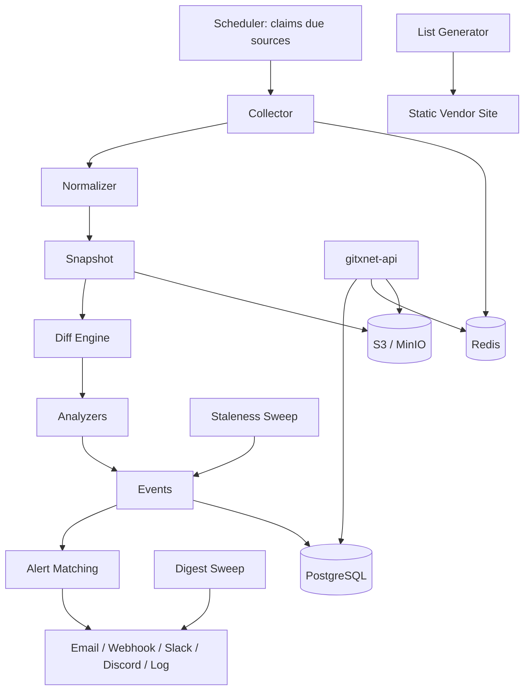

# GitXNet

An event platform for the public web — it watches the interfaces a business depends on but does not control (API descriptions, documentation, changelogs, legal and policy pages), preserves their history, and turns the differences into events a person can act on *and verify*. Go backend, ~46,000 lines. Pre-release.

---

## The Idea

Every product depends on interfaces it does not own.

A payment provider adds a value to an enum. A cloud provider withdraws a response field. An identity provider changes an authentication scheme. A vendor deprecates an endpoint with six months' notice, in a changelog nobody reads. A subprocessor list gains a company your DPA obliges you to notice. Terms change on a page you last read when you signed.

Most of these are discovered when something breaks — in production, in an audit, or in a renewal negotiation. Not because the information was secret: all of it was published. It was published *somewhere*, in a format nobody diffs, on a schedule nobody tracks.

GitXNet is built on the position that this is an observation problem with a verification problem sitting on top of it, and that the second one is what actually decides whether the product is worth anything. Detecting a change is not hard. Detecting it in a way the recipient can *check* — here is the document, here is the block that changed, here is what it said before, here is how sure we are and why — is what separates an alert someone reads from an alert someone filters into a folder.

That belief shows up as a rule the codebase enforces rather than aspires to:

> **The crawler is infrastructure. The intelligence is the product.**

And underneath it, a second one that constrains everything: *a claim never carries more authority than the source it came from.*

The current wedge is API descriptions, because that is where the evidence is strongest and the audience is sharpest. But the architecture is deliberately a platform rather than an application — watching legal documents, subprocessor lists, pricing pages, or security advisories means adding a normalizer for a new document shape and an analyzer for what its changes mean. Nothing else in the pipeline changes, because every stage downstream operates on normalized content and event drafts, never on the format they came from. Several of those directions are designed and not yet built; the write-up below is explicit about which is which.

---

## The Evidence Ladder

Vendors publish evidence of very different strengths, and coverage and precision pull in opposite directions across them. GitXNet models that explicitly rather than flattening it.

| Rung | Source | Confidence ceiling | What it can support |
| --- | --- | --- | --- |
| `spec` | OpenAPI / Swagger description | **0.99** | Exact, field-level claims derived by rule |
| `changelog` | The vendor's own feed or release notes | **0.80** | What the vendor said, in prose, quoted |
| `docs` | Documentation pages | **0.60** | Broadest coverage, weakest evidence |

The ceiling is not advisory. Analyzers produce drafts; the registry that runs them stamps and caps them, so a prose heuristic can never present itself with the authority of a schema comparison. Three rules live there rather than in each implementation: confidence is capped by the rung, drafts below the configured floor are dropped rather than stored, and identity fields are stamped from the input so an analyzer cannot attribute an event to the wrong target. One deliberate refinement — an *unset* confidence is not filled in with the ceiling, because "the analyzer didn't say" and "the analyzer was certain" must not collapse into the same number.

The ladder exists because of a measured fact, not an intuition: most vendors are watchable long before they are diffable. The platform's language reflects that distinction rather than rounding up — the API reports which one you have.

---

## What It Detects

**39 event types** across three groups. The vocabulary is deliberately operation- and field-level, because *"the spec changed"* is not actionable and *"a required field was added to `POST /v1/charges`"* is.

**Interface changes (29 types)** — the product. Operations added, removed, deprecated. Parameters added, removed, made required or optional. Request and response fields appearing and disappearing. Type changes, enum values in both directions, schemas added, removed and renamed. Security scheme changes, server changes, spec version changes, API versions published, APIs deprecated. And on the prose rungs: changelog entries published, documentation updated, breaking changes announced, deprecations announced.

**Source health (5 types)** — `source_unreachable`, `source_recovered`, `source_stale`, `source_unparseable`, `source_moved`. These report *GitXNet's own coverage failing* rather than a vendor changing, and they are delivered by default. The argument for them is sharp: "we may no longer be watching this for you" is the one thing no other vendor can tell a customer, and a monitor that broke silently is worse than no monitor at all.

**Pipeline bookkeeping (5 types)** — collection, snapshot and unchanged-content records, filtered out by default but available.

### Impact is three-valued

Fourteen types are *capable* of breaking a caller, but whether a specific change did depends on which side of the contract it sits on — and the detector decides that, authoritatively.

An enum value added to a **request** is safe: the API now accepts more than before. The same value added to a **response** is risky: a strict reader has no branch for it. A field removed is breaking on either side, for different reasons — strict servers reject an unknown request field, and callers read a response field that is gone.

Collapsing that into a boolean destroys the precision the product sells, and the project measured the cost: against five months of a real payments API, treating every compatibility risk as a break turned **78 alerts into 178** — mostly a vendor routinely adding payment-method values. That is exactly the volume that trains someone to ignore a channel.

---

## Engineering Summary

Roughly **31,400 lines of non-test Go against 14,500 lines of tests, with 486 test functions**, across 27 internal packages and four binaries. PostgreSQL for metadata, events and accounts; Redis for queues and rate limits; S3 or MinIO for immutable snapshot bodies; Prometheus and OpenTelemetry throughout.

The system is a queue-driven pipeline with clock-driven sweeps beside it, and the correctness story rests on two properties held everywhere:

**Delivery is at-least-once, so every stage is idempotent by construction** — and each stage's idempotency key is chosen and documented rather than hoped for. Collect keys on the observation's own identifier, so a replayed fetch records one attempt. Process keys on `observation_id UNIQUE`, so reprocessing cannot create a second version. Diff keys on the snapshot pair, so there is one comparison per pair, ever. Classify keys on an **event fingerprint derived from the claim itself**, so replaying a diff writes one event. Deliver keys on `(subscription_id, event_id)`, so a subscription is alerted once. Collecting the same unchanged document twice produces no second version and no duplicate events.

**History is immutable, enforced by the database.** `observations`, `snapshots`, `events` and `entities` carry an append-only trigger that raises an exception on `UPDATE` or `DELETE` — `gitxnet: UPDATE on events is forbidden: history is immutable` — rather than trusting every future writer to remember. Diffs are derived and may be pruned; snapshots and events may not. In a product whose value is the ability to prove what a document said on a date, that is not a nice-to-have.

---

## Architecture

Four commands share one dependency-assembly package: `gitxnet-api` serves the HTTP surface and never collects or classifies; `gitxnet-worker` runs the pipeline stages and, by default, the scheduler and both sweeps; `gitxnetctl` is the operator CLI (`migrate`, `vendor`, `source`, `collect`, `events`, `diff`); and a list generator writes the public vendor catalogue as static JSON.

The pipeline stages are queue-driven and scale by adding processes. The scheduler, staleness sweep and digest sweep are clock-driven and ride in one worker — they are not queue consumers because nothing arrives to trigger them, which for staleness is precisely the point.

**The queue has two interchangeable transports.** Redis for deployment, in-process for tests and single-process development, with identical semantics: at-least-once delivery, delayed republication, dead-lettering. That is what makes a full end-to-end pipeline test possible without infrastructure.

**Retry policy lives in exactly one place.** The worker is the only component that knows about retries, concurrency and message lifetimes. Stage handlers receive a decoded job and return an error; whether that error means "try again in a minute" or "this will never work" is decided once, rather than in four handlers with four different ideas about backoff. Nothing is dropped silently — a job that exhausts its retries goes to the dead-letter queue with the reason attached.

---

## The Pipeline, Stage by Stage

### Scheduling

The scheduler decides what is due and **leases the row**, so several instances can run at once without duplicating work: a target claimed by one is invisible to the others until its lease expires. A publish that fails releases the claim immediately rather than leaving the target invisible until the lease runs out — the kind of detail that only matters during an incident, which is when it matters most.

Per-host spacing is honoured across sources, so a vendor publishing twenty documents is polled politely rather than twenty times at once.

### Collection

Collection is the platform's only outbound behaviour, and it is deliberately unremarkable: an honest user-agent, GET only, robots.txt consulted before every fetch, one document per request. Nothing works around an access control and nothing pretends to be a browser. A source that does not want to be read is **recorded as blocked and reported as a coverage gap**, which is more useful to a customer than a number obtained by evasion.

The one piece of real engineering here is conditional requests. Measurement found 83% of published API descriptions honour an ETag or Last-Modified validator, and the median description is over a megabyte — so sending the validator turns almost every poll into a header exchange rather than a download. A `304` ends the cycle with no body and no work. That is what makes frequent observation affordable for the platform *and* for the hosts being observed.

Small hardening throughout: robots.txt reads are capped (a robots.txt larger than half a megabyte is not a robots.txt, and reading it would be a denial of service on yourself), and a missing robots file is treated as permissive rather than prohibitive, since refusing to collect because a file is absent would be stricter than the standard.

### Normalization

**Normalization is what makes everything downstream possible.** Seven normalizers reduce a document to one canonical shape, so a vendor reformatting their JSON is not a change and a reserialised description hashes identically to the original.

| Normalizer | Serves | Approach |
| --- | --- | --- |
| OpenAPI | `openapi` | Parsed into a dialect-independent interface model |
| JSON | `json` | Flattened to JSON pointers; key order is not change |
| HTML | `html` | DOM-path blocks with semantic sections |
| Feed | `rss`, `xml` | Atom/RSS entries keyed by identity, not position |
| Markdown | `markdown` | Heading-path blocks |
| Text | `text`, `sitemap`, `robots` | Fallback for anything unregistered |
| Listing | `listing` | A directory of published versions, for publishers who never edit a release |

The HTML normalizer carries the clearest justification. It parses markup rather than stripping tags with expressions, because the *section* a block sits in carries most of the interpretive weight — an edit in navigation is routine, an edit in a changelog entry is news, and only document structure can tell them apart. And the cost of not doing this was measured: byte-level comparison of documentation pages produced **fifty-seven changes in twenty minutes** against two on the description rung, almost all of it per-request nonces, rotating asset URLs and build identifiers.

A snapshot is written **only when normalized content differs**. Unchanged content ends the cycle.

### Diffing

The diff engine states facts and never opinions. *"The block at `schemas/Charge` changed from X to Y"* is a fact; *"Stripe broke the Charge type"* is an interpretation and belongs to the next stage. Keeping them apart is what makes an event explainable — every published claim traces back to a mechanical comparison a sceptical reader can repeat.

Comparison works on **blocks with stable addresses** assigned by the normalizer, not on lines or bytes. A section inserted at the top of a document does not renumber everything below it, which is the exact failure mode that makes line diffs useless for monitoring.

Two considered details: the itemised change list is capped at 500 (one document in the measured sample carries over sixteen thousand operations, and a release touching all of them produces a list nobody will read) while the **statistics stay exact** and a flag records that itemisation was truncated. And each change is weighted by its share of the total edit, so a one-word fix does not read like a rewrite.

Move detection is optional per comparison — worth doing for prose, where content genuinely relocates, and pointless for keyed structures, where the address *is* the identity.

### The API-Spec Engine

OpenAPI 3 and Swagger 2 are parsed into one dialect-independent interface model and compared field by field, which is where the field-level event vocabulary comes from. Each structural change carries its own evidence by construction — the location it happened at and the values on either side — so nothing downstream has to re-derive why a change was reported. Request/response direction is modelled explicitly, which is what makes three-valued impact possible, and schema renames are detected rather than reported as an unrelated removal and addition.

### Classification

This is where the platform stops describing and starts claiming, so the stage is deliberately narrow: assemble what the analyzers need, run them, mint the events they imply, hand each new one to delivery. Judgement lives in the analyzers; bookkeeping lives in the stage.

**Analyzers are registered, not hard-wired.** Watching a new kind of source — a version registry, a deprecation table, a status feed, a subprocessor list — means writing one implementation and registering it. Nothing else changes, because everything downstream consumes a domain event draft.

**Every event carries five things without exception**: a timestamp, its evidence, a confidence, its source, and a payload. That is enforced in the domain type, so an event missing any of them fails validation and is never persisted — a constraint that makes "alert without evidence" unrepresentable rather than discouraged.

### Alerting

A channel formats and sends; it never decides. Whether an event deserves an alert is settled before delivery runs, by the subscription's own filters — a channel that started making judgements would put the same rule in two places and guarantee they diverge.

Every payload carries the event's evidence, and the package documentation says why in one line: a customer who receives *"the receipt_url field was removed from the Charge response"* should be able to check it against the vendor's own document without asking anyone. **An alert that omits its evidence is asking to be trusted instead.**

Five channels — email, webhook, Slack, Discord, log — plus per-subscription delivery history and on-demand test sends, because a delivery integration nobody can test is one nobody trusts.

The digest sweep is the second half of alert-fatigue control. Deduplication already suppresses repeats of one claim; digest handles *distinct* claims a customer would rather read together than be interrupted by twenty times. Delivery records a match and stops; the sweep collects what accumulated and sends one message.

### Source Health and Staleness

The staleness detector answers the failure a monitoring product cannot afford: a monitor that broke without saying so, leaving the customer believing they are covered. No other stage can see it, because every other stage is driven by something arriving — and here, nothing arriving *is* the signal.

It judges each source against **its own history** rather than a global threshold: a source polled monthly is not blind because it was last collected a week ago. The defaults are deliberately reluctant, and the reasoning is stated in the domain type — a missed report means a customer learns late about a monitor that was already broken, a false one means they stop believing the next, and those costs are not symmetric. Three conditions each rule out a different way of being wrong: too little history to know the cadence, a source nobody is successfully collecting at all, and silence that has not yet beaten the source's own record by a margin.

Even then the claim is capped: a source genuinely can go quiet for a year and be healthy, so no amount of silence earns certainty.

---

## Accounts, Tenancy and Metering

The commercial model drove one genuinely interesting architectural decision.

**The corpus is deliberately not tenanted.** GitXNet observes public documents, so one collection of a vendor's description serves every customer. Giving each organization its own copy would multiply cost for no gain — and worse, would make the same real-world change produce a different event identifier per customer, which breaks deduplication, comparison and any claim to a shared factual record.

What *is* tenanted is the relationship to that corpus: a vendor's history is readable only by an organization watching it, the window is clamped to the plan's history allowance, and the vendor catalogue stays browsable so a customer can see what exists before choosing what to watch. Browsing is free; history is the product.

Plans are expressed as limits rather than as separate code paths — every plan runs the same pipeline and sees the same evidence, and what differs is how much of it an organization may claim. Metering lives in the API layer, where entitlement is checked, rather than being scattered through the domain.

Authentication is session-based with server-side records, argon2id passwords, per-session CSRF and single-use email tokens. Rate limiting moved from an in-process throttle to a Redis-backed one for a reason the package documents plainly: state in one process means an attacker spreading guesses across replicas gains a factor equal to the replica count, and a rolling deploy resets every counter to zero — neither matters with one process and no deploys, both matter the moment there are two. The interface the API consumes did not change, so which backend is in use is a deployment decision rather than a code one.

The public vendor list is generated by a component that **reads and never writes**, and cannot reach anything tenanted — no organization, watchlist, subscription or alert is queried from it. It emits JSON to disk for a static site build, so there is no service to keep up and nothing to attack.

---

## Operations

Configuration comes from the environment and nowhere else, with every setting documented and the ones that must change before deployment marked. Setting the production flag makes the process **refuse to start** with insecure cookies, a non-HTTPS dashboard URL, or the console mail driver — the three misconfigurations that are silent in development and serious in production.

Prometheus metrics and OpenTelemetry tracing run through both the API and the workers, with Grafana dashboards and a Prometheus config committed alongside. Health endpoints, migrations, and a backup path with a *verified restore* rather than an assumed one.

An LLM classifier exists and is **off by default**, under an explicit design rule: GitXNet must work without it, and turning it on changes coverage, not correctness. That is the only defensible place to put a probabilistic component in a product whose value proposition is verifiable claims.

---

## Measurement as Engineering

Two pieces of the project are research rather than product code, and they are what give the design decisions their weight.

**The source census.** A harness probes 100 third-party API vendors — 512 probes, plain HTTP from one ordinary address, no headless browser, no proxy, no evasion, robots.txt consulted before every fetch with denials recorded and never overridden. The findings:

| Measure | Result |
| --- | --- |
| Vendors with a usable machine-readable spec | 58 / 100 |
| — of which genuinely diffable descriptions | 53 |
| Vendors watchable via *some* source | 95 / 100 |
| Specs answering `304` to a conditional GET | 48 / 58 |
| Docs pages readable as plain HTML | 84 / 100 |
| Docs pages that are client-rendered shells | 12 / 100 |
| Probes hitting a bot wall | 25 |
| Probes disallowed by robots.txt | 9 |
| Vendors with no usable source at all | 5 |

The interpretation thresholds were **written down in advance** — a pre-registered "≥70% plain-HTTP fetchable means the economics hold" — so the result could have falsified the plan rather than being read to support it. It also settled the scope question directly: the bot wall that makes a competitor-pricing product uneconomic is not the binding constraint for the API wedge. The census re-runs twice daily as a CI job, so it is a time series rather than a snapshot, and it has its own comparison tool — explicitly described as a prototype of the diff engine's job rather than the diff engine.

**End-to-end verification against real data.** Two real Stripe API descriptions two years apart produce **2,186 events with evidence, 168 of them graded breaking, in about three seconds**. The operator CLI can run a source through the entire pipeline once and print exactly what a deployment would have stored and delivered, and it can diff two descriptions with no database and no network at all — including split descriptions where sibling documents must be supplied per side, because those change too.

---

## Testing

Roughly 14,500 lines of tests and 486 test functions, split across unit suites needing no services, integration suites against real PostgreSQL and Redis, and a full run under the race detector.

Three things about how the suite is built are worth more than the count:

**Integration tests refuse to skip in CI.** They skip locally when no database is configured — a developer without Postgres should see a skip, not a red build — but the CI job *fails if anything skipped*, because a job that tested nothing while reporting success is worse than no job.

**The fakes enforce the real invariants.** They are fakes, not mocks: append-only history, one snapshot per observation, one event per fingerprint. Those invariants are exactly what the pipeline relies on to be safe to replay, and a mock that merely recorded calls would prove nothing about it.

**Every bug fix carries a regression test naming the failure it prevents.**

---

## Design Rules

These are enforced in review, and most appear in the code as comments explaining *why*:

* **Public information only** — no authentication bypass, no credentialed collection, no exploit-based access, no detection evasion
* **History is immutable** — snapshots never overwritten, events never mutated, refused by database triggers rather than by discipline
* **Evidence and confidence are mandatory** on every event
* **Rules over AI** — the LLM classifier is optional and off by default
* **Interfaces belong to consumers** — business logic does not depend on infrastructure
* **Explainability over cleverness** — if a claim cannot be explained to the customer it affects, it should not be made

---

## Status and Licensing

GitXNet is **pre-release**: the pipeline, events, alerting, API, accounts and operations work end to end, while billing, deployment and a handful of smaller features are designed but not finished.

The repository is currently **closed**. The plan described in its own README is open-core: the backend — the entire pipeline, API, storage, alerting and CLI — to be released under **AGPL-3.0**, with the signed-in dashboard and marketing site staying outside that distribution. The API is the complete surface, with nothing reserved for a privileged client, so a self-hosted deployment would be a first-class one. The licence choice has a stated reason: AGPL is what stops a funded competitor taking the pipeline, running it as a service, and keeping their improvements — which is the actual competitive risk, and one a permissive licence would fund.

---

## Lessons Learned

**Confidence is a type, not a number.** The single most useful decision was making the source rung a first-class concept with a ceiling attached, and enforcing the cap centrally in the analyzer registry. Every alternative — trusting analyzers to be modest, tuning per-detector constants, applying the cap at display time — puts the same rule in many places and lets it drift. Making it structural meant a whole class of "the docs page said something and we announced it like a schema change" bugs cannot be written.

**The honest failure is a feature.** Source-health events were not in the original plan; they came from asking what the product does when it stops working. A monitoring service that goes quiet is indistinguishable from a world in which nothing changed, and that ambiguity destroys the customer's trust in every other alert. Building "we may no longer be watching this for you" into the event vocabulary — with the staleness detector deliberately reluctant, and its confidence capped — turned the scariest failure mode into something the product says out loud.

**Normalization is where monitoring products live or die.** Fifty-seven changes in twenty minutes from a documentation page, almost all of it nonces and build IDs, is what a naive implementation ships. Every hour spent on canonical form paid for itself twice: once in noise that never reaches a customer, and once in an unchanged document costing nothing at all downstream.

**Measure before scoping.** The census cost real effort and could have killed the plan. That is exactly why it was worth running before building the thing it justified, and why the thresholds were fixed in advance — a study you interpret after seeing the numbers is not a study.

---

## Technologies Demonstrated

* Distributed pipeline architecture — queue-driven stages, clock-driven sweeps, per-stage idempotency keys under at-least-once delivery
* Database-enforced immutability with append-only triggers, and a schema designed around provenance
* Multi-format document normalization to a canonical, hashable, block-addressed form
* Structural diffing with stable addressing, weighting and bounded itemisation
* OpenAPI 3 / Swagger 2 parsing into a dialect-independent model, with field-level comparison and rename detection
* A graded evidence and confidence model enforced centrally rather than per-implementation
* Distributed scheduling with row leases, per-host politeness and claim release
* Responsible web collection — robots.txt, conditional requests, honest identification, blocked sources reported rather than evaded
* Multi-channel alerting with subscription matching, digesting and delivery proof
* Session authentication, argon2id, CSRF, single-use tokens, and rate limiting that survives replication
* Multi-tenant entitlement over a deliberately shared corpus, with metering
* Production observability — Prometheus, OpenTelemetry, Grafana, health checks, verified backup restore
* Pluggable infrastructure ports (queue, blob storage, mail, rate limiter) with identical semantics across backends
* Empirical research as engineering input — a pre-registered availability census, re-run continuously

---

## Suitable Portfolio Categories

Backend Engineering · Distributed Systems · Data Engineering · API Design · Product Engineering
