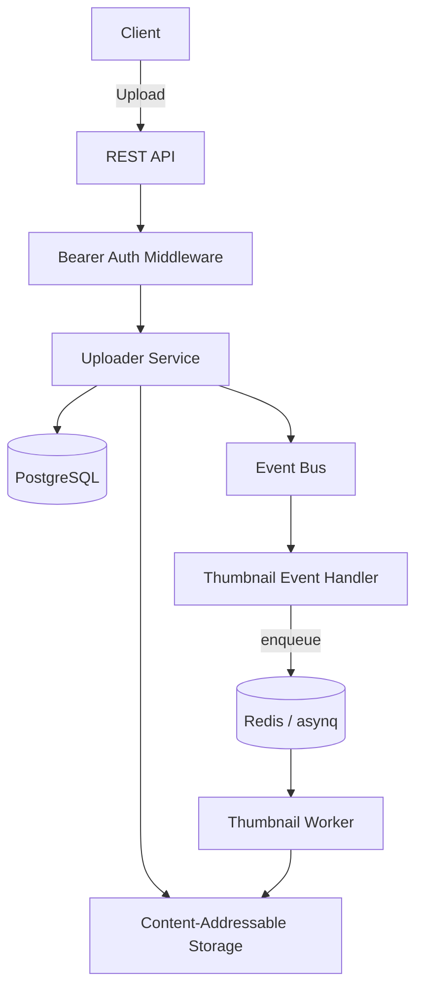

# HostIMG

A backend-first, API-driven storage engine for an image hosting platform — content-addressable storage, deduplication, and async thumbnail processing, built as the core that will eventually power a Telegram bot and other clients.

---

## Overview

HostIMG is the storage core for an image hosting service I'm building: upload a file, it gets hashed and stored once regardless of how many users upload the same content, metadata and ownership are tracked separately from the physical bytes, and expensive work like thumbnail generation happens asynchronously after the upload response has already returned. I designed storage, metadata, and processing as separate concerns from the start rather than one monolithic upload handler, so I can add new processors or swap the physical storage backend later without touching the parts that already work.

This is still in active development. What's built so far is the object storage engine, deduplication, user quota tracking, authentication, and the thumbnail pipeline — a foundation I'm treating as load-bearing, since everything else (albums, tags, search, archive export, and further out, things like OCR and AI tagging) gets built on top of it. I'd rather have a small, correct core than a wide surface of half-working features.

---

## Engineering Summary

The part that's done, I built carefully: content-addressable storage with SHA-256 hashing and a git-style sharded directory layout, atomic writes via temp-file-then-rename, and two separate layers of deduplication — physical files deduplicated by hash at the storage layer, and explicit reference counting at the database layer so per-user storage accounting stays correct even when multiple users share the same underlying file. The upload path is transactional and checks quota both before and after the physical write, cleaning up cleanly if a race is lost. Async work is decoupled from the upload request through a small in-process event bus. I put real effort into testing this — there's roughly as much test code as application code, including integration tests that run against a live Postgres container in CI rather than just mocks.

---

## Key Features

* Content-addressable object storage with automatic deduplication by SHA-256 hash
* Reference-counted storage accounting, decoupled from physical file dedup
* Per-user storage quota enforcement, checked both before and after the physical upload
* Async thumbnail generation (multiple sizes, Lanczos resampling) via a Redis-backed job queue
* Event-bus-based decoupling between upload and post-upload processing
* Bearer-token authenticated REST API
* Database schema and query layer generated via `sqlc` from hand-written SQL, with versioned migrations
* Integration tests run against a real Postgres instance in CI, alongside unit tests with the race detector

Albums, tags, search, archive export, and the storage backend swap to S3 are on the roadmap, not built yet.

---

## Technical Stack

**Backend**
Go, `chi` router

**Database**
PostgreSQL, `sqlc` (generated type-safe queries), `golang-migrate`

**Job Queue**
Redis, `asynq`

**Image Processing**
`disintegration/imaging` (thumbnail generation)

**Infrastructure**
Docker

**CI**
GitHub Actions — lint (gofmt/vet), unit tests with race detector, Postgres-backed integration tests, Docker build verification

---

## Architecture

An upload request hashes the file while streaming it to a temp file, then either finds an existing object with that hash (instant dedup) or moves the temp file into its sharded final location. Within a single database transaction, I upsert the object row (incrementing a reference count), update the user's storage usage only on the object's first reference, and create a per-user file record pointing at the shared hash. Once committed, an `object.uploaded` event fires; a thumbnail handler subscribed to that event enqueues an async job (only for image MIME types) that a separate worker picks up from Redis, generating thumbnails at several sizes and storing each as its own content-addressed object.

---

## Interesting Engineering Decisions

**Storage behind an interface, filesystem implemented first.** I defined the `Storage` interface (`Upload`, `Put`, `Download`, `Delete`, `Exists`) before writing any implementation, and built the filesystem driver first since it's the fastest way to get the rest of the system working end to end. Nothing above that interface depends on it being a filesystem specifically — swapping in an S3-compatible driver later shouldn't require touching the uploader, thumbnail generator, or API layer at all.

**Two separate dedup mechanisms, for two separate problems.** The filesystem layer deduplicates physically — uploading the same bytes twice just finds the existing file by hash and skips the write. I track a separate reference count on `storage_objects` at the database layer, incremented only when a *new* file record references that hash for the first time. This is what keeps per-user storage usage accurate: two users uploading the same image share one physical file, but each still "owns" a file record and neither gets double-charged for the other's copy.

**Quota checked twice, not once.** I check the storage limit before the physical upload (cheap, avoids wasted work for an obviously-over-limit request) and again inside the transaction after the physical write completes (correct, since a concurrent upload could have consumed the remaining quota in between). Losing that second race triggers cleanup of the now-orphaned physical file rather than leaving it dangling.

**A single-subscriber event bus, not a message broker.** For what I need right now — one event type, one handler — an in-process pub/sub is simpler and enough. It's deliberately small infrastructure that I can swap for something heavier later if the number of event types and consumers actually grows, rather than something I built out preemptively.

---

## Challenges

**Keeping per-user accounting correct under content-level deduplication.** Sharing physical storage across users is the whole point of content-addressing, but it means "how much storage does this user have" can't just be the sum of file sizes without double- or under-counting. Reference counting on the storage object, incremented and decremented independently of the per-user file records, is what keeps both numbers correct at once.

**Race conditions on quota enforcement.** Two concurrent uploads near a user's quota limit could both pass an initial check and then both succeed, exceeding the limit. Re-checking inside the transaction after the physical write closes that window — at the cost of occasionally uploading a file physically before discovering it has to be rejected and cleaned up, which I'm fine trading for correctness over a purely optimistic path.

---

## Reliability

* Uploads write to a temp file first and only become visible via an atomic rename, so a crash mid-upload can't leave a partially-written object at its final path
* Database writes for an upload (object upsert, usage update, file record creation) happen in one transaction, rolled back on any failure
* Event handlers are best-effort — a failing subscriber logs and is skipped rather than failing the upload it's reacting to
* CI runs both unit tests (with the race detector) and integration tests against a real Postgres instance, not just an in-memory substitute

---

## Security Considerations

* Authentication is currently a static bearer token plus a caller-supplied user ID header — enough for a trusted internal client (the Telegram bot I'm building this for) calling a backend I control, but not a general-purpose multi-tenant auth scheme, and I'm not presenting it as one
* Uploaded content is hashed and verified against the declared size before being committed to its final location
* No secrets are hardcoded — configuration is environment/config-file driven

---

## Lessons Learned

Separating "does this file exist physically" from "does this user have a right to this much storage" mattered more than I expected once deduplication entered the picture — a naive implementation would either double-count shared files or make deletion unsafe. Getting the reference-counting model right early, before building anything on top of it, made the accounting logic much easier to reason about than retrofitting it later would have been.

---

## Technologies Demonstrated

* Content-addressable storage design
* Deduplication with correct multi-tenant accounting
* Transactional consistency across storage and database layers
* Async job processing decoupled via an event bus
* SQL-first database access (`sqlc`) over an ORM
* Integration testing against real infrastructure in CI

---

## Suitable Portfolio Categories

Backend Engineering · Infrastructure · Distributed Systems · API Design