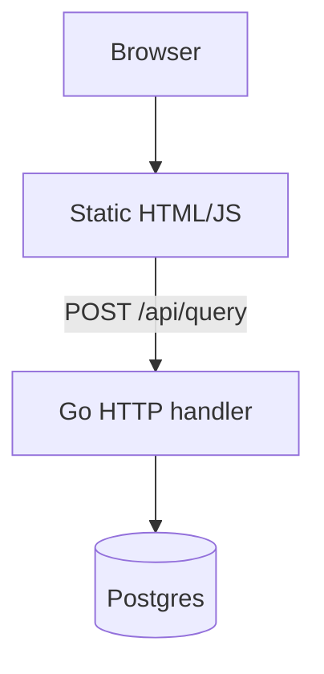

# Go Live SQL

A minimal Go backend that runs raw SQL queries against Postgres and returns the results to a browser UI, built while learning Go.

---

## Overview

A small tool for poking at a Postgres database directly: type a query into a web page, hit run, see the result set rendered as a table. No models, no query builder — the point was to learn Go's `database/sql` package and get comfortable with the language basics, not to build a production tool.

---

## Engineering Summary

This is a first-Go-project scale build: a single `main.go`, one HTTP handler, no dependencies beyond the Postgres driver. It shows the fundamentals — opening a DB connection, handling an HTTP request, decoding JSON, and using Go's reflection-y `interface{}` scanning pattern to return an arbitrary result set as JSON without knowing the schema ahead of time.

---

## Key Features

* Executes arbitrary SQL against Postgres and returns results as JSON
* Column-agnostic result scanning — works against any query without predefined structs
* Static file server + single API endpoint, no framework

---

## Technical Stack

**Backend**
Go, `net/http`, `database/sql`

**Database**
PostgreSQL, via `lib/pq`

**Frontend**
Static HTML/JS, no framework

---

## Architecture

One binary serves the static UI from `/public` and exposes a single `POST /api/query` endpoint. The handler decodes a JSON body containing a raw SQL string, runs it against Postgres, and scans the result set generically — column names and values are pulled out via reflection into a `map[string]interface{}` per row — so the same code path handles `SELECT`, `INSERT`, or any other query shape without per-query types.

---

## Interesting Engineering Decisions

**Generic row scanning over typed structs.** Since the tool needed to run arbitrary queries against an arbitrary schema, there was no fixed result type to scan into. Using `[]interface{}` pointers per column and reading `rows.Columns()` at query time was the simplest way to support any query without generating or hand-writing a struct per table.

**No query validation or restriction.** The SQL string from the request body is passed straight to `db.Query`. That's the entire feature — this is a local, single-user tool for running your own queries, not a service that accepts SQL from anyone else.

---

## Security Considerations

This executes whatever SQL is submitted, with no restriction on statement type. That's fine for a local tool run against your own database, but it is not something to expose on a network — there's no auth, and the "vulnerability" (arbitrary SQL execution) is the feature itself. Worth stating plainly rather than glossing over.

---

## Lessons Learned

This was mostly about getting comfortable with Go's syntax and standard library — `database/sql`, `net/http`, and JSON encoding/decoding — coming from other languages. The generic scanning pattern (`[]interface{}` + `rows.Columns()`) was the one part that took some digging to get right, since Go doesn't have an easy built-in way to scan a row into a map without knowing its shape ahead of time.

---

## Technologies Demonstrated

* Go standard library HTTP servers
* SQL database connectivity from Go
* Generic/reflection-based data handling
* Basic REST-style JSON API design

---

## Suitable Portfolio Categories

Labs · Backend Engineering · Open Source