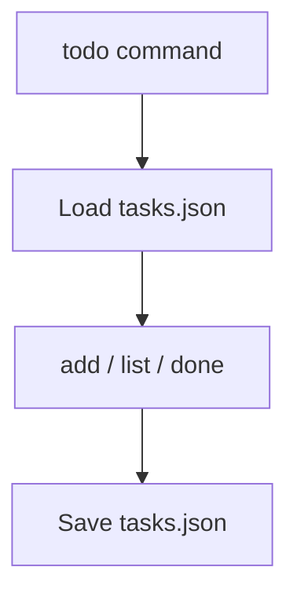

# Go Todo CLI

A small command-line to-do list manager, written to take a break from a harder project.

---

## Overview

A CLI tool for tracking tasks — add, list, mark as done — with everything persisted to a local `tasks.json` file. Built as a quick side exercise while working through a harder problem elsewhere, this is a fundamentals piece rather than a system: no dependencies, one file, plain JSON storage.

---

## Engineering Summary

The whole program is one `main.go` using only Go's standard library — `encoding/json`, `os`, basic string/argument parsing. It demonstrates clean separation between the data layer (`loadTasks`/`saveTasks`) and command handling (`addTask`/`listTasks`/`doneTask`), and straightforward argument-based command dispatch, without reaching for a CLI framework a project this size doesn't need.

---

## Key Features

* Add, list, and complete tasks from the command line
* State persisted to `tasks.json` between runs
* Zero external dependencies

---

## Technical Stack

**Language**
Go (standard library only)

**Storage**
Local JSON file

---

## Architecture

A single binary reads its subcommand (`add`, `list`, `done`) from `os.Args`, loads the current task list from `tasks.json`, applies the requested change, and writes the file back. There's no in-memory server or long-running process — each invocation is a full load-mutate-save cycle.

---

## Interesting Engineering Decisions

**Plain JSON file over a database.** For a single-user local CLI tool, a database would be pure overhead. A flat JSON file is human-readable, trivially portable, and sufficient for the actual scale of the problem — the kind of proportionate choice that matters more as projects get bigger, practiced here on something small.

**Missing-file treated as an empty list, not an error.** `loadTasks` explicitly checks `os.IsNotExist` and returns an empty task list rather than failing, so the first `add` on a fresh checkout works without requiring the user to create `tasks.json` by hand first.

---

## Lessons Learned

This was a small, low-stakes way to reinforce Go basics — file I/O, JSON marshaling, argument parsing — without the pressure of a bigger project's design decisions. Sometimes stepping away to build something this size is a faster way through a harder problem than staring at it directly.

---

## Technologies Demonstrated

* Go standard library file and JSON handling
* CLI argument parsing and command dispatch
* Basic data persistence patterns

---

## Suitable Portfolio Categories

Labs · Backend Engineering · Open Source