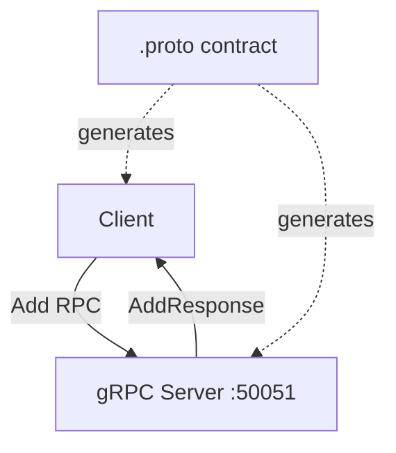

# gRPC Test

A minimal client/server calculator built to learn gRPC and Protocol Buffers.

---

## Overview

A single unary RPC — add two numbers — implemented with a proper `.proto` contract, generated Go bindings, and a real client/server pair talking over gRPC instead of REST. The scope is intentionally tiny: the point wasn't to build anything useful, it was to understand how gRPC's request/response flow, typed contracts, and generated code actually fit together before using the pattern in a larger project.

---

## Engineering Summary

This is a fundamentals exercise, and reads as one: a `.proto` schema defining one service and one RPC, generated client/server stubs, and just enough hand-written code to wire a server implementation and a CLI client together. It demonstrates understanding of typed service contracts and the gRPC toolchain (protoc-generated code, `UnimplementedXServer` embedding, context-based timeouts) rather than any particular system design.

---

## Key Features

* Typed `.proto` contract compiled to Go client/server stubs
* Unary RPC over HTTP/2
* Context-based request timeout on the client
* Server stays up across multiple client runs — no restart needed between tests

---

## Technical Stack

**RPC / Protocol**
gRPC, Protocol Buffers (proto3)

**Backend**
Go

---

## Architecture

A single `.proto` file defines `CalculatorService` with one RPC, `Add`. `protoc` generates the message types and service stubs into `proto/`. The server implements the generated `CalculatorServiceServer` interface with one method; the client connects, sends two numbers, and prints the result.

---

## Interesting Engineering Decisions

**gRPC over REST, specifically to learn the tradeoff.** The point of this project was understanding what gRPC actually buys you over hand-rolled REST + JSON: a typed contract both sides agree on at compile time, generated code instead of hand-written handlers and parsing, and binary (HTTP/2) transport instead of JSON over HTTP/1.1. Building the same "add two numbers" example in both styles makes the tradeoff concrete instead of theoretical.

**Insecure transport credentials, deliberately.** The client connects with `insecure.NewCredentials()` — no TLS. Correct for a local learning exercise talking to a server on `localhost`; would need real transport credentials for anything beyond that.

---

## Lessons Learned

gRPC's standardization is the main thing that stood out — everything follows the same generated-code pattern, which is powerful once you know it but means a lot of jumping between the `.proto` file and generated code to remember what's called what, at least early on. `go mod tidy` handling the dependency wiring smoothly was a small but genuine relief coming from more manual dependency management elsewhere.

---

## Technologies Demonstrated

* Protocol Buffers schema design
* gRPC service implementation in Go
* Generated-code workflows (protoc toolchain)
* Typed service contracts between client and server

---

## Suitable Portfolio Categories

Labs · Distributed Systems