# ln.c

A minimal C implementation of the natural logarithm, built without calling any libm log function.

---

## Overview

A CLI tool that computes `ln(x)` from a Mercator series expansion instead of `<math.h>`'s `log()`. The only things borrowed from `<math.h>` are `NAN` and `isinf`, used for edge cases — the logarithm itself is computed entirely by hand: range-reduce the input to keep the series' convergence fast, then sum terms until they fall below a fixed epsilon.

---

## Engineering Summary

Three files: `ln.h`/`ln.c` hold the math, `main.c` is a thin, carefully-validated CLI wrapper around it. The interesting part is the numerics — range reduction so the series converges quickly for any positive `x`, and memoizing `ln(2)` since it's the same constant on every call. CI builds the project under both GCC and Clang with `-Wall -Wextra -Wpedantic -Werror`, so warnings from either compiler fail the build.

---

## Key Features

* `ln(x)` computed from a Mercator series, with no libm logarithm call
* Range reduction (`x = 2^k · m`) keeps the series in its fast-converging region for any positive `x`
* `ln(2)` cached after first computation instead of re-derived on every call
* CLI input validation: rejects non-numeric input, trailing garbage, non-finite values, and non-positive `x`
* CI matrix building with both GCC and Clang under strict warnings

---

## Technical Stack

**Language**
C (C11)

**Build**
Make

**CI**
GitHub Actions (GCC + Clang, `-Werror`)

---

## Architecture

`main.c` reads a line, parses it with `strtod` (checking the end pointer to catch trailing garbage), and validates the result is finite and positive before calling `ln()`. `ln()` normalizes `x` to `x = 2^k · m` with `1 ≤ m < 2`, computes `z = (m-1)/(m+1)`, and returns `k·ln(2) + series(z)`. `series()` sums `z^(2n+1)/(2n+1)` until a term's magnitude drops below `1e-15`.

```mermaid
graph TD
    Input[Parse & validate input] --> Normalize["normalize(x) → x = 2^k · m"]
    Normalize --> Z["z = (m-1)/(m+1)"]
    Z --> Series[series&#40;z&#41; — Mercator sum]
    LnTwo["ln&#40;2&#41; — cached, computed once via series&#40;1/3&#41;"] --> Combine
    Series --> Combine["ln&#40;x&#41; = k·ln&#40;2&#41; + series&#40;z&#41;"]
```

---

## Interesting Engineering Decisions

**Range reduction before summing.** The raw Mercator series only converges quickly near `z = 0`. Normalizing any positive `x` to `1 ≤ m < 2` first guarantees `0 ≤ z < 1/3`, so the same series converges in a small, bounded number of terms regardless of whether `x` is `1e-300` or `1e300` — the alternative would be a series that converges too slowly (or not usefully) for inputs far from 1.

**`ln(2)` computed once, from the same series.** Rather than hardcoding the constant, `ln(2)` is derived by feeding `m = 2` into the identical `series()` function (`z = 1/3`) and cached in a static variable on first use. Same code path proves itself out on its own base case, with no duplicated derivation logic.

**`strtod` + end-pointer, not `atof`.** `main.c` parses with `strtod` and checks `end == line` and leftover non-whitespace characters explicitly, so `"25abc"` or an empty line fail with a clear error instead of `atof` silently returning `0`.

---

## Lessons Learned

Implementing a logarithm from scratch forces you to actually reckon with convergence radius and range reduction instead of trusting `log()` to handle it — the kind of thing that's easy to wave hands at in the abstract and much clearer once you have to make the series terminate correctly for both `0.5` and `1000000`. Running CI against both GCC and Clang caught the usual gap where one compiler is stricter than the other about the same code.

---

## Technologies Demonstrated

* Numerical series methods and convergence-radius reasoning
* Floating-point edge case handling (`NAN`, `isinf`, `isfinite`)
* Defensive CLI input parsing in C (`strtod` end-pointer pattern)
* Cross-compiler CI with strict warning flags

---

## Suitable Portfolio Categories

Labs · Numerical Methods · Open Source
