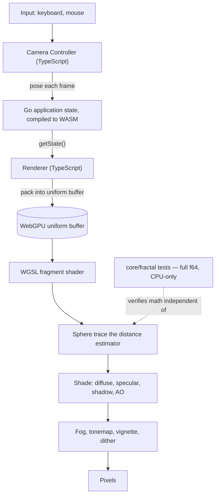

# Mandelbulb

A real-time 3D Mandelbulb fractal renderer running entirely in the browser, built from scratch across Go, WebAssembly, TypeScript, and WGSL — no rendering framework, no math library on the GPU side, no external shader dependencies.

---

## Overview

The Mandelbulb is a 3D generalization of the Mandelbrot set with no closed-form surface — the only way to see it is to numerically estimate, per pixel, how far a ray can safely step before it might hit the fractal, and repeat that thousands of times a frame. This project does exactly that on the GPU: a single full-screen WGSL fragment shader ray-marches the fractal's distance estimator, shades the hit with local lighting and soft shadows, and free-flies a camera through it in real time via WebGPU.

The interesting design choice is where the *other* half of the logic lives. Camera pose and fractal parameters — the things a user actually sets, via a slider, a preset, or a saved file — are owned by a small Go core, validated once, compiled to WebAssembly, and exercised by real Go unit tests running in full 64-bit precision on the CPU, completely independent of the GPU pipeline. The expensive, embarrassingly-parallel math runs where it belongs; the state that needs to be correct is verified where it can be, without a browser or a graphics driver.

---

## Engineering Summary

Four languages, each doing only the part it's suited for, with dependencies flowing one way: input → TypeScript camera controller → Go/WASM validated state → GPU uniform buffer → WGSL fragment shader → pixels. The distance estimator itself is implemented twice — once in Go (`core/fractal/mandelbulb.go`), tested on the CPU in double precision, and once in WGSL (`mandelbulb.wgsl`), tested only by looking at the rendered image — with a comment in the shader pointing back at the Go test that documents why a particular overflow clamp exists on both sides. Nothing renders through the WASM boundary; WASM carries small validated scalars per frame, and the GPU never leaves the pixel it's computing.

The project also takes precision seriously as a real engineering problem rather than an afterthought: WGSL has no `f64`, so getting close to the fractal's surface at deep zoom means running into `f32`'s ~7-digit limit directly. The renderer implements a double-single (compensated summation) technique to recover roughly double the effective precision without ever touching a 64-bit float on the GPU, and documents exactly where that technique stops helping (`docs/precision.md`).

Go build, WASM build, `go vet`, `golangci-lint` (run against both the host and `js/wasm` targets), and 16 Go unit tests all pass in CI; `tsc -b` type-checks the TypeScript side. The frontend has exactly two dependencies — `vite` and `@webgpu/types` — no rendering or math library at all.

---

## Key Features

* Real-time GPU ray marching of the Mandelbulb distance field via a single WGSL fragment shader
* Free-flight and orbit camera modes, with pointer-lock mouse look and WASD movement
* Fractal parameters (power, iterations, bailout) adjustable live, validated in Go before they ever reach the GPU
* Procedural lighting: Lambertian diffuse, Blinn-Phong specular, soft shadows from a secondary sphere-trace, and ambient occlusion from local distance-field sampling
* Fog, tone mapping, vignette, and dithering as a post-processing pass
* Double-single precision reconstruction on the GPU for stable rendering at deep zoom
* Six saved presets, and full configuration save/load as JSON
* Live diagnostics: FPS, frame time, and GPU pass timing via WebGPU timestamp queries where the adapter supports them

---

## Technical Stack

**Core logic**
Go — fractal math and validated application state, compiled to WebAssembly

**Application layer**
TypeScript — camera controller, input handling, WebGPU pipeline setup, UI panel

**Rendering**
WebGPU + WGSL — ray marching, shading, post-processing, entirely on the GPU

**Tooling**
Vite (frontend bundling), `golangci-lint` + `go vet` + `go test -race` (Go), GitHub Actions CI

---

## Architecture

A run of one frame, end to end: the TypeScript camera controller integrates input into a pose and pushes it into the Go/WASM core through a handful of setters (`setCameraPosition`, `setCameraRotation`, `setFOV`); Go validates and clamps (pitch can't flip past vertical, iteration counts can't go negative) and stores the settled state; the renderer reads it straight back out with `getState()` and packs it, along with fractal and render-quality parameters, into one flat uniform buffer of `vec4`s; the WGSL fragment shader reads that buffer once per pixel and does everything else — ray generation, sphere tracing against `mandelbulb_de`, a 4-sample tetrahedral normal estimate, shading, and post-processing — with the CPU never touching a pixel.

---

## Interesting Engineering Decisions

**Validated state lives in Go; per-frame integration stays in TypeScript.** These look like they could both be "just state," but they have different correctness needs. Camera movement needs to run every frame with no validation step in the way — that stays in TypeScript. What moves into Go is the *settled* state a user can set directly from a slider, a preset, or a saved file, where having one tested, validated source of truth matters more than per-frame latency. Go's setters reject a negative iteration count or clamp pitch past vertical exactly once, instead of that check being duplicated in every UI control that could change the value.

**The fractal math is implemented twice, deliberately, and tested on only one side.** `core/fractal/mandelbulb.go` and `mandelbulb.wgsl` both implement the same distance estimator, in double and single precision respectively, because Go's tests can only run on the CPU and the CPU can't run the real-time renderer. Rather than treating this duplication as a maintenance risk, it's used as a safety net: the Go test suite documents an `f32` overflow (`dr` growing unboundedly for aggressive power/bailout combinations, which turns into NaN on the GPU and silently poisons every ray's hit test) that was actually diagnosed by watching the renderer break, then reproduced and guarded against in the CPU implementation first, where it's cheap to write a table-driven test across parameter combinations.

**Double-single precision instead of reaching for perturbation rendering.** WGSL has no `f64`, and camera position eventually needs more precision than an `f32` uniform can carry once you zoom in close. Rather than the arbitrary-precision reference-orbit technique real deep-zoom explorers use (a fundamentally different rendering algorithm, CPU/GPU split, and real complexity), the renderer splits the camera position into an `f32` (hi, lo) pair on the CPU and recombines them on the GPU with Knuth's two-sum, recovering roughly double the effective mantissa for free. `docs/precision.md` is explicit about the ceiling: this only helps for the *local offset* being small, which is exactly the deep-zoom case, and building the more complex technique before there's an actual need for it would be solving a problem the renderer doesn't have.

**A 4-sample tetrahedral normal instead of 6-sample central differences.** Every normal sample is a full pass through the fractal's iteration loop, so halving the sample count directly halves that cost. Four non-coplanar offset directions are mathematically sufficient to recover a 3D gradient, so the renderer uses those instead of the textbook ±x/±y/±z scheme.

**Epsilon that scales with distance travelled.** A fixed hit threshold either wastes steps up close (converging tighter than a pixel could ever show) or under-resolves far away. `adaptive_epsilon` ties the threshold to the world-space size of one screen pixel at the ray's current distance, so precision spent is precision that's actually visible.

**Zero rendering or math dependencies in the frontend.** `web/package.json` lists exactly two devDependencies: Vite and WebGPU's TypeScript types. There is no Three.js, no glMatrix, no shader-graph tool — the camera math, the uniform packing, and the WGSL shaders are all hand-written. For a project whose entire point is understanding the rendering pipeline, pulling in a framework that hides it would have defeated the purpose.

---

## Challenges

**Diagnosing an `f32`-only bug from a `float64` test suite.** The `dr` overflow only manifests in the GPU's single-precision path — Go's `float64` has enough headroom to never hit it. The fix was porting the exact same formula and clamp to both implementations and writing the Go test to sweep a grid of power/bailout combinations wide enough to make the failure mode obvious in double precision too, even though it can't literally reproduce the NaN there.

**Making precision loss visible instead of just "the picture looks wrong."** Banding, stair-stepping, and normals collapsing to black at deep zoom all trace back to the same root cause (`f32` quantization swallowing a small offset added to a large camera coordinate), but they show up as three different visual symptoms in three different parts of the shader. Writing `docs/precision.md` alongside the fix was as much about pinning down *which* symptom the double-single trick actually addresses (ray marching and normal estimation up close) versus which it doesn't (detail far down a ray that's already `f32`-quantized before compensation ever runs) as it was about the implementation itself.

---

## Lessons Learned

Keeping the CPU-side Go implementation of the distance estimator wasn't redundant work — it turned into the only place a specific GPU-only failure mode could be cheaply tested, because a table-driven test sweeping parameter combinations is trivial on the CPU and impossible to write directly against a fragment shader. The other lesson was scope discipline on the precision problem: it would have been easy to reach straight for perturbation rendering once `f32` limits showed up, but the double-single trick solves the actual problem (rendering close to a bounded, origin-centered fractal) with a fraction of the complexity, and the docs say plainly where it stops working rather than overstating what it fixed.

---

## Technologies Demonstrated

* Ray marching / sphere tracing against a signed-distance-style estimator, implemented from scratch in WGSL
* WebGPU pipeline setup: bind groups, uniform buffers, GPU timestamp queries
* Go compiled to WebAssembly as an application-state boundary, with `syscall/js` bindings
* Compensated summation (double-single precision) for extending floating-point precision without `f64`
* Cross-implementation verification — the same numerical algorithm in two languages, tested where it's cheapest to test
* Procedural shading: Blinn-Phong, soft shadows via sphere tracing, ambient occlusion from distance-field sampling
* Hand-written 3D camera math (free-fly and orbit modes) with no math library

---

## Suitable Portfolio Categories

Labs · Graphics Programming · Systems Programming · WebAssembly · Open Source
