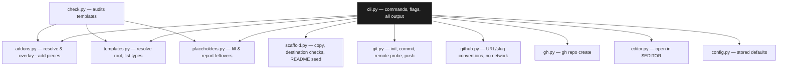

# ProjectTemplate

A personal starting-points repo for new projects — six license/shape templates plus a shared pool of drop-in pieces — driven by `projtemp`, a CLI that scaffolds, fills, commits, and pushes a new repo in one command. The CLI is the interesting part.

---

## Overview

Setting up a new repo means the same handful of decisions every time: which license, whether it needs `CONTRIBUTING.md` and `SECURITY.md`, which CI workflows apply, whether the copyright line and today's date are actually right. ProjectTemplate is six directories (`open-source`, `apache-2.0`, `agplv3`, `portfolio`, `paid`, `private`) that each hold that decision already made, plus a `global/` pool of reusable pieces — CI workflows, Docker files, editor config, issue templates — that any template can pull in regardless of type.

`projtemp` is the CLI that turns "copy the right directory and edit some placeholders by hand" into `projtemp open-source my-thing`. It copies the template, overlays any requested pool pieces, fills in `[repo name]`, `[DATE]`, and the copyright line, runs `git init`/commit, probes whether a matching GitHub repo already exists before ever touching `origin`, and opens the result in an editor — with `--dry-run` showing the exact plan before anything is written, and `projtemp check` auditing the templates themselves so a broken template is caught before it scaffolds a broken project.

---

## Engineering Summary

The whole CLI is built around one rule, stated in its own architecture doc and actually true of the code: *only `cli.py` imports click, and only `cli.py` prints.* Every other module — `templates.py`, `scaffold.py`, `placeholders.py`, `git.py`, `github.py`, `gh.py`, `addons.py`, `check.py`, `editor.py`, `config.py` — takes arguments, returns a value or a `ProjtempError`, and never touches the terminal. That split is what makes `check.py` possible at all: it imports `addons`, `placeholders`, and `templates` and audits the templates against the exact same rules the scaffolder itself would apply, without spinning up a subprocess or parsing anything's stdout.

The remote-handling logic is the other piece of real engineering here: before `origin` is ever added, `git ls-remote` (run non-interactively, with a timeout) resolves the target GitHub repo into one of four states — empty, non-empty, absent, or unknown — and each state gets a different, specific response. The design note calls this out explicitly: "a dangling remote that fails on the first push is worse than no remote — that is what this replaced," which reads like a decision made after actually hitting that failure once.

There is no unit test suite — the docs say so plainly rather than pretending otherwise — but the CLI dogfoods itself in CI: `.github/workflows/templates.yml` runs `projtemp check`, scaffolds every template type, and overlays every pool piece on every push, which is an end-to-end substitute for the unit tests the modules are otherwise structured to make trivial.

---

## Key Features

* `projtemp <type> <name>` scaffolds a new project from a template directory in one command
* `--add piece,piece` overlays reusable pieces (CI workflows, Docker, editor config, issue templates, …) from a shared pool onto any template
* Placeholder substitution for `[repo name]`, `[DATE]`, and the copyright line, applied to both templates and overlaid pieces
* Four-state remote probing (`empty` / `nonempty` / `absent` / `unknown`) before ever adding `origin`, so a dangling remote is never attached
* `--create` creates the GitHub repo via `gh` when it's genuinely missing, and never when the probe couldn't tell
* `projtemp check` audits every template and pool piece for missing required files, unfillable `[BRACKET]` markers, and copyright lines the substitution pass wouldn't rewrite
* `--dry-run` re-derives and prints the full plan — copies, overlays, fills, git steps — without writing anything
* Stored config (`~/.config/projtemp/config.json`) for the templates root, default author, GitHub owner, and editor
* A new project type or pool piece needs zero code changes — just a directory with a `LICENSE` file, or a directory under `global/`

---

## Technical Stack

**Language**
Python 3.9+

**CLI framework**
Click

**Packaging**
Hatchling, installed editable via `uv tool install` / `pipx install -e .`

**External tools shelled out to**
`git` (init, commit, remote probing/push), `gh` (repo creation)

**CI**
GitHub Actions — dogfooding workflow that scaffolds every template and pool piece on every push

---

## Architecture

Dependencies point one way, and the graph is nearly flat: `addons` imports `templates` for the pool directory name, `check` imports the three modules whose rules it audits, and nothing else imports a sibling. `github.py` and `gh.py` split along the network line rather than by topic — one owns the URL/slug/visibility conventions and never makes a call, the other only shells out to `gh` and decides nothing — which keeps the fiddly string logic testable without a network and the network code too simple to need much testing.

A `new` run is validate-then-write: the templates root, the type, every `--add` piece, and the destination are all resolved and checked before the first byte is copied, so a typo in `--add` fails with nothing on disk. From there: copy the template tree, overlay pieces in order (last one wins on a collision), seed the README if asked, run one placeholder-fill pass over everything including the overlaid pieces, then `git init`/commit, probe and attach the remote, optionally `gh repo create`, and open the editor — with each step after `git init` degrading to a warning rather than aborting the run.

---

## Interesting Engineering Decisions

**Probe before touching `origin`, and treat "couldn't tell" as its own state.** `git ls-remote` against the candidate URL, run with `GIT_TERMINAL_PROMPT=0` and a batch-mode SSH command so a private repo without credentials fails fast instead of hanging on a password prompt, resolves to one of four states. Critically, an unreachable host is `UNKNOWN`, not treated as `ABSENT` — "I could not tell" is not "it is missing," so the conservative response (attach nothing) is the same whether the network is down or the repo is private and inaccessible. Only a *confirmed*-empty remote gets pushed to automatically.

**`gh repo create --source .` instead of `git remote add` on the `--create` path.** When `projtemp` creates the GitHub repo itself, it deliberately doesn't call `git remote add` afterward — `gh` wires `origin` up on its own, picking https or ssh based on the user's existing git config, so the CLI reads back `git remote get-url origin` to report what actually landed rather than assuming it matches the https URL it probed with.

**A template is defined by structure, not a registry.** Adding a new template type is "add a directory with a `LICENSE` file in it" — no manifest, no code change, `projtemp list` picks it up immediately. The same is true of pool pieces: a directory under `global/` becomes addable the moment it holds a file. This is a real tradeoff the docs are upfront about — `LICENSE` is "load-bearing," and a template that loses it silently stops existing rather than raising an error — which is exactly the failure mode `projtemp check` exists to catch.

**`check.py` re-derives the CLI's own rules to audit the templates.** Rather than hand-writing a separate list of "things a template needs," the checker imports the same `placeholders` module the scaffolder uses and asks: does this bracket marker match what the substitution pass actually knows how to fill? The marker heuristic (ALL CAPS, or containing one of a fixed vocabulary like *name/owner/author/email/year*) is deliberately narrow and scoped to Markdown only, specifically so it doesn't flag `branches: [main]` in a YAML workflow or `[lint]` in a TOML file as a placeholder.

**Fatal versus recoverable is a load-bearing distinction, not a style choice.** `git.init` raises `ProjtempError` because there's nothing to build on top of a repo that failed to initialize; `commit_all`, `add_remote`, `push`, and `editor.open_in` all return `str | None` instead, because failing to commit (no `user.email` set, a rejected hook) or failing to open an editor shouldn't discard a scaffold that otherwise succeeded. `cli.py` renders the first as a hard error and exit code 1, the second as a yellow warning that lets the run finish.

**The verbatim-license exemption is explicit, not a special case buried in a regex.** `apache-2.0/LICENSE` and `agplv3/LICENSE` carry upstream boilerplate (`Copyright [yyyy] [name of copyright owner]`) that would trip both the marker check and the copyright check — correctly so, if it were original text. `check.py` names the two types that are exempt and *why* right in the source, rather than quietly special-casing a regex until it stops matching real problems too.

---

## Reliability & Self-Auditing

There's no unit test suite, and the docs say that outright rather than implying coverage that isn't there. What exists instead is a CI workflow that dogfoods the tool on every push: run `projtemp check`, scaffold every template type with `--readme --no-git --no-open` and fail on any required file missing or any `[bracket]` left unfilled, then overlay every pool piece onto a live scaffold and confirm nothing collides unexpectedly. That's a genuine end-to-end substitute for the module-level tests the architecture is already shaped for — every module but `cli.py` is pure input/output specifically so a real test suite could be dropped in without restructuring anything.

The `docs/architecture.md` file also keeps an explicit "known sharp edges" list — `--force-remote` never pushes, pool paths are literal (so `--add ci` keeps the group-level directory in the destination), `scaffold.copy` overcounts under `--force`, subcommand names shadow template types named `new`/`list`/`check`/`config`. Documenting known rough edges instead of hiding them is the same honesty the rest of this portfolio tries to hold to.

---

## Lessons Learned

The remote-probing design reads like it exists because a dangling `origin` actually happened once — the fix isn't "retry the push," it's "never attach a remote you haven't confirmed exists," which is a stricter and more useful guarantee. The single-responsibility module split (one job per file, only `cli.py` prints) paid for itself immediately in `check.py`: because the scaffolding logic was already pure functions with no side effects, writing an auditor that re-uses those exact functions to validate the templates was nearly free, rather than requiring a second, parallel implementation of "what counts as fillable."

---

## Technologies Demonstrated

* CLI design with Click, including a custom `Group` subclass for `projtemp <type> <name>` shorthand dispatch
* Subprocess orchestration around `git` and `gh` with explicit timeouts, non-interactive flags, and structured error classification
* A validate-then-write pipeline with dry-run support that re-derives its plan from the same functions the real run uses
* Self-auditing tooling — a checker built from the same primitives as the thing it checks
* Convention-over-configuration design (filesystem shape defines what's addable, no manifest)
* Clean separation of side-effecting and pure code, enabling an end-to-end dogfooding CI pipeline in place of unit tests

---

## Suitable Portfolio Categories

Labs · Developer Tooling · Automation · CLI Design
