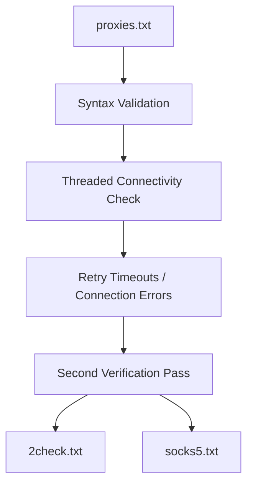

# Proxy Strainer

A multi-threaded Python tool for validating and filtering public proxy lists. My first-ever repository — later rewritten in C as [Proxyc](../proxyc.md).

---

## Overview

Public proxy lists (scraped from free sources) are mostly dead on arrival — wrong syntax, offline, or not actually proxying your traffic. Proxy Strainer takes a raw list and runs it through syntax validation, then live connectivity checks, then a second verification pass, to produce a short list of proxies that are actually confirmed working — with SOCKS5 proxies split out separately.

This was written before Proxy Strainer's later rewrite in C ([Proxyc](../proxyc.md)) — it's the original version, and the first real project in the portfolio.

---

## Engineering Summary

For a first project, this shows a genuine grasp of I/O-bound concurrency in Python: a `ThreadPoolExecutor` runs up to 120 proxy checks in parallel, with thread-safe file writes guarded by a lock. Validation is layered rather than one-shot — regex/URL-based syntax checking happens before any network request is made, avoiding wasted connections on obviously malformed entries, and failed proxies are categorized by error type (timeout, connection error, IP mismatch) so transient failures can be retried separately from proxies that are simply dead.

---

## Key Features

* Concurrent validation via a configurable thread pool (default 120 workers)
* Two-stage syntax validation — plain `IP:PORT` format and full URL-scheme format (`http://`, `socks5://`, etc.)
* Live connectivity check against a real endpoint, confirming the response actually originates from the proxy's IP (not just that the proxy accepted a connection)
* Error categorization (timeout, connection error, proxy error, IP mismatch) with a separate retry pass for transient failures
* Automatic SOCKS5 extraction into its own output file

---

## Technical Stack

**Language**
Python 3

**Concurrency**
`concurrent.futures.ThreadPoolExecutor`

**Networking**
`requests`

**Infrastructure**
Docker

---

## Architecture

A single script runs a linear pipeline: load the raw list, validate syntax, run a threaded connectivity check against every proxy, retry the ones that failed with a timeout or connection error, then run a second full verification pass on whatever survived. Each stage writes its own output file, so intermediate results are inspectable rather than hidden inside one opaque run.

---

## Interesting Engineering Decisions

**Validating a proxy by checking the response's origin IP, not just getting a 200.** A proxy can accept a connection and return a successful response without actually proxying anything (some "proxies" just forward you straight through, or are misconfigured). Checking that `httpbin.org`'s reported origin IP matches the proxy's own address is what actually confirms the proxy is doing its job, rather than just being reachable.

**Retrying specific error types, not everything.** Only `READ_TIMEOUT` and `CONNECTION_ERROR` proxies get a second attempt — these are plausibly transient (a proxy that was briefly overloaded), whereas a proxy error or invalid response is treated as a real failure and not retried, keeping the retry pass short instead of re-checking everything that failed for any reason.

**Syntax validation before any network call.** Regex and URL parsing catch malformed entries before a single HTTP request is made — cheap to check, and avoids burning thread-pool capacity and timeout windows on proxies that were never going to work.

---

## Challenges

**Distinguishing "proxy is down" from "proxy works but isn't really proxying."** Solved by comparing the request's reported origin IP against the proxy's own address rather than trusting a 200 status code alone.

**Avoiding false negatives from transient network conditions.** A proxy that times out once isn't necessarily dead — solved with a dedicated retry pass specifically for the error types likely to be transient, run separately from the main validation loop.

---

## Reliability

Failed proxies are logged with their specific error type and message to `failed_proxies.txt` rather than silently discarded, so failures are inspectable. Thread-safe file writes are enforced with an explicit lock around the shared output file, since multiple worker threads write results concurrently.

---

## Lessons Learned

This was the first project where concurrency actually mattered for the result, not just for speed — getting the retry logic and thread-safe writes right taught more about I/O-bound Python concurrency than any tutorial would have. Looking back, the linear file-based pipeline (write to one file, read it back in the next stage) works but is a clunky way to pass state between steps — Proxyc's later C rewrite addresses that directly.

---

## Technologies Demonstrated

* Concurrent/multi-threaded programming in Python
* Network programming and HTTP client usage
* Input validation and error categorization
* Basic Docker containerization

---

## Suitable Portfolio Categories

Labs · Automation · Networking