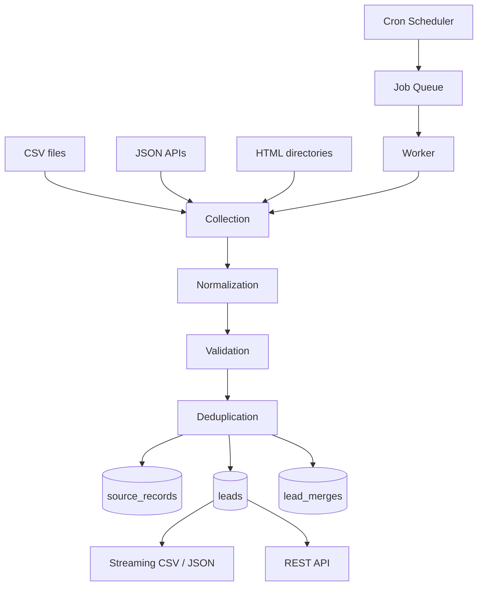

# LeadPipe

Configurable Python service that collects publicly available business leads from multiple sources, normalizes them into one schema, validates what it can, and works out which records describe the same company — keeping a full record of where every field came from. Open-sourced under MIT.

---

## Overview

The problem LeadPipe solves is not collection, it's agreement. A small business wants a list of potential B2B customers; the data exists across several public directories, and every source spells things differently:

```text
Nordic Clean Oy          NORDIC CLEAN OY              Nordic Clean
www.nordicclean.test     https://nordicclean.test/    nordicclean.test
+358 40 123 4567         040-1234567                  (blank)
Finland                  FI                           Suomi
```

Three rows, one company. `SELECT DISTINCT` merges none of them, because no two are identical. Multiply that by a few thousand records and manual cleanup stops being viable.

LeadPipe collects from configured sources (CSV files, JSON APIs, HTML listings), normalizes values into a single schema, validates each field into one of three states, decides which records are the same company, and stores enough history that you can always ask *which source supplied which field, and which rule merged it*. It ships with a REST API, a CLI, a Postgres-backed job queue with scheduling, and streaming CSV/JSON export.

---

## Engineering Summary

The system's centre of gravity is the storage model, and it's three tables rather than one.

`source_records` holds one immutable row per source per sighting — the untouched payload alongside the normalized values, fingerprints and validation result. `leads` holds the merged canonical company. `lead_merges` records *why* each record is attached to its lead: which rule fired, at what confidence, and whether it was flagged for review.

Everything good about the system follows from that separation. Provenance is answerable because the raw rows are still there. Merges are explainable because the reason is stored rather than implied. Re-runs are idempotent because a repeated sighting is a record that already exists. And because untouched payloads are retained, the whole pipeline can be re-run against historical data when the normalization rules change — which is exactly the operation a system that overwrites in place can never perform.

The second decision is that deduplication is built to refuse rather than to guess. Five rules run in order with explicit confidence values, and auto-merge requires 0.85. Name similarity is *capped* at 0.80, so by construction it can never merge two companies on its own — it can only flag them. The bundled fixtures include the case that justifies this: `Nordic Clean Oy` and `Nordic Clean Oyj`, different companies, same city, very similar names. They stay separate, and the link is kept as a review flag.

Roughly 4,650 lines of application code across twelve packages, with 3,740 lines of tests and 258 test functions, mypy `strict`, and integration tests that spin up a throwaway PostgreSQL container and run migrations against it, so the schema is verified rather than assumed.

---

## Key Features

* Sources are configuration, not code — CSV, JSON API and HTML adapters, added by YAML edit
* Normalization of company names, emails, URLs, phone numbers (to E.164) and countries (to ISO-3166 alpha-2)
* Tri-state validation — `valid` / `invalid` / `unknown`, so a missing field is never confused with a broken one
* Five ordered deduplication rules with explicit confidence and documented merge precedence
* Full provenance — which record, from which source, matched by which rule, at what confidence
* PostgreSQL-backed job queue with retries, jittered backoff, heartbeats and stale-worker recovery
* Per-source cron scheduling, deduplicated so overlapping runs never pile up
* REST API with keyset pagination and streaming CSV/JSON export
* CLI covering collection, queueing, workers, export, suppressions and retention purges
* robots.txt compliance, per-domain throttling, SSRF guards, and contact redaction in logs
* Deletion that cascades to raw records and suppresses the contact, so erasure survives the next collection

---

## Technical Stack

**Language**
Python 3.14, mypy `strict`, ruff

**Data**
PostgreSQL via SQLAlchemy 2 (async) and asyncpg; Alembic migrations

**Interfaces**
FastAPI (with generated OpenAPI docs), Typer CLI

**Collection**
httpx, BeautifulSoup + lxml, APScheduler

**Validation & normalization**
Pydantic 2, `email-validator`, `phonenumbers`

**Logging**
structlog, with a redaction processor

**Testing**
pytest, pytest-asyncio, testcontainers for real PostgreSQL

---

## Architecture

Five pipeline stages, wired together and driven identically by the CLI and the API — neither owns any logic.



Normalization, validation and deduplication are pure functions with no database and no I/O, which is why they're the fastest and most heavily tested part of the system. The layers that touch the world — fetch, sources, repositories — sit outside them.

**Storage is authoritative for state, YAML for shape.** Sources, their mappings, priorities and schedules live in configuration with `${VAR}` and `${VAR:-default}` interpolation so credentials stay out of version control. `priority` decides which source wins when two disagree about a field.

**The queue lives in the same database as the data.** Jobs are claimed with `SELECT ... FOR UPDATE SKIP LOCKED`, which keeps concurrent workers off each other without a broker. For a service that already requires PostgreSQL, a second piece of infrastructure would buy throughput this workload doesn't need.

---

## Deduplication in Detail

This is the part with the actual judgment in it.

**Fingerprints, computed once per record.** Email (only if it contains `@`), website domain, phone (only if it starts with `+`, meaning it survived E.164 parsing), a company-name slug, a location key, and any source-specific external ID. The guards matter: a placeholder can never become a fingerprint, so two unrelated companies that both wrote `n/a` are never matched on it.

**The name slug strips legal suffixes.** `Oy`, `Oyj`, `AB`, `GmbH`, `Ltd`, `LLC` and around thirty others are removed from the end of the name before comparison, because a company that appears as `Nordic Clean` in one directory and `Nordic Clean Oy` in another is one company.

**Trigram similarity implemented to match `pg_trgm`.** The candidate lookup happens in SQL using PostgreSQL's `similarity()`; the decision happens in Python. If the two disagreed about what "similar" means, the system would either miss candidates or reject the ones it found. So the Python implementation uses the same word-padding scheme PostgreSQL does — a trigram set built over `"  word "` — and the two agree by construction rather than by coincidence.

**Rules in order, first match wins.**

| Rule | Confidence | Merges automatically |
| --- | --- | --- |
| Exact email | 1.00 | yes |
| Normalized website domain | 0.95 | yes |
| Phone number (E.164) | 0.90 | yes |
| Company name + location | ≤ 0.80 | **no** — flagged for review |
| Source-specific identifier | 1.00 | yes |

Auto-merge requires 0.85 and name matching is capped at 0.80. That's not a tuned threshold — it's a structural guarantee that a fuzzy signal alone can never collapse two companies.

**Merging is field-by-field with a documented precedence.** Candidates are ranked by source priority, then recency, then completeness, then origin, and each field is taken from the first candidate that has one. Website and website-domain are taken together, because one is derived from the other and mixing them across candidates would produce a lead whose domain doesn't match its URL. Record IDs are zero-padded when they're used as a tiebreaker, so `"11"` doesn't sort before `"3"`.

---

## Interesting Engineering Decisions

**Bad records are flagged and kept, never dropped.** Validation returns one of three states, and an `invalid` record stays in the database with its reason. A pipeline that silently discards what it can't parse gives you no way to find out what you're missing.

**Failures are per-record, not per-run.** A malformed API item and a directory page disallowed by robots.txt both appear as errors in the run statistics without ending the collection. The bundled example makes this concrete: 34 records in, 23 leads out, two deliberate errors, and running it again produces zero new leads.

**Unreachable robots.txt means deny.** A 5xx or a connection failure is treated as disallow-everything, while a 404 is allow — because absent and unreachable are different answers, and only one of them means "there are no rules". Rules are cached per origin with a TTL, and `Crawl-delay` is honoured.

**Every resolved address must be public.** The SSRF guard resolves the host and rejects the request if *any* returned address is private, loopback, link-local, reserved, multicast or unspecified — because a name that resolves to both a public and a private address is still a way in. The check runs on each redirect hop, not just the first request.

**Throttling waits rather than drops.** The per-domain limiter holds a lock and sleeps until the next slot, so politeness is applied without losing work. A limiter that rejected instead would push the retry logic up into every caller.

**Redaction is a log processor, not a discipline.** Contact fields — email, phone, address, contact name, website — plus credentials are replaced with `[redacted]` by a structlog processor applied to every event, including those from third-party libraries. Nothing depends on remembering not to log a lead.

**Keyset pagination over offsets.** Lead listing pages on `id > after_id` rather than `OFFSET`, so deep pages cost the same as shallow ones and a concurrent insert can't shift rows across a page boundary.

**Exports stream.** CSV and JSON writers yield rather than building a document, so table size doesn't become memory size.

**Readiness means schema-current, not just connected.** `/health/ready` reports the applied Alembic revision against the expected one and returns 503 when they differ. A service that is up but running against a stale schema is not ready, and answering 200 there is how a bad deploy gets promoted.

---

## Challenges

**Making the SQL candidate search and the Python matcher agree.** Fetching candidates in SQL is necessary for performance; deciding in Python is necessary for testability and clarity. The failure mode of doing both is subtle — a matcher that never sees the record it would have merged — and the fix is that the trigram implementation is written specifically to mirror PostgreSQL's, with tests pinning the behavior.

**A queue that survives its workers.** Jobs carry a heartbeat, and a separate sweep requeues anything whose worker went quiet — unless it has already exhausted its attempts, in which case it's failed terminally with `"worker stopped responding"` rather than requeued forever. Backoff is exponential, capped at five minutes, and jittered so retries from a batch of failures don't synchronize.

**Normalization that has to be re-runnable.** Because normalization rules change, the untouched payload is stored alongside the derived values. That decision costs storage and buys the ability to reprocess history — which is the difference between fixing a phone-parsing bug going forward and fixing it retroactively.

**Idempotency across three different source types.** A CSV row, an API item and a scraped HTML block have nothing structurally in common, yet re-collecting any of them must produce no new leads. The external-ID fingerprint (scoped to the same source, since IDs from different sources mean different things) plus the immutable-record model is what makes the second run a no-op.

---

## Security & Compliance Considerations

The constraints in this domain are largely legal, and the project treats them as part of the design rather than as a disclaimer. The repository carries a dedicated legal document stating the posture plainly, including that it is not legal advice and that the lawfulness assessment belongs to the operator.

* `robots.txt` is fetched, parsed, cached and obeyed for every HTTP source; a disallowed URL is rejected with a reason and the run continues
* The client identifies itself as `LeadPipe/<version>`, with an optional operator contact appended — the point of a User-Agent being that someone who wants you to stop can find you
* Requests to private, loopback and link-local addresses are refused unless explicitly opted into, on every redirect hop
* Response sizes and redirect chains are capped, so a hostile source cannot exhaust the collector
* Contact data and credentials are redacted from every log line by a global processor
* Deleting a lead erases its raw records and adds the contact to a suppression list by default, so erasure survives the next collection rather than being undone by it
* A retention window and a `purge` command implement storage limitation, with a dry-run mode
* Write endpoints require an API key when one is configured; reads stay open
* Bypassing logins, defeating CAPTCHAs or anti-bot fingerprinting, rotating identities, and SMTP mailbox probing are all absent by design — the repository says so explicitly, in those terms

---

## Testing

* 258 test functions across unit and integration suites
* The pure core — normalization, validation, fingerprints, matching, merging — is tested exhaustively, because it has no I/O to mock and no excuse not to be
* Integration tests start a throwaway PostgreSQL container and run Alembic migrations against it, so the schema is verified on every run rather than assumed
* A dedicated privacy test suite covers erasure, suppression and redaction behavior
* The suite never touches the network; the HTML source is exercised against bundled fixture pages, including a deliberately robots-disallowed path
* CI runs ruff (lint and format check), mypy `strict`, and the full pytest suite

---

## Honest Limitations

The repository maintains its own limitations page, ordered by how likely each is to bite. The ones worth repeating:

* **Website matching uses the hostname, not the registrable domain** — no Public Suffix List, so `shop.example.com` and `example.com` are different companies. It errs toward not merging, which is the safer direction, but it's a gap.
* **Name matching flags but never merges, and there's no review UI.** You can see the decision; acting on it needs SQL.
* **Merges cannot be undone through the API.** The information to do it is stored; the operation is manual.
* **Country normalization is a fixed alias table** of roughly twenty countries, biased toward the Nordics and Western Europe.
* **Email validation is syntax only** — deliberately, since probing strangers' mail servers is exactly the behavior the project avoids. A perfect address at a dead domain still validates.
* **Every collection is a full run**; there is no incremental mode.
* **The queue is single-database** — correct for several workers, not a distributed workflow platform.

---

## Lessons Learned

Storing the raw payload alongside the derived values is the decision that keeps paying. It looks like duplication at design time and it costs real storage, but it converts every normalization improvement from "applies to new data" into "applies to everything" — and it's the only reason provenance can be answered honestly rather than reconstructed.

The other lesson is about thresholds. The instinct with fuzzy matching is to tune a number until the results look right on your test data, which produces a system that will merge two real companies eventually and give you no warning when it does. Capping name confidence *below* the auto-merge floor turns a tuning problem into a structural one: the fuzzy rule cannot merge anything on its own, no matter what the score comes out as, and that property holds without anyone maintaining it.

---

## Technologies Demonstrated

* ETL pipeline architecture with a pure functional core and I/O confined to the edges
* Entity resolution — fingerprinting, ordered match rules, confidence thresholds, field-level merge precedence
* Provenance modelling with immutable source records and explainable merges
* Trigram similarity implemented to match a database's own semantics
* PostgreSQL job queue with `SKIP LOCKED`, heartbeats, backoff and stale recovery
* Async SQLAlchemy 2 with Alembic migrations and schema-aware readiness checks
* REST API design — keyset pagination, streaming exports, tri-state validation surfaced to clients
* Configuration-driven extensibility with environment interpolation
* Responsible web collection — robots.txt, throttling, SSRF defence, identifiable clients
* Privacy engineering — log redaction, cascading erasure, suppression lists, retention policy
* Testing against real infrastructure with ephemeral containers

---

## Suitable Portfolio Categories

Backend Engineering · Data Engineering · Automation · API Design · Open Source
