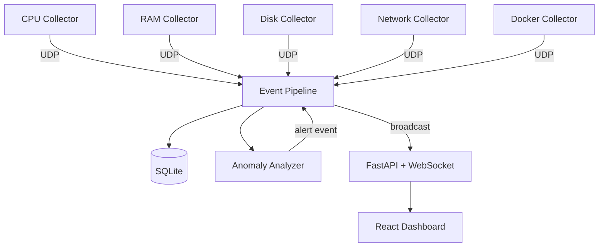

# Peace System

A hybrid Go + Python real-time system monitoring platform — metric collectors, an event-driven pipeline, anomaly detection, and a live React dashboard. Open source, finished with some planned features left undone.

---

## Overview

Peace System watches a machine's own vitals — CPU, RAM, disk, network, and Docker container activity — and streams them through an event pipeline into a live dashboard, with threshold-based anomaly detection raising alerts along the way. It's explicitly scoped to local/self-hosted use (everything communicates over localhost), inspired by tools like Netdata and Datadog but built small on purpose rather than as a distributed observability platform.

Development paused with the README stating plainly why: exams got in the way. What's there is functional end-to-end — collectors, pipeline, storage, alerting, dashboard — just without some of the deeper features (per-process analysis, deeper container introspection) the author wanted to add next. This was the second open-source project, following [Proxy Strainer](./labs/proxy_strainer.md).

---

## Engineering Summary

The core idea — Go for lightweight always-on collection, Python for the richer event/analysis/API layer — is a sound one, and the event pipeline in particular holds up: a proper pub/sub router with typed events, async validation/normalization/routing, and a worker queue so slow subscribers don't block the UDP receive loop. Anomaly detection uses a sliding window of consecutive threshold breaches (not a single spike) combined with an explicit alert state machine (NEW → ACTIVE → RESOLVED) and a cooldown, which is more thought than a lot of "if value > limit, alert" implementations put in. It's an earlier project than the rest of this portfolio's Go/Python work — there's no test suite and no CI — but the architecture itself was already pointed in the right direction.

---

## Key Features

* Go collectors for CPU, RAM, disk, network, and Docker container metrics, each running in its own goroutine
* UDP-based fan-in from collectors into a single Python event pipeline
* Async pub/sub event router with typed events (metric / alert / anomaly) and a dispatch worker queue
* Sliding-window anomaly detection — alerts on consecutive threshold breaches, not single spikes, with a state machine and cooldown to avoid alert spam
* WebSocket-powered live dashboard (React + Recharts) alongside a REST API (FastAPI)
* Buffered, batched SQLite writes with a configurable retention/cleanup loop
* Fully configurable via a single JSON file — intervals, thresholds, ports, retention

---

## Technical Stack

**Collectors**
Go, `gopsutil`, official Docker client library

**Pipeline / Backend**
Python (asyncio), FastAPI, `aiosqlite`, `httpx`

**Storage**
SQLite

**Frontend**
React, Vite, Tailwind CSS, Recharts

**Transport**
UDP (collectors → pipeline), WebSocket (pipeline → dashboard)

---

## Architecture

Each Go collector runs independently in its own goroutine, reading its slice of system state on an interval and firing a JSON event over UDP to the Python pipeline — a deliberately simple, fire-and-forget transport appropriate for metrics where an occasional dropped packet doesn't matter. The pipeline validates and normalizes incoming events, then routes them to subscribers by event type through an internal async queue, so a slow handler (like a database write) can't stall the UDP receive loop. Metric events fan out to storage, the analyzer, and a WebSocket broadcast; the analyzer can itself emit new `alert` events back into the same pipeline, which get stored and broadcast the same way.

---

## Interesting Engineering Decisions

**UDP for collector-to-pipeline transport.** Metrics are inherently ephemeral — a dropped CPU reading from one interval ago isn't worth retransmitting. UDP avoids the connection-management overhead TCP would add for a transport where "just send the next one" is an acceptable failure mode.

**Consecutive-hit anomaly detection over single-sample thresholds.** A single CPU spike above a threshold is often noise. Requiring N consecutive breaches (tracked in a small sliding window per source) before firing an alert, combined with a cooldown once an alert is active, is meaningfully closer to what a real monitoring tool would do than a naive per-sample check.

**Buffered writes over immediate per-event inserts.** Storage batches events in memory and flushes on either a size threshold or a timer, rather than hitting SQLite on every single incoming event — a reasonable choice for a pipeline that could otherwise be dominated by write overhead at higher metric volumes.

---

## Challenges

**Keeping the event pipeline responsive under slow subscribers.** Routing handlers into an async queue and dispatching them from a separate worker loop, rather than awaiting each subscriber inline during routing, means a slow handler (a flaky HTTP broadcast call, for instance) doesn't block ingestion of the next incoming UDP packet.

**Avoiding alert spam on a metric hovering near its threshold.** The state machine (RESOLVED → ACTIVE → RESOLVED) combined with a cooldown window means a metric bouncing just above and below a threshold doesn't fire a new alert on every single sample — it distinguishes "still critical" from "newly critical."

---

## Reliability

Storage runs a periodic retention cleanup loop, deleting events older than a configured window rather than growing the database unboundedly. The WebSocket connection manager tracks and prunes dead connections on broadcast failure rather than letting them accumulate. That said, this project predates the testing and CI discipline visible in later work — there's no automated test suite here, and that's a fair gap to flag rather than gloss over.

---

## Security Considerations

* Explicitly scoped to localhost-only communication — no cloud telemetry, no external data collection, stated directly in the README
* CORS is currently wide open (`allow_origins=["*"]`) — reasonable given everything runs on localhost today, but would need tightening before this could safely bind to anything beyond `127.0.0.1`
* The license includes an explicit clause prohibiting use of the Go collectors in malware (e.g., a monitoring component bundled into mining malware or spyware) — a deliberate, stated boundary rather than an oversight

---

## Lessons Learned

The event pipeline's pub/sub structure — typed events, async routing, a dispatch queue decoupled from ingestion — is a pattern that held up well and is worth carrying into future projects, even ones far from system monitoring. The rougher edges here (no tests, some quick-fix comments left in the code, CORS left open) are an honest snapshot of where the engineering discipline was at the time, and a useful contrast against later, more rigorously tested projects in this portfolio.

---

## Technologies Demonstrated

* Multi-language systems architecture (Go collectors + Python pipeline)
* Event-driven / pub-sub design with async dispatch
* Time-series anomaly detection with stateful alerting
* WebSocket-based real-time data delivery
* Buffered, batched database writes with retention management
* Docker Engine API integration

---

## Suitable Portfolio Categories

Backend Engineering · Automation · Infrastructure · Open Source