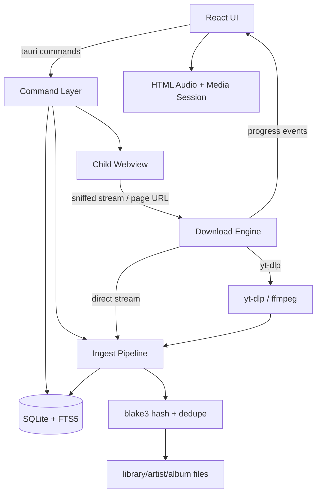

# SoundLight

Local-first desktop music library and player — Rust backend, React frontend, packaged with Tauri 2. Includes an embedded browser that turns any page containing audio into a library entry. Open-sourced under MIT. Currently paused.

---

## Overview

SoundLight is a desktop music application built around one premise: the library is a folder on your disk that you own, not a rented index. Everything it manages lives under a single root — `~/Music/SoundLight/` — holding the SQLite database, the audio files organized as `library/{artist}/{album}/`, and extracted cover art. That directory can be backed up, moved to another machine, or opened with any other tool, and nothing about the app depends on a service being online.

It does the things a music player does: import files and folders, browse and search a library, edit tags, build playlists, queue and shuffle and repeat. What makes it more than a player is the acquisition side — an embedded browser with an injected toolbar, so a page that plays audio can be turned into a tagged, deduplicated, filed library entry without leaving the app or knowing what yt-dlp is.

Built as a personal tool. Paused rather than finished — the core is complete and in use, but it stops short of the polish a released application would need, and the write-up below says where.

---

## Engineering Summary

Three pieces of the design carry most of the weight.

**One ingest door.** Files dragged from disk, a direct download, and a stream captured inside the embedded browser all converge on a single `ingest_file` function. Hashing, deduplication, tag reading, cover extraction, and the copy into the library happen exactly once, in one place, no matter where the audio came from. Adding an acquisition path means producing a file on disk and calling that function — none of the library logic knows the difference.

**Content addressing as the dedupe primitive.** Every file is hashed with blake3 on the way in, and the hash is a `UNIQUE` column. The same song downloaded twice from two different sites, under two different names, collapses to one row — because the identity of a track is its bytes, not its filename or its metadata.

**The browser is untrusted by construction.** The page renders in a *child* webview that has no access to the app's IPC. The trusted chrome stays in the main webview, and the injected toolbar communicates through a sentinel host (`soundlight.invalid`) whose navigation is intercepted and blocked before any request is made. An arbitrary website cannot reach a Tauri command, which is the property that makes "browse anywhere in-app" a defensible feature rather than a hole.

Roughly 2,550 lines of Rust across 11 modules and 2,780 lines of React/TypeScript, with 17 Rust unit tests concentrated on the parsing and path logic where the edge cases actually live.

---

## Key Features

* Library rooted in one movable, backup-able folder — database, audio, and covers together
* Import files or folders (walked recursively), with a per-import report of added, duplicate, and failed
* blake3 content-addressed deduplication across every import path
* FTS5 full-text search over title, artist, and album, kept in sync by triggers
* Tag editing written back into the audio file itself, not just the database
* Playlists with explicit ordering and cascading deletes
* Queue with shuffle, three repeat modes, play counts, and archive
* Embedded browser with an injected toolbar — navigate, search, and download without leaving the app
* In-page media sniffer for audio that only a logged-in session can see
* yt-dlp integration with in-app install and self-update; ffmpeg optional, with a different strategy when it's absent
* OS media-key and now-playing integration on all three platforms via the Media Session API
* Streaming downloads with live progress, throttled so progress events don't flood the IPC channel

---

## Technical Stack

**Shell**
Tauri 2 (Rust edition 2021), release profile tuned for size — LTO, one codegen unit, `opt-level = "s"`, stripped

**Backend**
`rusqlite` (bundled SQLite), `lofty` for tag reading and writing, `blake3` for hashing, `reqwest` with rustls and streaming bodies, `anyhow` for error context

**Frontend**
React 19, TypeScript, Zustand for state, Tailwind CSS 4, Vite 6

**External tools**
yt-dlp (managed, installed on request), ffmpeg (optional)

---

## Architecture

The Rust side owns the library and everything that touches disk; the frontend owns layout, playback, and interaction. They meet at a set of Tauri commands, plus events pushed the other way for download progress and library invalidation.

The database uses WAL with `synchronous = NORMAL`, and migrations are a plain ladder keyed off `user_version` — each step runs once, in order, and a shipped step is never edited. Search is an external-content FTS5 table synchronized by three triggers on insert, update, and delete, so the index cannot drift from the table it indexes.

Playback deliberately lives in the webview rather than in Rust. One `<audio>` element for the whole application, which buys the Media Session API — OS media keys and the native now-playing widget on macOS, Windows, and Linux — for almost no code. Writing an audio pipeline in Rust would have been more code for less platform integration.

---

## Interesting Engineering Decisions

**The toolbar is built with DOM APIs, not `innerHTML`.** The injected browser toolbar is constructed node by node and mounted in a shadow root. This is not a style preference: sites that enforce Trusted Types — YouTube among them — make `innerHTML` throw, and one throw kills the entire injected script, taking the toolbar with it. It's also re-checked on a one-second timer, because single-page apps replace `<body>` wholesale and the toolbar has to survive that.

**A sniffer inside the page, because yt-dlp is outside it.** yt-dlp runs as a separate process with no access to the browsing session, so audio gated behind a login is invisible to it. The only code that can see the real stream URL is code running inside the page — so the init script wraps `fetch` and `XMLHttpRequest.prototype.open`, collects anything audio-shaped, and offers the results in a panel. Two acquisition strategies with genuinely different reach, rather than one with a gap.

**A sentinel host instead of an IPC bridge.** The toolbar needs to tell the app "download this" — but giving the page any IPC access would hand every website a Tauri command. Instead it navigates to `https://soundlight.invalid/download`, and the navigation handler intercepts it and returns false. `.invalid` is reserved and never resolves, and the request is blocked before it's made, so this is a private channel that costs no privilege.

**Blocking navigation as a download trigger.** A click on a bare `.mp3` link is intercepted in the same handler: rather than letting the webview try (and usually fail) to render an audio file, the navigation is cancelled and the URL is handed to the download engine. The natural gesture becomes the right behavior with no separate UI.

**A complete User-Agent, and the same one twice.** The platform webview's default UA omits the `Version/… Safari/…` suffix, and enough sites read that as an unsupported browser to serve an error page instead of content. So the child webview presents an ordinary, complete UA — and the download client presents *the same* one, because hosts that tie a stream URL to the client that requested it will reject a fetch that arrives looking like something else. Referer is forwarded for the same reason.

**A managed yt-dlp that beats PATH.** The app looks in its own app-data `bin/` before falling back to `PATH`, so an update triggered from Settings can't be silently shadowed by an older system install earlier on the path. Updates run yt-dlp's own `-U` rather than re-fetching the release, because that's the mechanism the tool maintains for itself.

**ffmpeg optional, with a real fallback.** With ffmpeg present, audio is extracted and normalized to mp3 with metadata and artwork embedded. Without it, the format selector changes to `bestaudio[acodec!=none][vcodec=none]` — the best *single* audio stream, so nothing needs merging. The webview plays it and lofty tags it either way. The feature degrades rather than disappearing.

**Files are copied, never referenced in place.** The point of a local-first library is that it survives the original being moved, renamed, or deleted. Two different songs can legitimately share artist, album, and title, so the destination path suffixes on collision rather than overwriting — identical *content* was already caught by the hash, so a collision here means genuinely different audio.

**Tag edits go into the file.** Editing a tag writes it through lofty to the audio file itself and then updates the row, so the change survives re-importing and follows the file if it's copied elsewhere. An empty string is treated as a deliberate "clear this field" rather than as no-op.

**FTS input is quoted, not escaped.** User search text is split into tokens and each is wrapped in double quotes before being handed to FTS5, so a query containing `-`, `*`, `OR`, or `NEAR` searches for those characters instead of being interpreted as operator syntax — or failing outright as a syntax error.

---

## Challenges

**Positioning a native child webview.** Tauri's `auto_resize()` scales a child webview proportionally with the window, which is wrong when the surrounding chrome is fixed-size — the browser would creep out of its slot. The frontend measures the slot and drives the bounds explicitly instead, and the Rust side logs what it was told next to the window's real size, so a mismatch shows up in the dev log rather than having to be guessed at from a screenshot.

**Never guessing what yt-dlp named the file.** Output templates, extension changes during extraction, and title sanitization all mean the final filename is not predictable from the input. Passing `--print after_move:filepath` makes yt-dlp state the path after it's in place; the scratch directory is only scanned as a fallback when that produces nothing usable.

**Progress without flooding IPC.** A streaming download emits progress every 256KB rather than on every chunk. Emitting per chunk on a fast connection saturates the IPC channel with events the UI can't render anyway.

**Filenames as a metadata source of last resort.** A library full of "Unknown Title" is worse than a guess, so when a file carries no usable tags the stem is split on `" - "`, with a leading track number dropped and hyphens inside the title preserved. Tag values are equally messy in the other direction — `"3/12"` and `"2024-05-01"` both parse by taking the leading digits.

**Paths that work on every platform.** Tag text becomes folder names, so characters that are illegal or merely annoying on any of the three platforms are replaced, length is capped, and trailing dots and spaces are trimmed — those break Windows paths specifically. `AC/DC` becoming `AC_DC` is the case that makes it concrete.

---

## Security Considerations

* The page renders in a child webview with no IPC access; the app's own chrome stays in the trusted main webview, so no site can invoke a Tauri command
* Tauri capabilities are scoped to what the app's own UI needs — core, dialog, and opener defaults — rather than left broad
* The asset protocol is scoped to `$HOME/Music/SoundLight/**`, so the webview can read the library and nothing else on disk
* The toolbar's command channel is a reserved `.invalid` host, blocked before any network request is made
* Injected script failures are caught and swallowed rather than allowed to break the host page
* yt-dlp is fetched over HTTPS from the project's own release URL, into an app-data directory, and marked executable explicitly on Unix

---

## Honest Limitations

The project is paused, and it shows in specific places worth naming rather than glossing:

* **Tests are backend-only.** 17 Rust unit tests cover the parsing, hashing, path, and FTS logic — the parts with real edge cases — but there are no frontend tests at all, and the download and browser paths are only covered at the level of their pure helper functions.
* **No CI.** Nothing runs the test suite automatically; it's a `cargo test` away, but that's a habit rather than a guarantee.
* **The schema is at version 1.** The migration ladder exists and is correct, but has never actually been exercised by a second step.
* **Sniffing is inherently fragile.** Hooking `fetch` and `XHR` works until a site loads audio some other way, and the User-Agent and Trusted Types workarounds are the kind of thing that needs revisiting whenever a target site changes.

---

## Lessons Learned

The single-ingest-door design is the decision I'd repeat. Three acquisition paths that each did their own hashing, tagging, and filing would have drifted apart within weeks — a download that dedupes differently from an import is exactly the sort of bug you don't notice until the library is full of near-duplicates. Making "produce a file on disk, then call one function" the contract meant the browser feature could be built without touching library code at all.

The other lesson is that shipping a browser inside an application is mostly a security design problem, not a rendering one. Getting a page on screen took very little; deciding what that page is allowed to reach, and building a command channel that grants it nothing, was most of the work.

---

## Technologies Demonstrated

* Cross-platform desktop application architecture with Tauri 2 (Rust core, web frontend)
* Embedded webview isolation and capability scoping as a security boundary
* Script injection into hostile third-party pages, including Trusted Types and SPA-survival constraints
* Runtime interception of `fetch`/`XHR` for media discovery
* Content-addressed storage and deduplication with blake3
* SQLite schema design with FTS5 external-content tables and trigger-maintained indexes
* Audio metadata parsing and writing across a dozen container formats
* Subprocess orchestration with streaming output parsing and progress reporting
* Async streaming HTTP downloads with backpressure-aware event emission
* Cross-platform path handling and filesystem-safe name derivation
* Media Session API integration for native OS playback controls

---

## Suitable Portfolio Categories

Desktop Applications · Systems Programming · Rust · Frontend Engineering · Open Source
