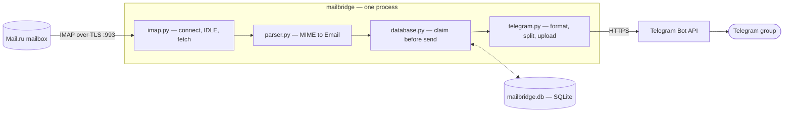

# mailbridge

A single-process daemon that watches one Mail.ru mailbox over IMAP IDLE and forwards new mail into a Telegram group — one mailbox, one folder, one destination, no web UI, no broker, nothing listening on a port. Open-sourced on GitHub under MIT.

---

## Overview

The job sounds trivial — "forward my email to Telegram" — until it has to run unattended for months without losing a message or sending one twice. mailbridge treats that reliability requirement as the actual point of the project. It watches an IMAP folder with `IDLE` rather than polling, parses MIME properly (RFC 2047 encoded headers, Cyrillic subjects, HTML-only bodies stripped to readable text, unknown charsets), forwards attachments as Telegram uploads, and tracks per-message delivery state in SQLite so that a crash mid-delivery costs at most a duplicate message — never a silently dropped one.

The scope is deliberately narrow and says so in its own README: one mailbox, one folder, one Telegram group. Multi-account support, extra folders, sender/subject filters, and a `/status` command are all explicitly out of scope, not stubbed anywhere in the code. That narrowness is what makes the reliability guarantees tractable to actually deliver.

---

## Engineering Summary

The core discipline is a shallow, acyclic dependency graph with delivery ordering concentrated in exactly one place. `config.py`, `log.py`, `parser.py`, and `database.py` import nothing from the rest of the package; `imap.py` and `telegram.py` each know about `Config` and the data shapes they render, but nothing about each other; only `main.py` sees every module, which is deliberate — it's the only place the ordering that makes delivery safe is allowed to live.

That ordering is the real engineering: a message is recorded and committed to SQLite as `pending`, claimed and committed as `sending`, *then* the Telegram API call is made, and only then is it marked `sent` — all committed writes happening strictly before the corresponding network call, never after. A crash at any point leaves a row that isn't `sent`, and the next pass treats anything not `sent` as unresolved and retries it. The system deliberately chooses at-least-once delivery over at-most-once: a duplicate is an annoyance, a silently lost email is not an acceptable failure mode for this tool.

274 tests pass, along with a clean `ruff`, `mypy`, and `basedpyright` run — verified directly rather than assumed. The docs are equally rigorous: `docs/architecture.md` states the delivery guarantee as a literal invariant with the commit ordering spelled out, and documents its own known bounds (memory scales with one message plus its largest attachment; a message with no `Message-ID` can't survive a `UIDVALIDITY` renumbering without a duplicate) rather than implying a stronger guarantee than the code actually provides.

---

## Key Features

* Watches an IMAP folder over TLS using `IDLE`, falling back to `NOOP` polling if the server doesn't support it
* Full MIME parsing: RFC 2047 header decoding, multipart walk, HTML-to-text fallback, charset recovery — and never raises on malformed input
* At-least-once delivery: state is committed before the Telegram send, so a crash costs a duplicate, never a loss
* Two-key deduplication — `(mailbox, uidvalidity, uid)` plus a `Message-ID` fallback — that survives an IMAP `UIDVALIDITY` reset
* Catches up automatically on everything that arrived while the daemon was down, including mail already read elsewhere
* Splits long emails across Telegram's 4096-character limit on line boundaries, backing off a cut that would land inside an HTML entity
* Recovers from dropped IMAP connections, Telegram `429`s and `5xx`s, and rate limiting, all with backoff and jitter
* `--check` validates configuration with no network calls; `--dry-run` fetches without sending or recording anything
* Secrets never reach the logs: a `Secret` wrapper renders as `***` everywhere, and the log formatter redacts both credential values out of every line as a second layer
* Runs as a locked-down Docker container: read-only root filesystem, dropped capabilities, no published ports

---

## Technical Stack

**Language**
Python 3.14

**IMAP**
`imapclient`, `IDLE` with `NOOP` polling fallback

**HTTP**
`httpx` (Telegram Bot API)

**Storage**
SQLite (WAL mode), no ORM

**Tooling**
`uv`, `ruff`, `mypy` + `basedpyright`, `pytest`

**Deployment**
Docker Compose or systemd, both wrapping the same single process

---

## Architecture

One pass: `resume_uid()` reads the highest UID that's safely behind the daemon — anything still `pending`, `sending`, or `failed` pulls that mark back below itself so an unresolved message is re-fetched rather than stranded. A `UID n:*` search (not `UNSEEN`) covers mail that was read elsewhere while the daemon was down; the server can answer with a UID below `n`, so the result is re-filtered client-side. `BODY.PEEK[]` against a read-only folder selection means a pass never sets `\Seen`, so the flag keeps meaning whatever it means to a human reading the same mailbox. From there: parse (never raises — a malformed part becomes an empty string), dedup against both keys, claim, send, mark sent.

Both network connections are outbound only; nothing in the process listens on a port.

---

## Interesting Engineering Decisions

**Commit before the network call, on both sides of it.** The `pending → sending → sent` state machine is written so that every transition is committed to SQLite strictly before the action it represents is attempted. A crash between the `sending` commit and the Telegram response leaves a row the next pass will retry — the "cost" of the crash is a duplicate delivery, and the architecture doc names this cost explicitly rather than pretending the system is exactly-once. Rows stuck in `sending` are logged at startup as an operator-visible signal that a retry is coming, not silently swept.

**Two dedup keys because one isn't enough.** `(mailbox, uidvalidity, uid)` is the primary key, but IMAP UIDs are only unique within one `UIDVALIDITY`, and a server can renumber a folder at any time. `Message-ID` is the fallback specifically for that renumbering: when the same message reappears under a new UID, a previously-delivered `Message-ID` marks it sent without a re-send. The system is honest that a message with no `Message-ID` header can't be recognized across a renumbering and will be delivered twice — a named, tested limitation rather than an unhandled edge case.

**`UID n:*`, not `UNSEEN`, as the search criterion.** Searching by UID range rather than the `\Seen` flag is what makes "catch up after downtime" actually correct: a message someone already read in the webmail while the daemon was offline is still forwarded, because forwarding doesn't depend on a flag a human might have already changed. The IMAP protocol quirk that `n:*` always returns the folder's current highest UID (even when it's below `n`) is compensated for with a client-side re-filter, rather than trusted at face value.

**Parse mode HTML instead of MarkdownV2, for a concrete reason.** HTML needs three characters escaped (`&`, `<`, `>`); MarkdownV2 needs eighteen, nearly all of which occur freely in real subject lines. Choosing the format with the smaller escaping surface for content the daemon doesn't control is a small decision that removes a whole class of "why did this email break the message format" bugs before they can happen.

**A `RateLimiter` that spaces sends preemptively, not just backs off after a 429.** Telegram allows roughly 20 messages a minute to one group; rather than only reacting to a `429` after it happens, every outgoing request waits on a `RateLimiter` that enforces a minimum interval up front, so a burst of mail can't trip the limit in the first place. The `429` handling that does exist honors the server's own `retry_after` value rather than guessing at a backoff.

**No Docker `HEALTHCHECK`, and the Dockerfile says why.** The only self-check the daemon exposes, `--check`, validates configuration and never touches the network — wiring that up as a healthcheck would report a wedged, disconnected daemon as healthy. Leaving the healthcheck out entirely, with a comment explaining the reasoning, is more honest than shipping one that lies.

**A `Secret` wrapper plus a redacting log formatter — two independent layers.** `Secret.__repr__`/`__str__` return `***`, which stops accidental leaks through an f-string or a traceback at the type level. But a library exception can still embed a raw token in a URL string that bypasses `Secret` entirely, so the log formatter separately scans every rendered line and redacts both known secret values, longest-match-first so an overlapping substring can't leave a fragment behind. Neither layer is trusted alone.

---

## Reliability

* **At-least-once delivery**, verified by the commit-before-send ordering above, and the cost of a crash is stated as a duplicate, never a loss
* **`UIDVALIDITY` changes are handled, not just detected** — state is keyed by it, so a server-side renumbering makes old rows stop matching rather than corrupting comparisons
* **IMAP reconnection** with exponential backoff and jitter, capped at 300 seconds; **Telegram `5xx`** retried up to 5 attempts with backoff; **Telegram `4xx`** treated as permanent and the row marked `failed` rather than blocking the rest of the queue
* **Attachment upload failures are isolated per file** — the email itself stays `sent`, and a failure note is posted to the group instead of the whole message failing
* **`SIGTERM`/`SIGINT` finish the in-flight message before exiting** — the systemd unit gives it a 60-second stop timeout specifically so a shorter one can't force a `SIGKILL` mid-delivery
* **A 15-minute heartbeat log line** carrying delivery/failure counts since start, so an idle daemon (nothing new arrived) is distinguishable from a wedged one from the logs alone
* **Configuration is validated all at once** — every missing or malformed variable is reported in a single error, not just the first one hit

---

## Security Considerations

* Mail.ru rejects the account password for IMAP outright; the tool requires a scoped application password that can be revoked independently
* Secrets are wrapped in a `Secret` type that renders as `***` everywhere, plus an independent log-formatter redaction pass as a second layer — email bodies and attachment contents are also never logged
* The Docker image runs as a non-root UID, with a read-only root filesystem, all capabilities dropped, `no-new-privileges`, and a tmpfs `/tmp`; it publishes no ports since both of its connections are outbound
* `.env` is excluded from both git and the Docker build context; credentials are passed to the container at runtime via `env_file`, never baked into a layer
* Attachment filenames are treated as untrusted network input and sanitized to a bare printable basename before ever reaching the filesystem or Telegram

---

## Lessons Learned

The delivery-ordering decision — write state before acting, never after — is the kind of thing that's easy to get backwards under time pressure (send first, then record success) and only shows its cost the first time the process dies between the two steps. Choosing the failure direction deliberately, and documenting the resulting duplicate-delivery cost as an accepted tradeoff rather than a bug, made the rest of the reliability work fall out naturally: heartbeat logging, interrupted-row reporting at startup, and the two-key dedup scheme are all downstream of having already decided which mistake was acceptable.

Being explicit about scope — one mailbox, one folder, one destination, and stating in the docs which post-MVP features aren't stubbed anywhere — kept the project small enough to actually finish with this level of rigor. A broader scope (multiple mailboxes, filters, a status command) would have multiplied the surface area the delivery guarantee had to hold across, for a use case this tool never needed to serve.

---

## Technologies Demonstrated

* At-least-once delivery design with an explicit, documented failure-mode tradeoff
* IMAP protocol handling: `IDLE`, `UIDVALIDITY` semantics, `BODY.PEEK` for read-only access, UID-range search quirks
* Defensive MIME parsing that never raises on malformed real-world mail
* HTTP client design with preemptive rate limiting, `retry_after` handling, and backoff with jitter
* SQLite as an embedded state store (WAL mode, schema versioning, crash-safe transactions)
* Secret handling with two independent redaction layers
* Hardened container deployment (non-root, read-only filesystem, capability dropping) and a systemd unit tuned for graceful shutdown

---

## Suitable Portfolio Categories

Backend Engineering · Automation · Telegram Systems · Reliability Engineering · Open Source
