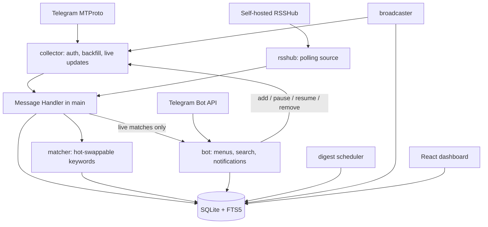

# Twork

Self-hosted Telegram job-hunting tool in Go — monitors channels and groups through a real user account, indexes every message locally, and surfaces matches through a Telegram bot and an optional web dashboard. Open-sourced under MIT.

---

## Overview

Telegram is where a lot of developer, freelance and startup work actually gets posted, and Telegram's own search is not equal to it. Following the useful channels means opening dozens of them every day; searching across them is barely possible.

Twork monitors them instead. It reads the channels and groups you point it at, indexes every message into a local SQLite database with full-text search, matches each one against keyword rules you control, and pings you when something lands. Everything runs on your own machine: no cloud service, no external API, no account beyond the two Telegram connections it needs.

It also does the reverse direction, deliberately narrowly — it can re-post your own pitch into the groups you monitor on a schedule, because in practice being visible where hiring people already are works better than answering stale posts.

---

## Engineering Summary

The defining decision is that Twork holds **two separate Telegram connections that never act on each other's behalf**. An MTProto user account — your own, authenticated once with `my.telegram.org` credentials — does the reading. A separate Bot API bot, with its own BotFather token, does the interface.

That split is forced by what each side can actually do. A bot cannot read the history of a channel it hasn't been added to with permissions, and job channels won't add one. A user account can read any public channel and any private one it has already joined, which is the entire premise of "monitor without checking manually". In the other direction, the Bot API is by far the better tool for an interactive menu — inline keyboards, callback queries, editing messages in place — so it does only that. The two meet through shared Go objects in `main.go` and nothing else; the account that reads your channels never runs bot-command logic, and the bot never touches the MTProto session file.

The second structural decision is that the bot doesn't depend on the collector at all. It depends on a `ChatSource` interface, and there are two real implementations: MTProto, and an RSSHub poller that reads public channels' preview pages without logging into Telegram at all — no account, no session file, nothing that can happen to a real Telegram account. The tradeoffs are real and documented rather than hidden, which is what makes it an honest second option rather than a checkbox.

Around 5,450 lines of non-test Go across nine packages, with 240 Go test functions and 6,000 lines of test code against it, plus a React dashboard with its own 34 tests and CI job.

---

## Key Features

* Monitors Telegram channels and groups through a real user account, including private ones already joined
* Local SQLite index of every message, with FTS5 full-text search
* Deterministic keyword matching — positive and negative groups, substring or whole-word per group
* Keyword and settings edits from the bot apply live, with no restart
* Global cross-channel deduplication on normalized message text
* Three notification modes — live pings, a daily digest, or both
* Carousel browsing of matches, favourites and search results — one full post at a time rather than truncated summaries
* Bookmarks, `.md` export of any view, and direct links back to the original message
* Three ways to add a chat — by username (no join), invite link (real join), or a shared folder link (joins every chat in it)
* Optional resume broadcasting into monitored groups, off by default, with rate limits
* Optional local web dashboard for chats, resume and compliance settings
* Second chat source via self-hosted RSSHub, requiring no Telegram account at all

---

## Technical Stack

**Language**
Go 1.26

**Telegram**
`gotd/td` for MTProto, `go-telegram-bot-api/v5` for the Bot API

**Storage**
SQLite via `mattn/go-sqlite3` (CGO, `sqlite_fts5` build tag), WAL, FTS5

**Feeds**
`mmcdole/gofeed` for the RSSHub source

**Dashboard**
React 19, TypeScript, Vite — built and embedded into the binary with `go:embed`

**CI**
GitHub Actions — gofmt, vet, golangci-lint, race-enabled tests with coverage reporting, plus a separate lint/test/build job for the dashboard

---

## Architecture

Every message, backfilled or live, goes through one callback. It is inserted (which computes a normalized-text hash and rejects duplicates), run through the current matcher, and — only if it matched, only if it arrived live rather than during backfill, and only if the notification mode includes live pings — handed to the bot to notify. Three concurrent goroutines run alongside: the chat source, the bot dispatch loop, and the digest scheduler.

**Storage is the source of truth.** `config.yaml`'s chats, matching rules and notification settings are seed data only — copied into SQLite on first run if the database is empty, and ignored from then on. Only genuine secrets (MTProto credentials, bot token, owner ID) stay in the file. That is what lets the bot add chats and rewrite keywords at runtime without editing config or restarting anything.

---

## Interesting Engineering Decisions

**Deterministic matching, no AI.** A message matches if it contains at least one positive keyword and no negative keyword. That's the whole rule. The upside is that a match is always explainable — you can point at the group that hit — there is no per-query cost, no rate limit, and no external service that has to be up for the tool to work. The project's own README is blunter about how it got there: *"No AI (i have bad experience with the api honestly)."* Which is a perfectly good reason, and closer to how these decisions actually get made than a post-hoc architectural argument would be.

**Global deduplication on normalized text.** Job posts are cross-posted across many channels with trivial formatting differences. So the dedup key is not the raw text but a normalization of it — lowercased, URLs and `@mentions` stripped, punctuation and emoji dropped, whitespace collapsed — hashed with SHA-256 and matched against *every* indexed message, not just those in the same chat. Duplicates are skipped silently: never indexed, never matched, never notified. There's no fuzzy similarity scoring, and that's the point — "why was this a duplicate" has an exact answer.

**Whole-word matching without regex.** Rather than building a regex with `\b` per alias, the matcher walks the string with `strings.Index` and checks the runes on either side of each hit for word-character-ness. Cheaper than compiling patterns for every keyword group, and it behaves correctly on non-ASCII text, where `\b` semantics get slippery.

**A hot-swappable matcher behind an RWMutex.** Keywords are editable from the bot, and rebuilding the matcher is cheap, so edits construct a whole new `Matcher` and swap the pointer. Readers take a read lock and get a consistent snapshot; there is no partially-updated ruleset a message could be evaluated against.

**Synthetic IDs that can't collide.** The RSSHub source has no Telegram message IDs to work with, so it derives stable ones by hashing — the username for chats, the entry GUID or link for messages. Chat IDs are forced negative so they can never collide with a real MTProto channel ID, and re-ingesting the same feed item on every poll is a no-op because storage's `(chat_id, telegram_message_id)` uniqueness constraint doesn't care where the ID came from.

**The first poll of a new chat is a quiet backfill.** An RSS feed returns a window of recent posts, so a newly added chat would otherwise fire a notification for every post already sitting in it. The first poll is treated as backfill; the same rule already applies to MTProto history, where adding a channel with a long backlog could produce hundreds of pings at once.

**One message, rewritten in place.** Every menu screen in the bot is the same Telegram message, edited as you navigate. Prompts for free-text input are deleted along with your reply the moment they're handled. Only three things are ever sent fresh: live-match alerts, which can arrive at any time regardless of what menu is open; and `.md` exports, which are files you're meant to keep.

**A carousel instead of a paginated list.** Matches, favourites and search all render one full post at a time with prev/position/next controls, sharing a single renderer — only the underlying query differs. A job post truncated to a list row loses the thing you need to judge it by.

**Three ways to add a chat, with three different consequences.** By username resolves without joining anything, because Telegram allows reading a public channel's recent history without membership. By invite link performs a real join, because a private chat has no other way to be read. A folder link does that across every chat in it. And Twork never leaves a chat automatically — "Remove" only stops monitoring, since joining was a deliberate, visible act and leaving should be too.

**Resume broadcasting, constrained in the storage layer.** Twork can re-post your pitch into monitored groups on a per-chat schedule. It's off by default, groups only — channels are broadcast-only and a send there would blast every subscriber rather than build presence — and the restriction is enforced in storage rather than only in the UI, with the scheduler re-checking chat kind before every send rather than trusting that. Two limits apply: a minimum delay between sends into the same group, and a rolling cap across all groups per hour, defaulting to 5 minutes and 10 per hour. A failed send doesn't burn the chat's cooldown or the hourly budget. DMs are never touched in either direction, and the read-only RSSHub source can't broadcast at all.

---

## Challenges

**Backfill and live updates sharing one path.** History replay and live updates produce the same messages through very different mechanisms, and both must be idempotent — a restart re-runs backfill. Insertion is idempotent on `(chat_id, telegram_message_id)`, so replaying is always safe, and the live/backfill distinction is carried as a flag on the callback rather than as two separate pipelines, so the matching logic can't drift between them.

**Notification volume as a design constraint.** Between backfill, cross-posted duplicates, and multiple monitored channels carrying the same ad, the naive version of this tool is a notification firehose. Three separate mechanisms exist to prevent that — backfilled messages never ping, duplicates are dropped globally before matching, and the notification mode can turn live pings off entirely in favour of one daily digest.

**A dashboard that has to exist inside one binary.** The React app is built and embedded with `go:embed`, which means CI can't just run `go build` — the Go steps depend on a real dashboard build having happened first, not the committed placeholder. The Go workflow builds the web app before it vets, builds, or tests anything.

**CGO, and what it costs.** FTS5 through `mattn/go-sqlite3` requires a C toolchain and the `sqlite_fts5` build tag everywhere — local builds, CI, Docker, and cross-compilation. The arm64 cross-compile job exists as a manual trigger with an aarch64 toolchain installed specifically because building it in Docker ran out of memory.

---

## Security Considerations

* The MTProto session file is touched only by the collector; the bot has no access to it
* Credentials live in `config.yaml` and nowhere else — everything else the bot can change lives in the database, so no secret is ever rewritten by a runtime edit
* The bot answers exactly one Telegram user ID: either the configured owner, or the first person to send `/start`, claimed permanently after that
* The web dashboard is disabled by default; enabling it without a username and password is rejected at config validation, and every route including static assets goes through HTTP Basic Auth with constant-time credential comparison
* Broadcasting limits are hardcoded defaults rather than blank fields — an unset value in config resolves to the safe default rather than to zero

---

## Testing

* 240 Go test functions across every package — 100 on the bot alone, 50 on storage, 33 on the collector, plus a fake Bot API for exercising flows end to end
* 34 tests on the React dashboard with Testing Library and jsdom
* CI runs gofmt, `go vet`, golangci-lint, and `go test -race` with atomic coverage across all packages, publishing a per-function coverage breakdown into the job summary
* The dashboard has its own workflow — lint, test, typecheck and build

---

## Honest Limitations

The project's own architecture doc keeps a limitations section, which is the right instinct; the ones that matter most:

* **Single owner.** One Telegram user ID. This is a self-hosted personal tool, not a multi-tenant service.
* **No PTS gap recovery.** Live updates use the raw update handler rather than `gotd`'s updates manager, so a dropped connection could in theory miss an update. The next backfill catches up, but that's recovery by luck of timing rather than by design.
* **Digest scheduling is wall-clock and server-local** — in Docker that means the container's timezone, which needs setting explicitly.
* **CGO everywhere**, with the build and packaging friction that implies.

---

## Lessons Learned

The `ChatSource` interface is the piece that earned the most. It was introduced to make the bot testable without a Telegram connection, and it turned out to be the thing that made a completely different acquisition strategy — RSSHub, no account at all — possible without touching the bot, the matcher, the storage layer or the UI. An interface written for testability paid out as an architecture seam.

The other lesson is that a monitoring tool's real problem is not finding things, it's not drowning you. Indexing everything is easy. Almost all of the interesting work — global dedup, backfill suppression, digest mode, negative keywords — exists to reduce what reaches you, not to increase it.

---

## Technologies Demonstrated

* Telegram MTProto client work — authentication, chat resolution, history backfill, live update handling
* Telegram Bot API interface design — inline keyboards, callback routing, stateful prompts, in-place message editing
* Interface-driven architecture with genuinely interchangeable implementations
* SQLite schema design with FTS5, WAL, and trigger-maintained search indexes
* Text normalization and content-hash deduplication
* Concurrent Go — multiple long-running goroutines, context cancellation, lock-protected hot-swapping of shared state
* Rate limiting and scheduling with rolling windows and defense-in-depth checks
* Embedded single-page dashboard with `go:embed`, behind constant-time Basic Auth
* Multi-language CI with coverage reporting and cross-compilation

---

## Suitable Portfolio Categories

Backend Engineering · Automation · Telegram · Distributed Systems · Open Source
