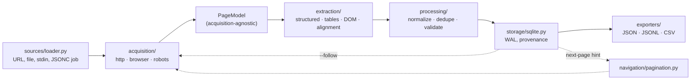

# UniParse

Python/TypeScript scraper that extracts structured records from arbitrary websites with little or no per-site configuration. Early development and testing stage — the engine and CLI work end to end, but it's still being hardened against real sites. Active, though not currently being worked on day to day.

---

## Overview

The usual scraper is a pile of per-site CSS selectors that breaks the moment a site redesigns its markup. UniParse tries the opposite approach: point it at a URL and it finds the product grid or article list on its own, names the fields, follows pagination to the end, and writes a CSV — no selector written by hand.

```bash
uparse https://books.toscrape.com --output books.csv
```

It won't always get every field right, and the project is upfront about that. The intended loop is `try automatic → inspect the result → override what broke → deliver`: `uparse inspect --explain price` shows exactly why the engine picked the selector it did, and a wrong field gets pinned in a small JSONC config rather than the whole page being hand-selectored from scratch.

An optional `generate` command closes the remaining gap — sites where a field lives behind a meaningless CSS-in-JS class name, like `span.sc-g7h8i9`, that no vocabulary could guess. It asks an LLM to *name a column the engine already found and validated*, not to invent a selector; the model only ever answers with an id, and everything it points at is re-run against the real page before being written to a job file it never sees again.

---

## Engineering Summary

Roughly 8,050 lines of Python across the engine, plus a small TypeScript browser worker, against 2,825 lines of tests (229 test functions: unit, integration against a real local HTTP server, and a corpus of real saved pages with hand-written expectations). CI runs ruff, mypy, and the non-browser test suite with coverage on every push; the browser worker gets its own job that builds and typechecks it, though the Playwright-driven browser integration tests are marked and skipped in CI rather than run there — an honest gap for a project at this stage, not a hidden one.

The core design bet is that extraction should never know how a page was acquired. Chromium, a plain HTTP fetch, and a local `.html` file all resolve to the same `PageModel` (url, html, status, title), which is what lets the entire extraction and scoring test suite run against saved HTML with zero network access, and what makes `--no-browser` a real, fully-supported mode rather than a degraded one.

The second bet, and the more interesting one, is that extraction strategies **compete on a stated quality score rather than run in a fixed priority order**. The README calls this out directly as a fix for a real bug: under a first-non-empty chain, a layout `<table>` used to beat a 0.94-confidence product grid simply because tables were tried first. Every strategy — configured selector, structured data (JSON-LD/microdata), data table, DOM-collection clustering — now states a quality, `max(attempts, key=quality)` wins, and `inspect` records what lost and why.

---

## Key Features

* Four extraction strategies arbitrated by stated confidence, not tried in a fixed order: explicit config (1.00) → structured data (0.95) → data tables (0.30–0.95, scored on header/evenness/nesting) → DOM-collection clustering (0.00–1.00)
* **Cross-record alignment** reads a collection as a table: a relative selector resolving in ≥60% of records becomes a column, a column whose values all parse as dates becomes a typed `date` field, and a namespaced class token (`span.country-capital`) names its own column — this is what keeps working on CSS-in-JS sites where no class name means anything
* `inspect --explain <field>` prints the exact selector and every scoring signal that produced a value, in the same additive form the engine used internally
* Optional LLM-assisted field naming (`generate`) that only ever selects among engine-validated columns by id — the model cannot express a selector, so it cannot invent one, and coverage below `min_coverage` gets the field dropped with a stated reason
* `--follow` visits each listing row's detail page and merges what it finds back into the record, treating a detail page as one entity rather than a collection
* Per-host politeness (`politeness.per_host`, default 2) independent of job-wide concurrency, so N workers across N different hosts never becomes a burst against any single one; `robots.txt` fetched once per host and honored, including `Crawl-delay`
* Deterministic output regardless of worker count — export order follows `sources.id, pages.id, record_index`, not insertion order, with a test asserting `-j 1` and `-j 8` produce byte-identical files
* Categorized, retryable failures (`NAVIGATION_TIMEOUT`, `HTTP_ERROR`, `BLOCKED`, `ROBOTS_DISALLOWED`, ...) — one bad page never kills a job, and `uparse retry job.db` re-runs only what failed
* SQLite as the actual job artifact (WAL mode, streaming inserts), with `--provenance` recording confidence, source, and selector for every value, alongside JSON/JSONL/CSV export
* A deliberate boundary: on a challenge page the run reports `BLOCKED` and moves on — no CAPTCHA solving, no fingerprint spoofing, stated as permanent rather than a missing feature

---

## Technical Stack

**Engine**
Python 3.14, Click, Pydantic, lxml + cssselect, httpx, python-dateutil

**Browser worker**
TypeScript, Playwright (Chromium), spawned as a Node subprocess and driven over newline-delimited JSON on stdin/stdout

**Storage**
SQLite (WAL mode) as the job database; JSON/JSONL/CSV as export formats

**LLM assist (optional)**
Pluggable providers — OpenAI-compatible endpoints (Gemini free tier, Ollama, LM Studio, OpenRouter, Groq), a generic `command` provider, or the Anthropic API — with a no-op `null` provider as the default

**Tooling**
uv, ruff, mypy, pytest + pytest-cov, a hand-rolled corpus evaluator (`tools/eval.py`)

---

## Architecture



The browser worker is a separate process, not a library call: Python spawns `node browser/dist/main.js` and speaks a small framed protocol over stdin/stdout — `hello` to launch Chromium and build a page pool, `navigate` per page, `shutdown` to close it all down. stdout carries protocol frames only; every diagnostic goes to stderr, which matters because of how the worker is designed to die (below). Requests are correlated by id through a reader thread rather than serialized one-at-a-time, so several navigations are genuinely in flight at once.

Two shared-state details keep concurrency honest: the SQLite `Store` takes every statement under one lock with transactions held across `BEGIN`/`COMMIT`, and `follow` runs on a **separate** thread pool from source fetching specifically so detail-page fetches can never queue more source work and deadlock the two pools against each other.

---

## Interesting Engineering Decisions

**Arbitration by stated quality, not strategy order.** This is the fix the README highlights as the reason `_arbitrate` exists at all: `result.notes` records which strategy won and what it beat, so a regression in strategy choice shows up as a diff in test output rather than a silent behavior change months later.

**Fields come from evidence in a stated trust order, and alignment is the interesting tier.** Named (`itemprop`, vocabulary) and patterned (values that *state* themselves, like a price glyph) come first; cross-record alignment is what's left when a site's markup carries no semantic information at all. It deliberately refuses to name a field from value shape alone when nothing else backs it — a documented decision made after that heuristic "produced confident nonsense" in practice, which is a good sign for a project this early: someone tried the more aggressive version and rolled it back.

**Guards against overconfident extraction.** `_implausible` rejects a value that cannot be what its field name claims — a class named `mobile_comments` is not going to parse as a phone number just because the regex matched. `_demote_containers` penalizes a candidate selector that wraps a more specific one, so a `<div class="byline">` loses to the `<a>` sitting inside it. Both exist because the alternative (score everything, take the max) rewards a selector that's merely broad.

**Selectors are computed record-relative, not document-relative.** The consequence is threefold and each one depends on the others: `inspect` can print a selector you paste directly into a config, a pinned selector resolves once per record instead of grabbing the first match on the whole page, and consistency scoring (does this selector resolve the same way across records?) is even meaningful in the first place.

**The LLM never gets to invent a selector — it can only point at one.** `generate` sends the model the same compact report `inspect` already produces (2–4KB against a 50–600KB page), with every candidate column pre-validated by the engine and given an opaque id like `c1`. The model answers with ids, not text, so a hallucinated selector is structurally impossible — the failure mode collapses from "wrong CSS" to "picked the wrong already-real column," and every accepted id is re-run against the live page before anything is written. `uparse scrape` never imports the assist package at all, so the feature's absence when no API key is configured is exact, not degraded.

**The browser worker is written to die cleanly, from two lessons stated directly in the docs.** Writing to a broken stdout pipe raises `EPIPE`; logging that error to stderr can raise `EPIPE` again if stderr is also gone, and that loop pins a CPU core — so the worker treats "nowhere to report to" as a reason to exit rather than retry. Separately, a worker reparented to init (its Python parent died) gets no reliable close signal, so it watches for that directly; closing Chromium on the way out is attempted but explicitly time-boxed and never blocks a hard exit.

**Worker creation is guarded by a lock for a concrete, previously-real bug.** Without the lock, every thread racing past an `is None` check spawned its own Node process and its own Chromium instance; only the last assignment to the shared reference survived, and every other spawned browser became an orphaned, unreachable process. That's the kind of bug that only shows up under concurrency, which is exactly the setting this tool runs in by design (`-j 8`).

**Determinism is asserted, not assumed.** The claim "same job, same output regardless of worker count" is backed by an actual test comparing `-j 1` and `-j 8` output byte-for-byte — a much stronger commitment than most concurrent tools make about their own output ordering.

---

## Challenges

**Politeness has to be a property of the host, not the job.** A naive `--concurrency 8` would let eight threads hit one unlucky host in a burst while another host with only one URL in the batch gets no protection at all. `HostLimiter` keys concurrency and pacing on hostname specifically so the job-wide worker count and the per-site politeness budget are two independent knobs — solving that required treating "how fast am I going" and "how many things am I doing at once" as genuinely different questions.

**Number parsing is a heuristic with a stated, known failure mode.** UniParse reads a single separator followed by exactly three digits as thousands grouping (`1.299` → `1299`), which is right far more often than it's wrong — except for a value like `12.500` genuinely meaning twelve-and-a-half, which it will misread. The README lists this as a known limitation with the escape hatch (`type` override) rather than pretending the heuristic is exact.

**Keeping the corpus honest as the actual regression net.** `tests/corpus/` holds real, gzipped pages with hand-written expected output, and `tools/eval.py` turns "did that change help?" into a number `make eval` reports; `tests/test_corpus.py` fails CI on a regression. The docs are explicit that scoring weights move on evidence from that corpus, not on whichever site was looked at most recently during development — a real discipline for a heuristic-heavy engine, and one that's easy to state and hard to actually hold to.

---

## Security Considerations

* Page content — including attacker-controlled text on a scraped page — reaches the LLM prompt only as part of a structured, pre-validated report; the model's answer space is a closed set of ids, never free text, so there's no path from page content to an injected instruction with executable effect
* `generate` never runs unless explicitly invoked with a provider configured; `uparse scrape`, the default command, never imports the assist package
* `robots.txt` is honored by default, including `Crawl-delay`; bypassing it (`--no-robots`) is an explicit opt-out, not the default
* Detected blocks (challenge pages, CAPTCHAs) are reported and skipped — the project states this as a permanent design boundary, not a gap it intends to close
* The browser worker communicates over a private stdin/stdout pipe to its own spawned subprocess, not a network-exposed interface

---

## Testing

* 229 test functions across roughly 2,825 lines: unit tests for extraction, scoring, normalization, pagination, and limits, all without network access
* Integration tests run against a real local HTTP server serving a generated site — pagination, detail pages, a robots.txt with a disallowed path, a challenge page, and JS-rendered content
* Browser tests are marked (`@pytest.mark.browser`) and skipped without a built worker rather than failing — CI currently builds and typechecks the TypeScript worker but does not run this marked suite, a known limitation at this stage rather than an oversight
* A corpus of real, gzipped pages with hand-written expected output, scored by `tools/eval.py` and enforced in CI by `tests/test_corpus.py` — the project calls this its actual regression moat
* CI: ruff (lint + format), mypy, pytest with coverage for the Python engine; a separate job builds and typechecks the Node/TypeScript browser worker

---

## Lessons Learned

The `PageModel` boundary is the decision worth carrying into the next scraper: making extraction acquisition-agnostic from day one is what makes an entire heuristic-heavy engine testable against static fixtures instead of live sites, and it's the kind of seam that's cheap to draw early and expensive to retrofit once extraction code has quietly started assuming it always has a live `Page` object to poke at.

The arbitration rewrite is the other one. A first-match strategy chain looks fine until two strategies both produce plausible results and the wrong one happens to run first — and the fix wasn't a better table detector, it was making every strategy state a number and admitting that "which one wins" is a comparison, not an order.

---

## Technologies Demonstrated

* Heuristic information extraction — structured data parsing, DOM-collection clustering, cross-record table alignment as a fallback when semantic markup is absent
* Confidence-based arbitration between competing extraction strategies, with the losing choice recorded for debuggability
* A subprocess-based polyglot architecture: Python driving a TypeScript/Playwright worker over a framed stdio protocol, with explicit process-lifecycle handling (broken-pipe exit, orphan detection, time-boxed shutdown)
* Concurrency control at two independent levels — job-wide worker pool and per-host politeness — with deterministic output ordering verified by test
* LLM integration scoped to eliminate its own failure mode: constrained output space (ids only), mandatory re-validation against ground truth, zero-cost absence when unused
* Corpus-driven regression testing for a heuristic system, where "did this help" is a measured score rather than a feeling
* Failure categorization and selective retry for long-running, partially-failing batch jobs
* SQLite as an application's durable, queryable job artifact rather than an implementation detail

---

## Suitable Portfolio Categories

Backend Engineering · Data Extraction · Developer Tooling · Applied AI · Open Source
