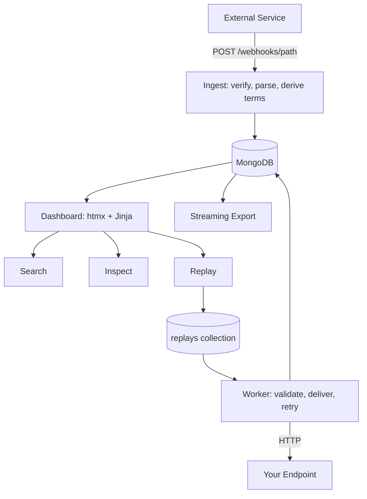

# Webhook Inbox

Self-hosted webhook inspection, search and replay platform — FastAPI, MongoDB and htmx. Keeps every inbound request in full, makes it searchable even when you misremember the name, and replays the original bytes at your local machine. Open-sourced under Apache-2.0.

---

## Overview

A webhook fails in production. The sender shows a 500 and no body. Your logs have the request ID but not the payload. The event is gone, so you cannot reproduce it locally.

Webhook Inbox is the thing that would have caught it. It receives webhooks at `/webhooks/{path}`, stores the complete request — headers, query, parsed body, raw bytes — and gives you three things over that store: search that tolerates a typo, an inspector that renders the payload readably, and replay that sends the *original bytes* to a destination you choose, so a receiver verifying an HMAC still sees a valid signature.

It runs as `docker compose up`, serves a dashboard rendered server-side with htmx, and has no dependency beyond MongoDB.

---

## Engineering Summary

Two decisions carry the project, and both are contrarian in a way the repository defends explicitly.

**Search doesn't use MongoDB's `$text` index**, and the architecture doc records the actual probes behind that rather than asserting a preference. Instead, terms are derived at *write* time — tokens and trigrams stored on the event document — so query time never parses a payload, and ranking is four tiers scored in a single aggregation pass. That yields exact, prefix, multi-term and fuzzy matching from one indexed `$or`.

**Replay is treated as an SSRF engine that has to be constrained**, because that is what it is: it sends stored data to a URL a user supplies. The constraints *are* the design — validated twice, connected to the validated IP rather than a re-resolved hostname, redirects followed by hand with every hop re-validated, and any hostname refused outright if even one of its addresses is private.

Around 3,190 lines of application code against 3,080 lines of tests — 272 test functions across unit, integration and **security** suites, the last of which is 81 tests of its own covering auth, malicious payloads, limits, secret exposure and response hardening. Integration and security tests run against disposable MongoDB containers; replay tests against a local stub server. Nothing touches an external service.

---

## Key Features

* Accepts any HTTP method and content type; bodies that aren't valid UTF-8 are stored base64-encoded
* Per-endpoint HMAC-SHA256 or static-secret verification, checked against untouched bytes before parsing
* Exact, prefix, multi-term and fuzzy search, ranked in one query, with no text index
* Server-rendered collapsible JSON viewer, with headers, query and raw bytes on their own tabs
* Replay to any destination with hard SSRF validation and narrow retry rules
* Filtering by endpoint, status, method, event type and date range, with keyset pagination
* Streamed JSON, JSONL and CSV export that honours the current filters and search
* Per-endpoint or global retention enforced by a MongoDB TTL index
* Argon2id passwords, hashed session tokens, CSRF on every mutation, split rate limits
* Redaction that keeps secrets out of both the logs and the search index

---

## Technical Stack

**Application**
Python 3.14, FastAPI, Pydantic 2, uvicorn

**Storage**
MongoDB 8 via pymongo

**Interface**
Jinja2 templates with htmx — server-rendered, no frontend build step

**Security**
argon2-cffi for password hashing, httpx with manual redirect handling

**Logging**
structlog with a redaction processor

**Testing**
pytest against disposable MongoDB containers and a local stub HTTP server

---

## Architecture

One FastAPI application serving three surfaces that share nothing but the database.

| Surface | Path | Authentication |
| --- | --- | --- |
| Ingestion | `/webhooks/{path}` | Per-endpoint signature, or none |
| Dashboard | `/`, `/events`, `/endpoints`, `/settings` | Session cookie |
| JSON API | `/api/*` | Session cookie + CSRF header |

Ingestion never touches the session collection. A webhook arriving at 2 a.m. shouldn't pay for a session lookup, and the two paths have genuinely different threat models — one accepts anonymous traffic from the internet, the other guards a human's browser.

**A document store is the right fit, not a default.** Webhook payloads have no shared schema: a Stripe event and a GitHub push have nothing structurally in common, and both change without notice. The relational alternatives are a JSON column (a document store with extra steps) or normalizing into key-value rows and losing the ability to query nested structure. Here the payload is stored as it arrived and stays queryable at any depth.

**Both the parsed body and the raw bytes are kept**, because they do different jobs. Signature verification runs against raw bytes before any parsing — re-serializing JSON changes whitespace and key order, which breaks every HMAC. Replay resends those same bytes, so the receiver's verification still passes. And a body too deeply nested to walk safely is stored with `raw_body` intact and `body: null`: the webhook is never lost, it's just not traversed.

---

## Search, and the Index That Wasn't Used

Search is the part with the most design in it, and the most explicit reasoning.

**Terms are derived at ingest.** Endpoint name, event type, header names and values, query names and values, and every key and string leaf of the body become tokens; trigrams are generated from each token of three characters or more. Query time never parses a payload — it matches against two multikey indexes.

**Numbers are indexed as text; booleans are not**, because `true` would match nearly every event.

**Identifiers keep their unsplit form.** `checkout.session.completed` yields `checkout`, `session`, `completed` *and* the whole string, so an exact-phrase search still hits. A whole sentence doesn't get that treatment — it would only bloat the index.

**Trigrams are space-padded so prefixes anchor**: `checkout` becomes `" ch"`, `"che"`, `"hec"`, … `"ut "`.

**Ranking is four tiers in a single pass** — exact token match scores 100, prefix 60, all-terms-present 40, and trigram overlap ≥ 0.4 scores 30 × ratio, with anything under 12 discarded. So a typo that matches nothing exactly still returns sensible results, labelled by how they matched:

**Sensitive keys are excluded at write time**, reusing the same `is_sensitive` check the log redactor uses. A body field called `api_key` remains stored and visible on the event page, but never becomes a searchable term — otherwise search would quietly reintroduce exactly the leak that redaction exists to prevent.

**Both arrays are capped** — 512 tokens, 2048 trigrams — so one enormous payload cannot dominate a multikey index. Oversized payloads lose the tail of their terms, which is the right thing to sacrifice.

### Why `$text` was rejected

The obvious approach is MongoDB's `$text` index, and the project tested it against a real MongoDB 8 rather than reasoning about it. The probes: `$text` works as a first pipeline stage, fails inside `$facet` because score metadata is unavailable, works inside a `$unionWith` sub-pipeline (score metadata included), fails after any other stage, and a second text index on a collection is not allowed at all.

So it *does* compose. It was rejected on cost rather than capability: it permanently spends the one text index a collection gets, it needs a separate field duplicating words the token array already holds, its tokenizer isn't yours so ranking becomes less predictable exactly where scoring control matters most, and its only real gain is stemming — which buys nothing on identifiers, enums and IDs.

Dropping it made the design *simpler*. With no stage-ordering constraint, the tiered query stopped needing `$unionWith` plus `$group` to deduplicate, and collapsed to one `$match` with an indexed `$or`, one `$switch` for the tier score, and one threshold `$match`. The backend is behind a protocol, so a `$text` implementation can still be added without touching the routes.

**The honest limitation:** transposing adjacent characters in a short word destroys every trigram, so `jhon` does not find `john`. Deletions and substitutions are fine — `creted` finds `created`. Fixing transposition means edit distance, a different and far more expensive mechanism.

**Measured, not assumed.** At 100,000 events: 78.6 MB of data, 5.1 MB for the token index, 23.0 MB for the trigram index, 29.1 MB of indexes total — 0.37× the data size. A benchmark asserts `explain()` shows no collection scan.

---

## Inspection

Payloads render server-side, fully escaped, with nested objects and arrays collapsible. Headers, query parameters and the original raw bytes each get their own tab.

---

## Replay and SSRF

Replay sends stored data to a URL the user supplies. Unconstrained, that is a server-side request forgery engine pointed at whatever the host can reach — cloud metadata endpoints, the database, anything on the internal network. So the constraints are the feature.

**Validated twice, deliberately.** The API validates at queue time so the user gets immediate feedback; the worker validates again immediately before connecting. The gap between queueing and sending is exactly where DNS can change underneath you.

**Connections go to the validated IP**, with `Host` and TLS SNI carrying the real hostname. Resolving once for validation and then letting the HTTP client resolve again at connect time would leave the rebinding hole wide open.

**Every resolved address must pass.** If a hostname resolves to several addresses and any one is private, loopback, link-local, multicast, reserved or unspecified, the whole name is refused — one public answer does not excuse a private one. IPv4-mapped IPv6 (`::ffff:127.0.0.1`) is unwrapped and checked as the v4 address it hides.

**Redirects are followed by hand.** The client is always built with `follow_redirects=False`, and each hop is re-validated from scratch. Letting the client follow redirects would re-resolve DNS entirely outside validation.

**Retries are narrow.** Timeouts, connection errors and 5xx are retried with exponential backoff. 4xx never is — the destination understood the request and refused it. A rejected destination is never retried, because a validation failure cannot fix itself.

**Headers are filtered by purpose, not by list.** `Authorization`, `Cookie` and `Proxy-Authorization` are never forwarded — they're reusable credentials. Signature headers like `x-hub-signature-256` *are* forwarded: they're derived from the body being sent, useless anywhere else, and replaying them is the entire point of testing a receiver's verification locally.

The queue is a MongoDB collection leased with `findOneAndUpdate` on `next_attempt_at`. A worker that dies mid-attempt leaves the job `running`, and leases older than the timeout are reclaimed. No Redis, no broker — the database already provides atomic claim.

---

## Interesting Engineering Decisions

**Ingestion checks run cheapest-first.** Header count, header size and query length are validated with no I/O at all; then the rate limit, which is in memory; and only then is the database touched. A flood of malformed requests cannot become a flood of queries. The rate-limit key is the endpoint path plus client address, both available from the URL without a lookup.

**Oversize is refused before buffering.** `Content-Length` is checked when present, and the streamed body is abandoned the moment it exceeds the limit — so a chunked request that lies about its length is still caught.

**Nesting depth is measured over the raw bytes**, with a scan that tracks string and escape state so brackets inside strings aren't counted. The reason is specific: parsing, key escaping and tokenizing all recurse, and a payload nested a few thousand levels deep is only a few kilobytes — it sails through the size check and then exhausts the stack.

**Signature verification fails closed.** An unrecognized auth type, a missing secret and a missing header are all rejections, never a pass. Comparison uses `hmac.compare_digest`.

**Restricted key names are escaped with lookalikes.** MongoDB forbids `.` and a leading `$` in field names; webhook payloads contain both. Keys are stored with `．` (U+FF0E) and `＄` (U+FF04) and unescaped on read and export. A payload key genuinely containing those lookalikes would round-trip wrong — which is precisely why `raw_body` stays authoritative.

**"Keep forever" is expressed by absence.** When retention is disabled the `expires_at` field is omitted entirely rather than set to null, because MongoDB's TTL monitor ignores documents lacking the field. Changing an endpoint's retention recomputes expiry on its stored events server-side via `$dateAdd` — without that, an override would silently apply only to future events.

**TTL deletion is documented as approximate.** MongoDB's background task runs about once a minute, so events disappear shortly *after* expiry, not on it — measured at 22 seconds on a live stack. This is stated on the settings page too, because "deleted after 30 days" implying a precise moment is the kind of assumption that causes trouble later.

**Export reuses the list view's filter parser**, so an export can never disagree with the table it was launched from — fuzzy search queries carry through. Responses stream with `Transfer-Encoding: chunked` and no `Content-Length`, which is the observable proof they aren't buffered.

**CSV cells are defused.** Any cell beginning with `=`, `+`, `-` or `@` is quote-prefixed, so spreadsheet software can't evaluate an attacker-supplied `event_type` as a formula.

**The endpoint name is denormalized onto each event** so the list renders without a join — with the trade stated: renaming an endpoint doesn't rewrite past events, and `endpoint.id` remains the join key for anything that must be correct.

---

## Security Considerations

The threat model is stated in two facts, and everything follows from them: `/webhooks/{path}` accepts anonymous internet traffic and must stay cheap to reject, and replay sends data to user-supplied URLs.

* Argon2id password hashing; session tokens stored hashed, never in plaintext
* CSRF required on every mutation; session expiry swept by a TTL index rather than application code
* Rate limiting split between ingestion and sign-in, with different limits, because they're different attacks
* Redaction applied to logs *and* the search index from one shared sensitivity check
* Full SSRF suite on replay, as described above, with 81 dedicated security tests covering auth, malicious payloads, limits, secret exposure and response hardening
* Production overlay requires MongoDB authentication, with the application connecting as a user holding `readWrite` on its own database and nothing else
* The seeded `demo` endpoint accepts unauthenticated writes so `docker compose up` works out of the box, and the production checklist says to delete it — stated plainly rather than left as a surprise

**Out of scope, explicitly:** the dashboard has no roles. Every authenticated user has full access, including reading every payload. The docs say so rather than leaving it to be discovered.

---

## Honest Limitations

* **Fuzzy search can't handle transposition** — `jhon` won't find `john`, for the structural reason described above
* **No role-based access.** One tier of authenticated user, full access
* **TTL deletion is approximate**, by design, and observably so
* **Export is unbounded.** Memory stays flat, but a filterless export of a very large collection holds a cursor open for a long time
* **Renaming an endpoint doesn't rewrite history** — the denormalized name on past events stays as it was

---

## Lessons Learned

The `$text` investigation is the piece I'd point to. The instinct when a database offers a built-in feature is to use it, and the instinct when it doesn't quite fit is to work around it — in this case with `$unionWith` and a deduplicating `$group`. Probing what it actually does, then rejecting it for reasons that had nothing to do with whether it worked, produced a *simpler* pipeline than accommodating it would have. Writing down the probe results matters as much as the decision: the next person to ask "why not just use `$text`?" gets an answer with measurements instead of an opinion.

The other lesson is that a feature which sends requests to user-supplied URLs is not a feature with a security consideration attached — it's a security problem with a feature attached. Validating twice, pinning the connection to the validated address, and hand-rolling redirect handling are all things that look like paranoia until you notice that the ordinary implementation of each is exactly the hole.

---

## Technologies Demonstrated

* Document-store modelling for genuinely schemaless data, with indexes justified individually and measured
* Custom search: write-time term derivation, inverted and trigram multikey indexes, tiered scoring in one aggregation
* Empirical evaluation of a database feature, with the negative result documented
* SSRF defence in depth — double validation, IP pinning, manual redirect handling, IPv4-mapped IPv6 handling
* Hostile-input handling: cheapest-first check ordering, pre-buffer size limits, depth bounding over raw bytes
* HMAC signature verification against unparsed bytes
* Database-backed job queue with leases and reclaim
* Server-rendered UI with htmx — no frontend build step
* Streaming exports with formula-injection defence
* Session authentication with Argon2id, hashed tokens, CSRF and TTL-swept expiry
* Testing against ephemeral real infrastructure, with a dedicated security suite

---

## Suitable Portfolio Categories

Backend Engineering · Security · Data Engineering · API Design · Open Source
