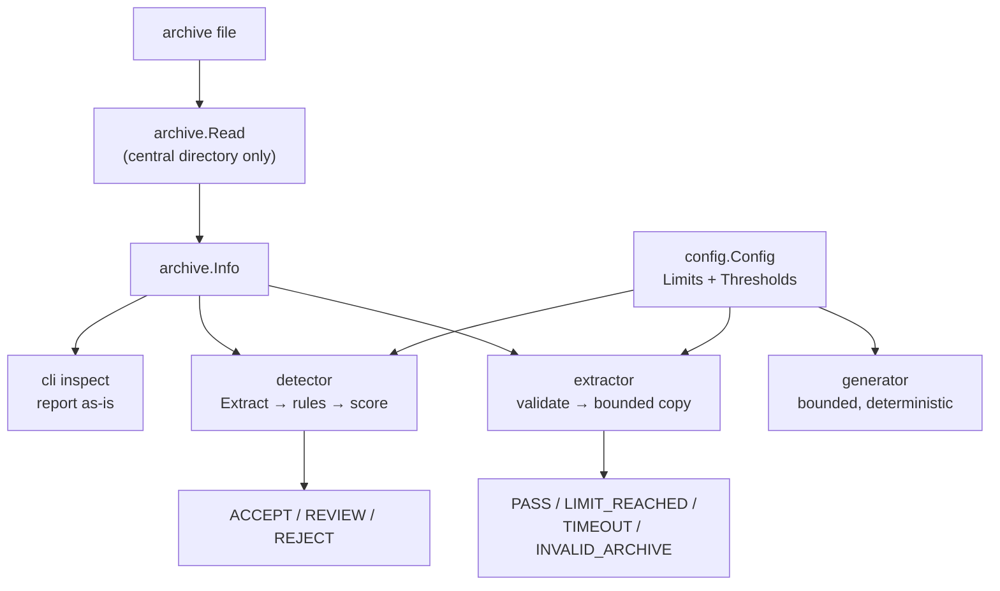

# zipthorn

Go CLI and library for ZIP-bomb and archive-security research: generate bounded pathological archives, inspect and score real ones, and extract untrusted archives under hard resource limits. Zero external dependencies. Actively developed, currently paused.

---

## Overview

Anything that accepts a ZIP upload — a crawler, a document pipeline, a malware scanner, a CI artifact step — eventually has to answer a question it usually hasn't tested: what happens when the archive is 20KB on disk and claims to be 4GB uncompressed? zipthorn exists to make that question answerable on purpose, instead of the first time it happens in production.

It does three distinct things behind one CLI: `create` generates a controlled pathological archive (high compression ratio, huge file count, deep nesting, adversarial metadata — seven profiles, byte-identical given the same seed); `inspect`/`detect` read an archive's central directory and score its risk without ever extracting it; `test` extracts an archive for real, but only inside limits enforced twice — once against the declared metadata before a byte is written, and again against the actual bytes as they land, because the declaration in a ZIP's central directory is exactly the thing a malicious archive lies about.

The three are meant to compose: generate a fixture with `create`, keep it as a permanent regression test, and assert your own extractor rejects it with `test` or `zipthorn.Guard` — reproducibly, without needing a real zip bomb from the internet.

---

## Engineering Summary

The architecture's organizing rule, stated directly in the codebase, is that **parsing, policy, and action are separate**: the archive parser (`internal/archive`) never decides what's dangerous, the detector (`internal/detector`) never extracts, and the extractor (`internal/extractor`) never invents a limit of its own — everything traces back to one `config.Config`. That separation is what makes `detect` safe to run on fully untrusted input: it only ever reads a central directory, the metadata a ZIP file front-loads before any compressed data, so it can characterize even a genuinely catastrophic archive without touching the payload that makes it catastrophic.

The extraction path takes that one step further and refuses to trust the metadata it just used: `test` validates the whole central directory against limits *before* writing anything, then re-checks every limit again as bytes actually land through a `limitWriter` that refuses the write that would cross a byte or ratio limit, rather than truncating after the fact. The pre-check exists to reject cheaply; the second check exists because the declaration was never proof.

About 6,000 lines of non-test Go against roughly 6,400 lines of tests — 215 test functions plus two fuzz targets with a dedicated malformed-archive corpus (truncated files, contradictory metadata, path traversal, reserved Windows device names, deep nesting). All tests are black-box, in external `_test` packages against the exported API only. CI runs the full suite under `-race` on Linux, macOS, and Windows, plus a 60-second fuzz smoke run on the generator and extractor, `govulncheck`, and gofmt/`go mod tidy` drift checks. The module has no dependencies at all — no `go.sum` — which is a deliberate constraint, not an accident: a security tool that reads hostile input has one less thing to audit if it isn't also trusting a dependency tree to do it safely.

---

## Key Features

* `create` — seven generation profiles (`ratio`, `file-count`, `nested`, `depth`, `metadata`, `mixed`, `fuzz`), bounded by the same limits the extractor enforces, byte-identical for a given seed
* `inspect` — reports what an archive *claims* (size, ratio, file/dir counts, depth, compression methods, comments) without extracting or judging
* `detect` — scores compression ratio, declared size, file count, depth, nesting, path traversal, duplicate entries, suspicious metadata, and encryption against configurable thresholds; prints a 0–100 score and an ACCEPT/REVIEW/REJECT recommendation
* Five named detection policies (`default`, `strict`, `permissive`, `web`, `ci`) — preset thresholds plus a disabled-rule list, applied wholesale rather than merged with local config
* `test` — extracts under limits with a pre-check against the declared central directory and a live re-check as bytes are written; partial output is removed on failure unless `--no-clean`
* `benchmark` — measures extraction throughput and behavior across repeated runs
* Layered config resolution (`~/.zipthorn/config.yaml` → `./.zipthorn.config.yaml` → CLI flags) with full provenance: `--verbose` and `--json` report which layer decided every field
* A stable, documented exit-code contract (0 success, 1 error, 2 usage, 3 risk/rejection, 4 unsupported) so `detect` composes directly in CI gates
* `--json` on every command for automation; `--quiet` for a single summary line
* An embeddable Go API (`zipthorn.Guard`) doing inspect → assess → extract in one pass over the archive, with pluggable `Sink`s (`DirSink`, `DiscardSink`, `MemSink`) and a `Writer` for building bounded archives of your own

---

## Technical Stack

**Language**
Go 1.26, single static binary, zero runtime dependencies (no `go.sum`)

**CLI**
Hand-rolled over the standard `flag` package — argument permutation so flags can follow the archive path, and `flag.Visit`-based provenance so an unset flag never claims credit for a config-file value

**Config parsing**
Hand-rolled scanner over a flat `key: value` subset, not a YAML library — the schema is two maps of scalars, so a real dependency would buy nothing

**Testing**
Standard `testing` + `testing/quick`-style fuzzing (`go test -fuzz`), black-box `_test` packages, committed crash corpus

**CI/Release**
GitHub Actions (3-OS matrix, race detector, govulncheck), goreleaser for cross-platform binaries

---

## Architecture

`zipthorn.go` is the one stable, exported surface — every public type is a real struct converted at the boundary from whatever internal package did the work, never a type alias, so restructuring `internal/` never breaks a library caller. Everything under `internal/` is free to change without a version bump.

`Guard`, the library's one-call gate, reads the central directory exactly once whether or not it goes on to extract, because detection never needs to and extraction validates from that same parse — a caller doing both doesn't pay for two passes over the archive.

---

## Interesting Engineering Decisions

**Detection reads metadata; it never opens a compressed stream.** `detect` and `inspect` operate entirely on the central directory `archive/zip` already parsed for free. That's what makes `zipthorn detect suspicious.zip` a safe thing to run on an archive you don't trust at all — there's no code path from "assess this" to "decompress this."

**The extractor pre-validates a *plan*, then re-validates the *execution*.** `validateBeforeExtract` checks declared size, ratio, file count, depth, and nesting against the whole central directory before a single byte is written — so a rejected archive produces zero filesystem output. But the declaration is a claim, not a fact, so `limitWriter` enforces the same byte and per-entry expansion-ratio limits again as the actual decompressed stream flows through it, refusing the write that would cross the line rather than truncating after. Two checks against the same numbers, at two different points where a lie could hide.

**Path safety is a property of the name, computed once, used everywhere.** `archive.Escapes` and `archive.PathIssues` treat backslashes as path separators even on non-Windows systems — specifically because a smuggled `..\` aimed at an extractor that only splits on `/` is exactly the attack this exists to catch — and detect absolute paths, drive prefixes (`C:`), reserved Windows device names (`CON`, `COM1`, ...), control characters, and trailing dots/spaces that some filesystems silently strip. `Writer`, the archive-*building* side, calls the same `Escapes` check on the way in, so nothing produced by this codebase can carry a Zip Slip into whatever extracts it later — the same function guards both directions.

**Config fails closed, not soft.** A missing config file is fine — the built-in defaults apply. A malformed one, or one with an unrecognized key, aborts the command outright rather than falling back silently. For a tool whose entire job is enforcing a policy, running quietly on the wrong policy is the worse failure mode.

**A policy replaces thresholds; it doesn't merge with them.** Selecting `--policy strict` swaps in that policy's whole threshold set and disabled-rule list rather than layering over whatever local config already set. A half-applied security policy — some numbers from `strict`, some left over from `permissive` — is judged worse than either policy cleanly applied.

**Generation fails closed too, symmetrically with extraction.** `create` computes the full output plan (every file, every nested archive, every declared size) and checks it against the limits *before* writing anything; an over-budget request produces no partial file. The same seed and parameters always produce the same bytes, which is what makes a generated pathological archive usable as a committed regression fixture rather than a one-off.

**Exit code 3 prints no error line.** A `REJECT` verdict or a `LIMIT_REACHED` result is the tool working correctly, not failing — so it's reported through `Result.Status` and a specific exit code, never through the error path a genuine I/O or config failure uses. `if ! zipthorn detect --policy strict upload.zip; then reject; fi` reads correctly because the tool's own error semantics match what a CI gate wants to branch on.

---

## Challenges

**Where do "detect" and "extract" draw the line between telling the truth and being useful?** `inspect` explicitly refuses to have an opinion — it reports what an archive claims and nothing more, with `detect` as the separate command that renders a verdict. Keeping those genuinely separate (rather than having `inspect --verbose` quietly start judging) is what lets `Guard` compose them safely: detection's output is never contaminated by having partially extracted something first.

**Depth measured against the wrong path is a real bug class.** The extractor measures directory depth on the archive-relative entry name, not the resolved destination path on disk — because a `Sink` writing to a deeply nested destination directory would otherwise make the *same archive* trip a depth limit depending only on where the caller happened to point it. Getting this backwards would make `MaxDepth` behave inconsistently across callers of the same library function.

**A dependency-free hand-rolled config parser is a real constraint, not a shortcut.** The config schema is two flat maps of scalars, but hand-writing that scanner (sections, `key: value`, line-numbered errors, unknown-key rejection) instead of pulling in a YAML library means every parsing edge case is the project's own responsibility to get right and test — which is exactly what the config test suite spends its effort on.

---

## Security Considerations

* Detection is metadata-only by construction; nothing in the `detect`/`inspect` path can be induced to decompress attacker-controlled bytes
* Path traversal, absolute paths, drive-letter prefixes, and reserved device names are checked before extraction and refused categorically — not scored as risky and extracted anyway
* Extraction limits are enforced twice: once against declared metadata, once against real bytes as they're written, closing the gap a malicious declaration could otherwise exploit
* A malformed or unrecognized-key config file aborts the command rather than silently running on defaults or a partial policy
* `Writer`'s own path check means archives this codebase produces can't carry a Zip Slip into a downstream extractor
* The project ships its own `DISCLAIMER.md`: it is built for testing systems the operator owns or is authorized to test, and states plainly that its safety mechanisms bound zipthorn's own behavior, not every third-party parser's

---

## Testing

* 215 test functions plus two fuzz targets (`FuzzGenerator`, `FuzzExtractor`), all black-box against the exported API
* A dedicated malformed-archive corpus: truncated files, contradictory central-directory metadata, path traversal, reserved names, unsupported compression methods — every case required to fail safely, never panic, never run unbounded
* Integration tests drive real command flows end to end: `create → inspect`, `create → detect`, `create → test`, across every generation profile
* CI matrix on Linux, macOS, and Windows under the race detector; a separate fuzz-smoke job runs both fuzz targets for 60 seconds and uploads crashers on failure; `govulncheck` and gofmt/`go mod tidy` drift checks run as their own jobs

---

## Lessons Learned

The clean split between "here's what this archive claims" and "here's whether that's dangerous" turned out to matter more than any individual detection rule. Once `inspect` was disciplined about never rendering a verdict, `detect` could be built as a pure function of `(archive.Info, thresholds)` — easy to test at every boundary, easy to swap a policy underneath without touching a single rule, and safe to run on input nobody has vetted, because nothing in that path ever asks the archive to decompress itself.

The two-phase extraction check is the piece worth reusing elsewhere: validate the whole plan against a declaration first for a cheap rejection, then never actually trust that declaration once real bytes start moving. A ZIP bomb's entire trick is a central directory that lies convincingly; checking it once and then trusting it is the same mistake stated twice.

---

## Technologies Demonstrated

* Low-level binary format handling — ZIP central directory structure, compression method identification, path encoding edge cases
* Security-focused systems design: fail-closed configuration, defense in depth (pre-check + live re-check), categorical refusal over best-effort scoring for path safety
* CLI engineering beyond the standard library's defaults — argument permutation, flag-provenance tracking, a stable cross-command exit-code contract
* A dependency-free hand-rolled parser, deliberately, as an attack-surface decision rather than a convenience one
* Deterministic, seedable test-fixture generation for reproducible security regression testing
* Fuzz testing with a committed crash corpus, integrated into CI as its own job
* A public Go library API designed separately from its CLI consumer — real types at the boundary, `internal/` free to change underneath
* Multi-OS CI (Linux/macOS/Windows) under the race detector, plus dependency vulnerability scanning

---

## Suitable Portfolio Categories

Backend Engineering · Security · Developer Tooling · Open Source
